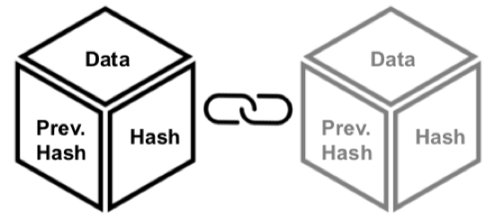

# Blockchain for data security

Danilo Acosta Villalobos and Ricardo Rojas Ruiz  
Universitat Politècnica de Catalunya, Facultat d'Informàtica de Barcelona  
_danilo.acosta@est.fib.upc.edu  
ricardo.rojas@est.fib.upc.edu_

**Keywords:** Blockchain - Data - Security

## 1\. Introduction

Technology is a double-edged knife. Just like companies try to consistently improve their security measures, “threat actors consistently improved their cyber-weapons and quickly adopted new methods and adapted their attacks to emerging technologies” [12]. Blockchain technologies have been around since 2008, when Satoshi Nakamoto (alias) implemented it as the digital ledger for Bitcoin; since then, people have realized that it is not only a platform for cryptocurrencies, but rather a system that allows to record transactions of everything of value [7]. Diverse applications have used Blockchain technology in different environments, and, unavoidably, hackers and other threats have now targeted them. In this paper, we will try and cover some ways in which Blockchain will help, not only to serve its original purpose, but rather to further protect valuable data.

## 2\. Data Security

In order to better understand the applications of blockchain for data security,we will quickly explain what data security is. According to Techopedia, datasecurity is the protective digital privacy measures that are applied to preventunauthorized access to computers, databases and websites [1]. These measurescan be classified into three main aspects: confidentiality, availability and dataintegrity; they will be later discussed in this section. Finally, the data wouldhave to be of certain value to either the sender, the receiver, or any other actorthat could potentially obtain the data; hence it will be worthy of securing bysome means.

### 2.1 Confidentiality

Confidentiality refers to the aspects of security that pertain to ensuring thatonly the sender and receiver of data will see it. For the purpose of this paperwe will only review two main aspects of confidentiality: i) identification and ii)authorization. In order to make clear the difference between all these concepts,we will use an example.

Let us imagine that a man named Bob wants to send an email to his businesspartner Anna. Identification would be the means by which we can prove that Bobreally is Bob and that Anna is Anna. This can go from simple and straightforwardthings like the emails on the header (sender and receiver) and/or a signature; toeven contextual things like the topics discussed and the figures of speech usedamong others. Given, each of these methods of identification have different levelsof reliability and thus not all of them would be required to be used in order toidentify a person.

Authorization on the other hand, is relevant to who is allowed to read thecontent of a message. Following our previous example, the email Bob sent toAnna is supposed to only be read by Anna, the final recipient. In our example,governments usually protect this by means of making it a crime to read someoneelses mail. In this sense, if another person were to see the contents of the emailand was caught, would be subject to the law and would face certain consequences.Furthermore, either Bob or Anna could allow someone else to read the email bysharing it with someone else or physically showing it to someone else; we mustkeep in mind that access to information can be provided or taken away at anymoment by the owners of the data.

### 2.2 Availability

Availability is concerned about the ease of access to the data being secured.When securing data, one has to make decisions taking into consideration thefact that data has to be available at the right moment in order to create value,while at the same time making sure that no other party other than the intendedis going to be able to see it. Thus, we will consider two aspects of data availabilityin this paper: i) accessibility and ii) codification.

In our example, accessibility should be high since modern email providersallow their users to read email from most every site there is access to the in-ternet, but it remains secure behind one-step or two-step verification processes.Encryption on the other hand, refers to the capability of someone else beingable to interpret the data. This can be something as simple as a different lan-guage, to complex encryption algorithms. This aspect is not always the same onall systems and, in some cases, the email may be sent unprotected through theinternet.

### 2.3 Integrity

Last in our list, integrity is whether the message has been compromised in anyway or if it remains the same as the sender created it, if it is the same, we can saythat the data is accurate and complete. There are many ways in which data maybe altered and they range from loss of data, to alteration of contents, or evento its deletion. For this last concept, since the email is written on a computer,there is no way to ensure that a document is really the document created exceptby means of an audit comparing both the original document and the current version that is currently being used. This is commonly done by comparing hashcodes of the file.

## 3\. Blockchain

Now that we understand security, we will move onto an explanation of whatBlockchain is and how it works. Simply put, a blockchain is an append-only dis-tributed database with transaction order that guarantees three things by meansof its implementation: 1) encrypted data storage (by means of public and privatekeys), 2) data immutability and 3) public audit of all transactions. As its namesuggests, Blockchain is a serialized set of blocks that contain at least 3 main ele-ments: the encrypted data that needs to be stored, a unique hash for that blockof data, and the unique hash of the previous block. All blocks are immutableonce they are created, meaning that it cannot be modified or deleted. Since thehash function that gives the block its ID takes both the data and the previoushash as inputs, if a block were to be modified, all other blocks proceeding itwould be rendered corrupt. This set of blocks is distributed to all nodes of thenetwork, fully replicating the complete chain on each node.

**Fig. 1.** Blockchain basic structure.

In order to append a new block, the nodes have to verify transactions, encryptthem on blocks and then transfer the block to all other nodes once a consensusabout the network state has been reached. In order to ensure that all nodes getthe same probability of creating the next block, the network relies upon a proof-of-work mechanism. This mechanism creates a challenge that ensures both thata certain minimum of processing time is required to solve it and that no singlenode will consistently solve the challenges. The mining node that solves thechallenge then broadcasts the solution to all other nodes, triggering a consensusalgorithm. The consensus algorithm requires that at least half of the network (51%) agrees that the next block that is being created is the only one possiblenext true state of the chain. Once this is agreed upon, all nodes add the blockto their chain and the cycle begins anew.

The combination of all three encryption and hashing, proof-of-work and net-work consensus mechanisms work together to ensure the database security. The hashing and encryption of blocks makes it difficult to modify the chain since ifone node is altered, you then need to alter all proceeding blocks; the proof ofwork further inhibits a nodes capability to influence the chain by making surethat even if one of the nodes was altered, the amount of time and computationpower required to recreate all following blocks would be almost impossible toachieve; finally, the consensus mechanism ensures that even if it were manage-able to fully recreate a section of the chain, it would still not match the chain heldby other nodes, so the modification would not be accepted unless the majorityof the nodes were compromised.

**Fig. 2.** Blockchain security layers.

### 3.1 Advantages

From what we have learned there are several great advantages to the blockchain: encryption, validation of data and integrity, and it is virtually impossible to hack. However there are other “hidden” advantages that were not specifically mentioned in the previous section. Since Blockchain works on a distributed environment, we can safely assume that all of the benefits from distributed computing also apply to this technology. This means that all applications built on Blockchain will immediately be more resilient (since there is no single point of failure), it will almost always be available, it helps distribute the valued data over the whole network, and it can still be able to be implemented both as a public or private environment.

Other advantages that Blockchain has are: there is no administrator user that has access to sensible user data like passwords; data belongs to the users and it can only be read by means of their private key, although there are still no clear regulations for blockchain; it can be reimagined to serve other purposes, for example running code (Ethereum) and creating users with different degrees of access and permissions (EOSIO) among others; and ultimately, the technology creates trust among all users of the network. This last advantage is key since it allows for collaboration between users who don’t know each other and that would in any other situation have no reason to trust their counterpart. This can ultimately lead to the elimination of bureaucracy and automate processes like: wire transfers (a bank is necessary to transfer money from one account to the other and usually It is several banks when doing an international transaction) or sharing medical records from one medical institution to another (where the user has to ask their medical institution to send the data to another institution’s doctor as opposed to just granting the new doctor access to the records).

However, we must remember that no technology is perfect. The mechanisms that allow these benefits to materialize have some countereffects that we must always be aware of. The next section will describe the disadvantages that Blockchain has to compromise with.

### 3.2 Disadvantages

In order to better discuss the disadvantages, we will classify them in three different categories: i) technological limitations, ii) derivate countereffects, and iii) other implications. Technological limitations will strictly talk about what the technology needs in order to function properly; derivate countereffects will be all disadvantages that result from the way the technology is meant to work; and other implications will be the rest.

**Limitations.** In the same wat that the advantages of distributed systems apply to Blockchain, the disadvantages work in the same way. Firstly, having a fully replicated database on a network implies that every node has to have enough storage space to hold the entire database, so, in this way, nodes should be sort of homogeneous. Secondly, all changes made to the database need to be replicated throughout the entire network. This forces the network to have an enormous communication overhead; this, on top of the consensus mechanism, make Blockchain require big bandwidth. Thirdly, since blockchain implements proof-of-work, it will require that all nodes be constantly spending processing capabilities in order to validate the transactions made. Finally, the combination of the three limitations get worse while the system is scaling up in storage size, nodes and number of transactions, so the bigger the blockchain is, the more it will require of the whole system.

**Derivate countereffects.** Now that we have mentioned scalability, not only does size affect the blockchain while it is scaling up, but it also is counterproductive to have a small blockchain. This is due to the fact that the security of the database is directly related to the number of nodes on the network, since, once a hacker has control on more than 50\% of the nodes, he can easily manipulate the entire system.  
There are other two disadvantages that are related to the size of the blockchain: updating the system and, of course, costs. The first one has to do with the fact that, since it is a distributed network with no master, any update to the way the blockchain works has to be rolled out to every node. On a public blockchain this is impossible to do at the same time, so we will end up having a network with nodes running a mix of the old and the new system. On a private blockchain, this could be mitigated, but there eventually the network would find itself on the same situation. This state of heterogeneous nodes can lead to the creation of forks on the blockchain, meaning that there can be two valid blockchains at a certain point in time.  
The last size related disadvantage is the cost of the system. Since the blockchain is always alive, always communicating, and always running complex calculations, the system has a huge consumption of energy. And not energy is the problem, since we have already stated that a blockchain with a few nodes is not desirable in terms of security, the cost of deploying a secure private blockchain is even higher.  
Last but not least, this system, although it works with timestamps, cannot guarantee that a transaction is made at the moment that it is received. In fact, the blockchain will wait until a new block is generated in order to process the transaction. This means that the system, even if it is a huge improvement over current solutions (for example an international money transfer, which takes days to be processed can now be done in hours), is still not at the desired state to be implemented as a real-time solution, which can be a stock trading system, for example. There is still work to be done in order to make Blockchain the solution it is meant to be.

**Other implications.** The last two disadvantages that we see in Blockchain are the fact that the technology is just relatively new and it is constantly being redefined and restructured to work in specific ways. This incremental evolution of the software is not being done in a standardized way. This can be seen in the sense that the original blockchain was meant to store data and now it is possible to execute code on Ethereum and have different permissions for users like in (EOSIO), however, both platforms are completely unrelated.  
The last disadvantage that we will be mentioning is the fact that there is no current legislation that dictates the proper way of handling information like personal data. The GDPR, for example, raises some questions as to who is controlling the personal data that lies within a blockchain, whether or not a public key is considered as personal information, and the consequences of storing personal data on a system that promotions itself as an immutable database when a person has the right to be forgotten.

While making the decision to use or not use Blockchain for your system, we will have to take into consideration both the advantages and disadvantages of the technology. We believe that it is still too early for companies to begin implementing this technology, in many cases it will not be really justified. However, there are companies that are taking this technology to their advantage and creating solutions that bring great value. In the following section we will mention and briefly describe some of these companies and their solutions.

## 4\. Security applications on Blockchain

### 4.1 Civic

Civic is an application that allows people to verify and store their personal identification data (e.g. ID, passport, visa, credit cards, …). The data is safely stored on the phone and a request is sent to the pertinent authority in order to validate your data. This way the data will be verified and will remain valid until one of two events happen: 1) the expiration date is reached or 2) the user changes the data (it will be rendered invalid until it is verified by the authority).

This application has a lot of applications in the real world; from traveling, to purchasing, driving, and any other possible situation on which you have to prove who you are. You could, make a trip reservation online, receive a request from the website for personal data, fully complete the formulary, and then travel seamlessly for your whole trip. You will be able to use your phone and fingerprint to prove your identity to the airline, on airport security and hotel instead of using your physical documents.

### 4.2 CryptoMove

CryptoMove is a key vault that encrypts and decentralize API keys and other app secrets with fragmentation and a moving target defense. The platform uses blockchain in order to split the keys in blocks, split them and increase security as you need all the blocks to decrypt a secret. Also, the platform does not expose the keys directly, since it uses an user token to access a key and it connects directly to the corresponding API to use the secret (i.e. AWS, Dropbox, Azure, etc).

### 4.3 BlockArmour

Blockchain Defined Perimeter creates a software defined perimeter including blockchain technology and a zero-trust-policy. This allows companies to protect form phishing, the most used attack to gain access to user credentials, BlockArmour uses a three factor authentication model, requiring a password, digital authentication and device authentication to prove your identity. Furthermore, the BDP makes the platform invisible to the outside world, drastically reducing the possibility for a distributed denial of service attack (DDoS). Also, since blockchain is basically an immutable database, attackers that do manage to hack into the service will not be able to eliminate their tracks, enabling the company to improve their security and possibly take action against the perpetrator.

### 4.4 Hacken

Hacken provides several platforms, tools and consultancy teams focused on blockchain security services such as Ethereum, EOS and TRON. It implements several security factors and review existing applications to improve the already implemented applications. One of these applications is Hacken Proof, a platform that allow companies to securely share code to a community of white-hat-hackers while not compromising your live-operative systems.

## 5\. Conclusions

Blockchain technology by itself improves traditional system security, making data more secure the more widespread it is. It not only makes sense to have a system that is more secure, but blockchain will become an even more relevant technology with the continuous digitalization of all aspects of our world and the growth of IoT. Nonetheless, Blockchain has yet to reach its full potential, and even though some applications of this technology have been developed to improve security, the road is not completely paved and there is still room for improvement. This provides any developer with great opportunities to create a business leveraging blockchain technology, enjoying with a low competitive business environment.

## References

1.  Techopedia (2019). Data Security. Retrieved from:[https://www.techopedia.com/definition/26464/data-security](https://www.techopedia.com/definition/26464/data-security)
2.  Toribio González, Ángel (Apr 2019). 05 – Cloud Security. Retrieved from: [https://raco.fib.upc.edu/avisos/attachment?assig=CCBDA-MIRI&idAvis=97951&idAdjunt=77179](https://raco.fib.upc.edu/avisos/attachment?assig=CCBDA-MIRI&idAvis=97951&idAdjunt=77179)
3.  Coding Tech (Feb, 2018). Blockchain Technology Explained (2 Hour Course) [Video file]. Retrieved from: [https://www.youtube.com/watch?v=qOVAbKKSH10](https://www.youtube.com/watch?v=qOVAbKKSH10)
4.  Acronis (2019). Acronis Notary: a new way to prove data authenticity via Blockchain. Retrieved from: [https://www.acronis.com/en-us/articles/data-protection/](https://www.acronis.com/en-us/articles/data-protection/)
5.  Simply Explained (Nov, 2017). How does a blockchain work - Simply Explained
[Video file]. Retrieved from: [https://www.youtube.com/watch?v=SSo_EIwHSd4](https://www.youtube.com/watch?v=SSo_EIwHSd4)
6.  Iuon-Chang, Lin and Tzu-Chun, Liao (Sep, 2017). A Survey of Blockchain Security Issues and Challenges. Retrieved from: [https://pdfs.semanticscholar.org/f61e/db500c023c4c4ef665bd7ed2423170773340.pdf](https://pdfs.semanticscholar.org/f61e/db500c023c4c4ef665bd7ed2423170773340.pdf)
7.  A. Bahga, V. Madisetti, “Blockchain Platform for Industrial Internet of Things”, Journal of Software Engineering and Applications, No. 9, pp. [36] 533-546, 2016 
8.  Mire, Sam (Nov, 2018). Blockchain In Cyber Security: 10 Possible Use Cases. Retrieved from: [https://www.disruptordaily.com/blockchain-use-cases-cyber-security/](https://www.disruptordaily.com/blockchain-use-cases-cyber-security/)
9.  Eureka (Dec, 2017). How blockchain technology keeps data secure. Retrieved from: [https://eureka.eu.com/gdpr/blockchain-technology/](https://eureka.eu.com/gdpr/blockchain-technology/)
10. Drolet, Michelle (Jun, 2018). 4 reasons blockchain could improve data security. Retrieved from: [https://www.csoonline.com/article/3279006/4-reasons-blockchain-could-improve-data-security.html](https://www.csoonline.com/article/3279006/4-reasons-blockchain-could-improve-data-security.html)
11. Golosova, Julija and Romanovs, Andrejs (Nov, 2018). The Advantages and Disadvantages of the Blockchain Technology. Retrieved from: [https://www.researchgate.net/publication/330028734](https://www.researchgate.net/publication/330028734)
12. Check Point Research (2019). Cyber attack trends analysis: Key insights to gear up for in 2019. Retrieved from: [http://www.snt.hr/boxcontent/CheckPointSecurityReport2019_vol01.pdf](http://www.snt.hr/boxcontent/CheckPointSecurityReport2019_vol01.pdf)
13. Gartner (Aug, 2018). Hype Cycle for Emerging Technologies, 2018. Retrieved from: [https://blogs.gartner.com/smarterwithgartner/files/2018/08/PR_490866_5_Trends_in_the_Emerging_Tech_Hype_Cycle_2018_Hype_Cycle.png](https://blogs.gartner.com/smarterwithgartner/files/2018/08/PR_490866_5_Trends_in_the_Emerging_Tech_Hype_Cycle_2018_Hype_Cycle.png)
14. Civic (2019). Secure Identity Platform. Retrieved from: [https://www.civic.com/products/secure-identity-platform/](https://www.civic.com/products/secure-identity-platform/)
15. CryptoMove (2019). What is moving target defense. Retrieved from: [https://www.cryptomove.com/what-is-mtd.html](https://www.cryptomove.com/what-is-mtd.html)
16. BlockArmour (2019). What is BlockArmour?. Retrieved from: [https://www.blockarmour.com/](https://www.blockarmour.com/)
17. Hacken (2019). Crowdsourced cybersecurity testing platform. Retrieved from: [https://hackenproof.com/?__hstc=51220406.2d3efc6d8abd80dc747689d7652cdc48.1556315088497.1556519020792.1556521528393.3&__hssc=51220406.1.1556521528393&__hsfp=2622329694](https://hackenproof.com/?__hstc=51220406.2d3efc6d8abd80dc747689d7652cdc48.1556315088497.1556519020792.1556521528393.3&__hssc=51220406.1.1556521528393&__hsfp=2622329694)

