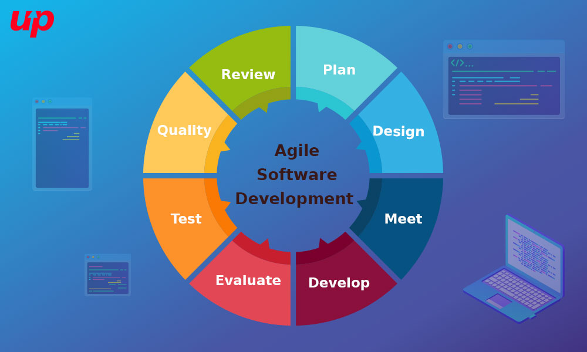
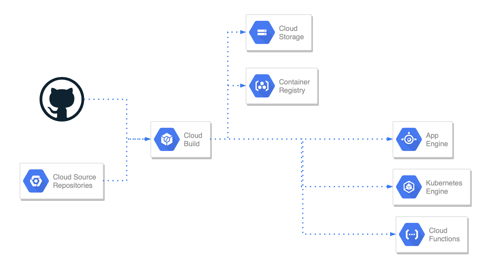
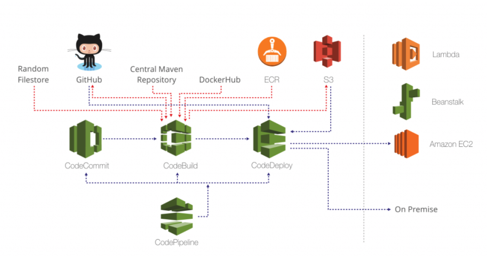
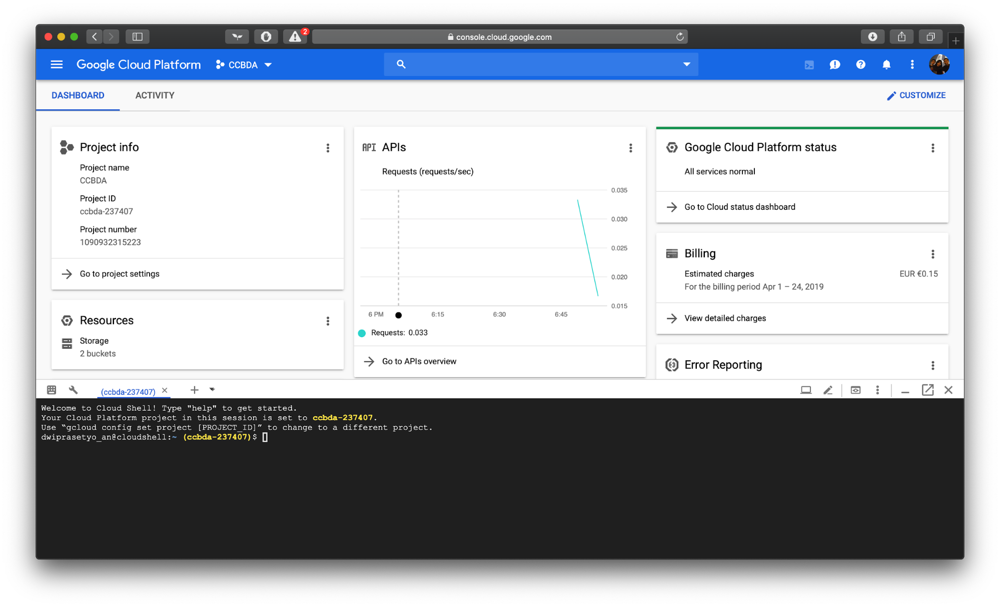
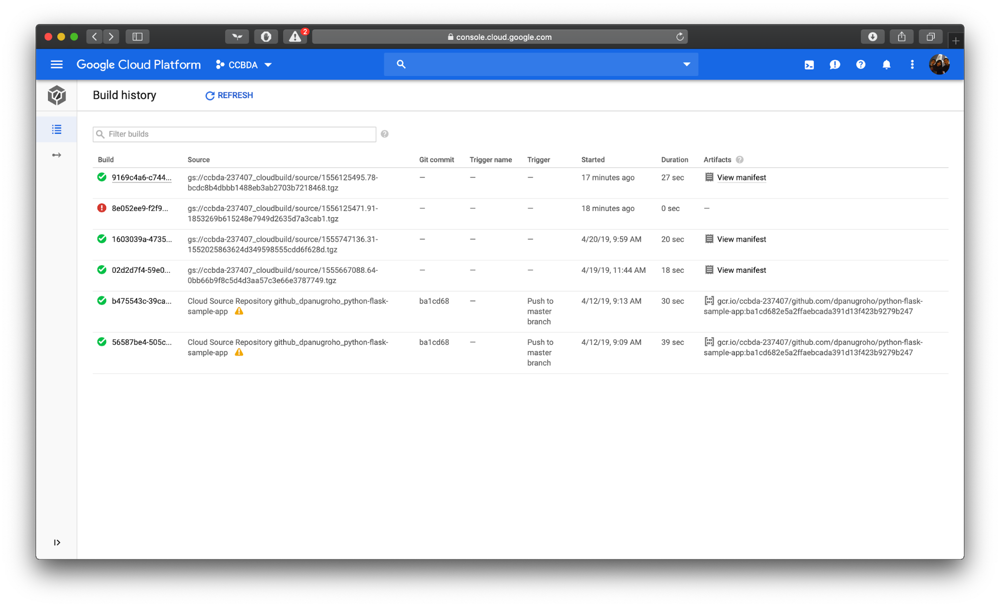
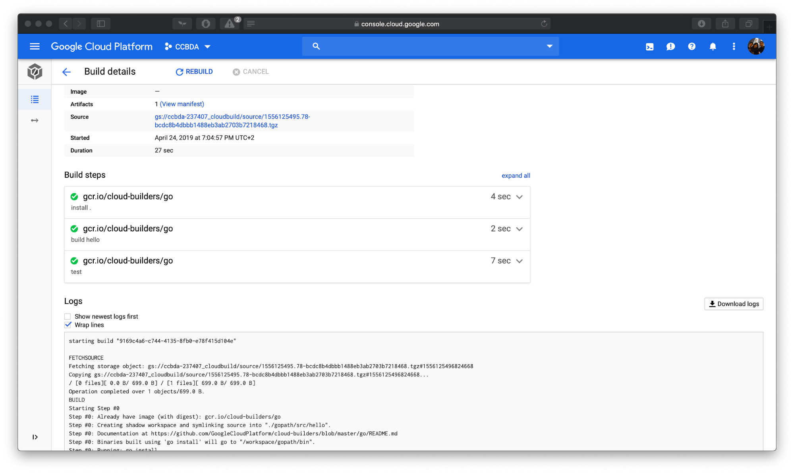
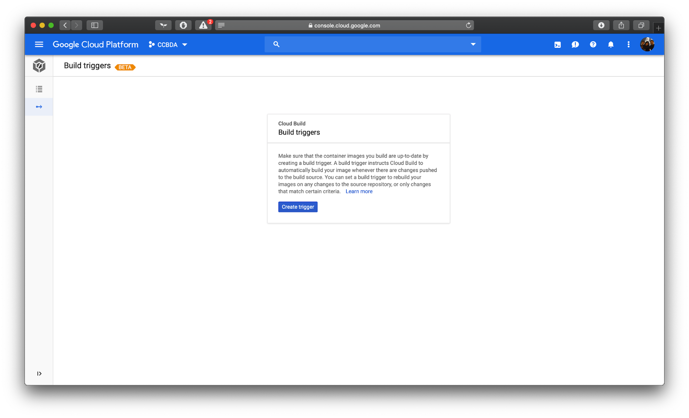
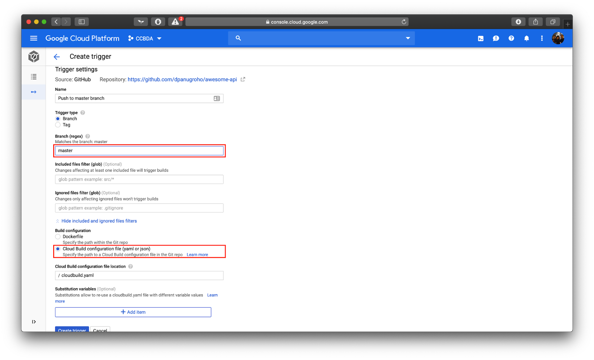
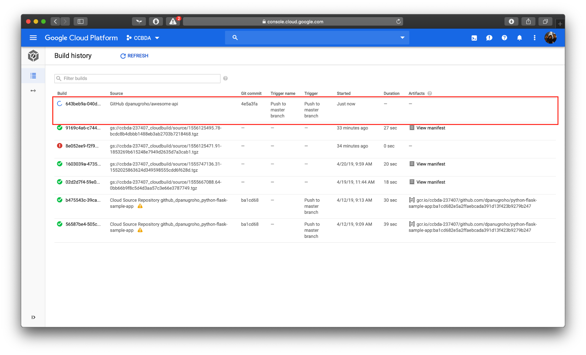
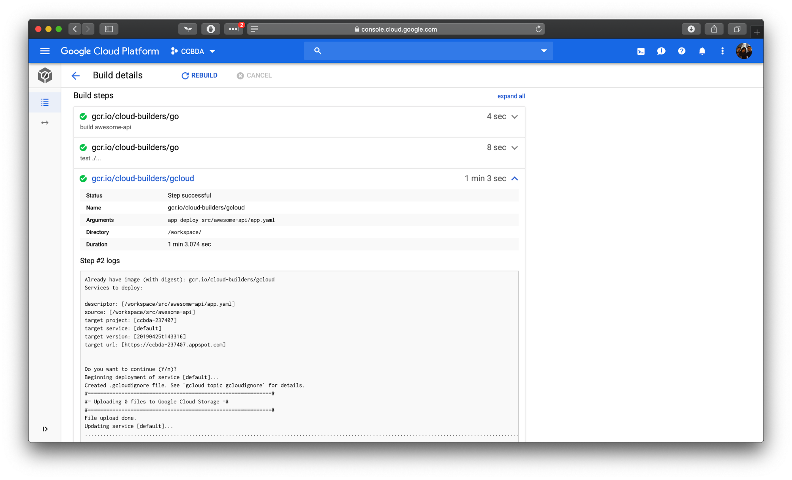

# Cloud Architecture for CI/CD

## Introduction


As startup industries getting the hype for the last few years, people start to consider taking a lean startup approach. Lean startup approach focuses on spend as less time, effort, and money as possible to launch your startup. This is important nowadays because it is less risky as your initial objective is to validate your idea.



To apply this lean startup, it is common to use a methodology called Agile. Unlike traditional methodology approaches like Waterfall, Agile allows startups to develop idea, build product, push into market, and analyze it quickly and iteratively. Startup is a never ending iterative process to test products (features) after all.

To achieve this fast pace flow, there should be a way to shorten product development time. Some repetitive tasks that used to be running manually can be automatically executed. In software engineering practice, there exists an automation pipeline that will help developers to quickly test out their code and deliver it to users as soon as possible, this is what we call CI/CD.

## What is CI/CD?


CI Integration/Continuous Delivery (or Continuous Deployment) is a pipeline of automation to integrate and deliver code changes as soon as possible. Some people mix up CI/CD with Agile and DevOps. Basically, CI/CD focuses on the software-defined lifecycles and its tools and how those tools can be automated. Unlike Agile which focuses more on the development and changes while DevOps focuses on responsiveness. As the name suggest, this pipeline can be broken down into two phases as follows.


### **Continuous Integration**
Continuous Integration is a practice in modern agile practice that enables developers to routinely integrating code changes into main branch of a repository. Furthermore, the changs will automatically tested as early as the new code hit the repository.

Continuous integration bring into table several benefits in particular early feedbacks on code changes. The traditional approach may take a few hours or even days to test new changes since they need to allocate people to test it manually and even end-clients that can take days to test. By the time feedbacks from these people went in, new changes already went in. Continuous Integration resolve this issue by applying automations in testing new code changes. This resulted in the process that usually take manual approach that may need a few hours or even days to test can be done in a few minutes or if it is a very complex project then just over an hour at most. Continuous Integration have two major phases: compilation and test.


The compilation part basically test out if the code can be compiled. In case of scripting language applications such as Python and Javascript this means to test that the codebase is syntactically correct and can be executed. If there are some problems in trying to compile the project then the system will halt on this process and will report to developers especially the one that make the code changes. This resulted in early feedback for developers to know that their code not compilable.

The test part of Continuous Integration pipeline make sure that the code works as designed. This can be broken down into several type of tests.

1. **Unit tests**
   
   This is a common type of test that already exists even before Continuous Integration come into existence. It is a set of tests predefined by developers that working on specific feature and check if methods and code that developers write for that particular feature is working. Note that this kind of test only covers code level tests and does not take into account of the functional test.

2. **API tests**

   As microservices getting more popular, it is common that a big application will be broken down into several microservices instead of a one huge application. This resulted in a need of tests synchronization between modules. This is where API tests resolve this problem by hitting endpoints from different modules and see if both services working jointly together.

3. **Functional tests**
   
   To overcome issue with previous tests that does not take into consideration the user interaction on the user. Example of functional test frameworks in testing web application are HTTPUnit and Selenium. Functional tests are built by modeling user workflows in the app and instead of users doing it themselves, the test framework will do it for developers. However, functional tests have several issues disadvantages. Firstly, there can be issue in timing. For instance if the test is about testing a login page where user will input their email address and password and wait for user’s home page to show up. The way it usually be done is that tester set a delay to wait for the login page to show up, however there can be cases in slow network where the page is not loaded up yet and the test will return fail. That is why creating a functional test should be carefully thought. Also since it require user-like interactions then running functional test will take more time. However, the advantages are far more than its disadvantages as the closer the test to the actual user workflow, the automated tests will need less time.

These tests that run in Continuous Integration pipeline will typically implemented in all branches. This is done so that each developers can work and get feedback independently. Then when the code has been tested in that particular branch they can merge it to the common branch where developers merged their work to (before staging and production branch). After that, the common branch will be against tested with various merged code changes from other branches. It is possible that even when the codebase is individually tested in their own branch that the the code passed the test, but when it reach the common branch it is not. This can be happened due to the wrong resolvement of merge conflict or two or more new branches involving a shared affected code.

### **Continuous Delivery (CD)**
As code changes have been evaluated in Continuous Integration as long as the tests are well-defined and cover most of the cases then it is safe to say that the code exist in the main branch is considered ready to be deployed. However note that Continuous Delivery still require human interaction to deploy the ready-to-deploy code to the actual production. There is a more radical approach that is called Continuous Deployment (CD).

### **Continuous Deployment (CD)**
Continuous Deployment is a further improvement of Continuous Delivery where instead of requiring human interaction to deploy the code, it can automatically shipping changes to production. This is a vulnerable process especially if the test cases are not defined carefully.

### **Continuous Delivery vs Continuous Deployment**
This will depends on the way the company works. There can be some company who fit more with Continuous Delivery and others who suited more with Continuous Deployment. Continuous Deployment makes more sense if the company wants its users to have the newest and latest features as soon as they are ready. For example Flickr does Continuous Deployment to make sure that their users can use newest features as soon as they are ready. On the other hand, software houses or client-based projects are more suitable to use Continuous Delivery as business people in the team want to release the newly created feature at a certain date. For example, in a software house project there can be negotiation for the price of the new feature. Unless this negotiation is finished then the software house will not release the new feature to its client. The middle ground for this kind of case is to do a Continuous Deployment to staging environment and Continuous Delivery in production environment. By applying such schema, then team members can still try out and test new features on their own in the staging environment as soon as they are ready. But, the client or end users will only receive new update after certain time defined by business team.

## Cloud Service for CI/CD
In this section we will cover provider that offer CI/CD solution. Two of the big player in this area are Google Cloud Platform (GCP) and Amazon Web Service (AWS).

### **Google Cloud Platform (GCP)**
Google cloud platform offers services that let us to create a CI/CD pipeline that is fully in their environment as well as integrate it with external services. The CI service is provided by Google Cloud Build. This service will execute the predefined build steps, such as compiling and creating binary, running the test, and storing the artifact. The build execution can be triggered manually or by connecting it with the git repository of the code. The former option allows Google Cloud Build to automatically execute the build once there is a push or merge to a specific branch or tag. The git repository can be from Google Cloud Source Repository offered by Google Cloud Platform or from a Github repository.

The build will execute steps that are defined in the yaml file. Typically it consist of building, testing, and storing the artefact/output produced by the build step. The building step will build the code into an artefact, such as an executable program or a docker image. Once it is successfully built, it continue the pipeline by executing the test files. If all test passed, it will execute the next step on the yaml file, and if not all test are passed it will stop the build and output the detail of the error on the Google Cloud Build dashboard. The artifact of the successfully built is then stored in a bucket in Google Cloud Storage service. 




We can further pipeline the previous steps by deploying the artefact on the Google App Engine or Google Kubernetes Engine to accomplish the CD part. In order to do that, we need to specify the deployment command on the yaml configuration file.

### **Amazon Web Service (AWS)**
The CI task can be built on AWS by using AWS CloudWatch, AWS CodeCommit or a Github repository, and AWS CodeBuild. AWS CloudWatch will be used to catch events when a pull request to the AWS CodeCommit or Github repository is made. After detecting a pull request (e.g to the master branch), AWS CloudWatch will trigger AWS CloudBuild to start executing the build commands. If we use AWS CodeCommit instead of Github repository, AWS CloudWatch can also be configured to catch the event when the build is finished. Hence we can check the build result right from the AWS CodeCommit, along with which commit or pull request triggering the build.

The AWS CloudBuild itself is a running a docker container to execute the build steps that we defined. Its flexibility allow us to expand this base container to add more functionality that we need for our build command. It support continuous scaling, hence it can automatically spawn more instance of the container when the number of build executed at the same time increase. We are charged as you go, which means we only charged when the service actually perform a build command and will not be charged when it is idle. Similar to Google Cloud Build, AWS CloudBuild also provide a dashboard where we can see which builds is success and which are not. 

We can continue the current pipeline by adding the continuous delivery part using AWS CodeDeploy. This service helps us to coordinate deployment of successfully built and tested to AWS EC2 instances. It also help us to deploy the same application to each deployment environment, which guarantee consistency compared to manually deploy the app to each deployment environment. AWS CodeDeploy also keep application to be highly available by tracking health of each deployment. This service also don’t have certain cost and we only pay for the resources used to as the deployment environment.



Lastly, the whole process can be organized using AWS CodePipeline. This service provide an easy graphical user interface to organize our CI/CD  pipeline. For example we can chain the CI steps of AWS CodeCommit, AWS CloudWatch and AWS CloudBuild with AWS CodeDeploy to build a complete pipeline. We can also add custom logic on each step of the pipeline using as a AWS Lambda function. Besides automatic execution, AWS CodePipeline allows us to have manual approval at any step before continuing.

### **Other Services**
Besides GCP and AWS, there are other services offering cloud CI/CD using their own platform that run on their own infrastructure. The example of this category is CircleCI and TravisCI. Meanwhile other services offer an additional layer to make CI/CD even simpler using simpler user interface and less configuration. However, they the process are executed on either AWS or GCP under the hood. Examples of these services are CodeShip and CodeFresh.

## Use Case Example: CI/CD Pipeline for Simple Golang WebApp on GCP
In this section we are going to demonstrate how to create a CI/CD pipeline using Google Cloud Build and Google App Engine. This example assume that we already have a GCP account and a new GCP project already set up. We will use Google Cloud Build to execute our build steps, Github repository to store our code, Google Cloud Storage to store our artefact, and Google App Engine to deploy our artefact.

The application that is going to be used as example is a simple web application written in Go. The project will contain two Go files: main.go which contain code for the web application and main_test.go which contain the tests for it. We will introduce minor change that will be pushed on non-master branch and later merged to master to trigger the build and deployment. The initial content of main.go and main_test.go is as follows:

```go
// main.go
package main

import (
    "fmt"
    "net/http"
)

func homeHandler() func(w http.ResponseWriter, r *http.Request) {
    return func(w http.ResponseWriter, r *http.Request) {
        fmt.Fprintf(w, "Hello World! ")
    }
}

func main() {
    http.HandleFunc("/", homeHandler())
    http.ListenAndServe(":8080", nil)
}
```

```go
// main_test.go
package main

import (
    "net/http"
    "net/http/httptest"
    "testing"
)

func TestMain(t *testing.T) {
    http.HandleFunc("/", homeHandler())
    req, _ := http.NewRequest("GET", "", nil)
    w := httptest.NewRecorder()
    hf := http.HandlerFunc(homeHandler())
    hf.ServeHTTP(w, req)
    if w.Code != http.StatusOK {
        t.Errorf("Home page didn't return %v", http.StatusOK)
    }
}
```

We can start building the pipeline by preparing the Google Cloud Storage bucket to store our build artefact. We can do this using command line that is executed using the Cloud Shell from our project’s dashboard.



In order to create a new bucket, we can use the following command:
```
gsutil mb gs://[BUCKET_NAME]/
```

The next step is to create the build step. In Google Cloud Build, the build steps is written in a cloudbuild.yaml file following certain structure. We will use the standard build-test-store-deploy pipeline for this demo. Hence the content of build.yaml is as follows:

```yaml
steps:
- name: 'gcr.io/cloud-builders/go'
 args: ['build', 'awesome-api']
- name: "gcr.io/cloud-builders/go"
 args: ["test",'./...']
artifacts:
 objects:
   location: 'gs://awesome-api-bin'
   paths: ['awesome-api']
```

The three files should be stored in the same directory, i.e in the following schema:
```
.
├── cloudbuild.yaml
└── src
    └── awesome-api
        ├── main.go
        └── main_test.go
```
As it is already configured in the cloudbuild.yaml file, we can now test our build pipeline by triggering it manually to see if our code and configuration working correctly with GCP Cloud Build. Note that since the file are stored locally in our own machine, we have to use GCP command from the GCP SDK that has to be already configured in our local machine. We can trigger the build using the following command:
```
gcloud builds submit
```

We can check our build log and detail by going to Google Cloud Build menu from our GCP project’s dashboard. 



We can also click on one of the build to see detail of the build, such as the duration, which step that cause error, and also the complete log of the build task.



Now that we already have our manual build working, we can configure the automatic triggering using github integration. First of all, we need to create a github repository to store our code. After that, we can create the trigger by going to the Triggers submenu of the Google Cloud Build and click on Create Trigger.



Next, we have to select Github as our source code result. We will need to authenticate to Github in order to access our repositories. After the authentication succeeded, it will list all of our repositories. We can then select our repository for our Go project and continue. On the following page, we have to configure which branch to trigger the build and which build configuration to use. We will use master branch as our build trigger and use the cloud build configuration file instead of docker for our build configuration. Finally, we can click Create Trigger to activate our trigger.



In order to test our trigger, we can make a small change to our code and push it to master branch. For instance, we can change the message being printed (the “Hello world” string). After we pushed the update to master branch, our trigger will immediately start our build pipeline. We can check it in the Cloud Build history.



The artifact for this build are stored in the Cloud Storage bucket that we create before. We can check it by going to Cloud Storage menu from project’s dashboard and go to the corresponding bucket.

We can chain our CI pipeline with a CD pipeline by configuring automatic deployment of our application to Google App Engine service. This can be done by configuring additional permission for our Cloud Build Account, add additional step on the cloudbuild.yaml file, and add add a app.yaml file to store configuration for the Google App Engine.

Our Cloud Build Account need the App Engine Admin role. We can add this role by going to IAM page from our project’s dashboard, select our Cloud Build Account (``[OUR-PROJECT-NUMBER]@cloudbuild.gserviceaccount.com``), then add App Engine → App Engine Admin role. Next, we add the following step to our cloudbuild.yaml file right after the test step:
```yaml
# cloudbuild.yaml
- name: 'gcr.io/cloud-builders/gcloud'
 args: ['app', 'deploy','src/awesome-api/app.yaml']
 timeout: '600s'
 ```

Finally, we add app.yaml configuration for app engine with the following content:

```yaml
# app.yaml
runtime: go112
```

We can test our pipeline by calling ``gcloud builds submit`` manually or by committing our change to cloudbuild.yaml and push it. If we check the Cloud Build History, we can see that the CD step has been successfully executed. 



## Conclusion
As agile methodology getting more popular from time to time, this makes CI/CD an integral part of software development ecosystem. It is also has been proven to help cutting development time by automatically run tests and deployment rather than doing it manually. Thus, CI/CD is something that every software developers should invest some time to learn and apply it to their projects as it will help developers in the long run.

## References
- https://www.slideshare.net/startuplessonslearned/2012-05-15-eric-ries-the-lean-startup-pwc-canada/22-Minimize_TOTAL_time_through_the
- http://www.fluper.com/blog/implement-agile-scrum-methodology-effortlessly/
- https://cellcode.us/quotes/life-cycle-development-phases-agile.html
- https://www.edureka.co/blog/ci-cd-pipeline/
- https://docs.travis-ci.com/user/apps/
- http://markjberger.com/testing-web-apps-in-golang/
- https://www.sohamkamani.com/blog/2017/09/13/how-to-build-a-web-application-in-golang/ 
- https://www.atlassian.com/continuous-delivery/continuous-integration
- https://www.atlassian.com/continuous-delivery/continuous-deployment
- https://www.coveros.com/continuous-delivery-means-deployment-is-a-business-decision/