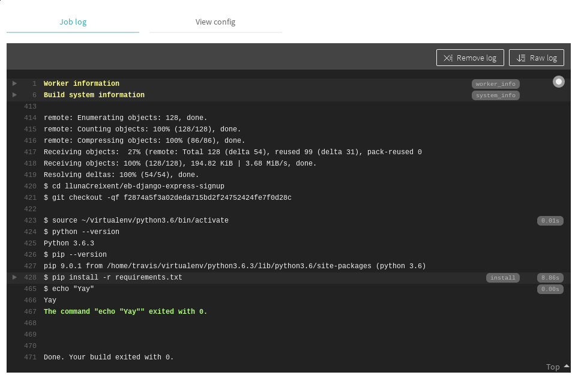

Authors: Elena San Miguel Pérez, Anthony Nixon

Continuous Integration
===

## Introduction

**Continous Integration requires that developers integrate to a shared repository for an automated build several times a day.**

> **Clarification** You may have also heard the terms *Continuous Delivery* and *Continuous Deployment*. All three terms are related but slightly different. Depending who you ask, *Continuous Delivery* is after the is the process of building code and releasing to a staging/preproduction environment while *Continous Deployment* means every change is automatically deployed to production: this is useful when you plan that the *client* be the actual tester. See the below graphic for an idea of how things stack. However, it's also quite common for someone to say be referring to ALL three stages under the umbrella term *Continous Integration*.
>

>
> Img Source: https://stackoverflow.com/questions/28608015/continuous-integration-vs-continuous-delivery-vs-continuous-deployment

In the past software development tended to follow a waterfall approach where the specifications and requirements were gathered together and a top-down delivery methodology was implemented. The idea was to build the whole software product exactly as the customer requested (or as we interpret the request of the customer) then when everything is working perfectly - release the product. There are many issues with this approach that we will not go into here but you can look find out more by researching 'problems with waterfall software development'. After realizing these drawbacks, software development has mostly moved to an [Agile methodology](https://agilemanifesto.org/), which is proactive and client driven and stresses iteration and incremental releases in order to gain feedback and have releases that are immediately useful and always current.

This transition to Agile addresses the team->client relationship, however, it was seen that there can also be improvements in the developer->team dynamic. Even with an Agile methodology driving and organization, it is often the case that individual programmers would work on a feature in its entirety (or a large portion of it) before integrating into the core product. This looks suspiciously similar to the waterfall appoach, although at a different level of abstraction.

#### Traditional Integration (waterfall)

Continuous Integrations further extends the core values of Agile methodology to the build, testing, and deployment dynamic of the development process.

#### Continuous Integration (agile)

In this way, teams can make use be more pro-active and less re-active to the software from the bottom up.

Motivation and Benefits
---

One of the primary challenges in software development is the integration of separate contributions into the larger product. If one developer is in charge of component A and another of component B, they may be developing independantly based on assumptions or test data which is out-dated or incorrect. When they finally push their code to a common branch, it is often the case that the application either contains bugs, fails tests, or doesn't even build! Things get exponentially more complex as a project scales up further accross multiple teams, where MANY hours of work might occur before an attempted integration.

*Continous Integration's main advantage is that it can minimize the amount of hours lost by ensuring that code can work properly together and be deployed successfully at any time.*

Along with this main goal are many other important benefits and side effects. We will discuss some of the main features we find of particular interest here, but for even more benefits please refer to some sources below that express additional opinions and possible advantages.

1) Bugs are detected EARLY
    * because the integration is being done so frequently (multiple times per day)
2) Removes the stress of upcoming release dates
    * having a ready to go production branch means that the code is almost always ready to relase
3) There is a constant availability of a build suitable for testing, demo, and release.
    * this is very benefitial because perhaps you have a client come in unexpectely, or you are considering purchasing a third party addition to your code base and want to see if it will integrate with what you have right now.
4) Ongoing metrics and feedback
    * every time an integration takes place you get test results and build logs. This allows you do track the performance and state of the project over time which might lead to improvements in performance or feedback.
5) Improve communication in your team and understanding of the code
    * all contributors regularly touch base with the rest of the code. This allows users to understand more of the whole project and improves communication and team interactions.
6) Scale easily
    * having a foundation of automated testing and deployment lets your team leverage infrastructure as code. Everything preconfigured.

###### *Pipeline diagram illustrating the CI process - https://forge.etsi.org/gitlab/help/ci/README.md*

> Sources and more benefits at these sites:
> https://dzone.com/articles/9-bene-ts-of-continuous-integration
> https://apiumtech.com/blog/top-benefits-of-continuous-integration-2/

Reviews and Experiences with the CI process
---

When you are considering whether continuous integration will work well with your team, it's useful to research how it has been deployed in other teams and gather opinions on what has worked and what were challenges. Continous Integration benefits are numerous and there is a good chance it will have a positive effect on your organization but in this section we will try to provide some example experiences and reviews gathered from different sources.

---

*Excerpts from Parveen Khan* - [A Tester's Story of Adapting to the New World of Pipelines](https://www.mabl.com/blog/testers-story-adapting-to-continuous-integration)

In her post, Parveen discusses some of the key concerns she had when the team decided to switch to a continuous integration system. She was curious about how it would affect her current test process, what changes *she* would have to make, what do are the benefits of pipelines and how do they work?

One thing that helped her was to draw the pipelines and visualize them. "I sat with my colleagues and said: "Let's please visualize the pipeline by drawing it on a big white board." They  agreed and we had a whole discussion around these pipelines."

Her team had a discussion and come up with their own version of of a Continuous Integration pipeline because there was no definitive structure.

Their pipeline was:

static code analysis->unit tests->integration tests. Later they added a build verification test and eventually some regression testing.

"Each morning I could see the results of which tests where passed and which were failed and the difference was that I could add the build number while raising the issue, so it got easier for a developer to find the root cause."

---

*Excerpts from Paul McGillivray* - [The life-changing wonder of Continuous Integration and Deployment](https://medium.freecodecamp.org/the-life-changing-wonder-of-continuous-integration-and-deployment-97f833505eea)

"Continuous Integration and Deployment is to me the most exciting development of all in recent years." Paul praises the automation and high availability of the builds. He say it relieved a lot of the human burden such as checklists, and remembering steps; now he just does a Git check-in and everything is deployed.

However, in the article, he says the setup isn't out of the box or completely straight forward. An example he gave from his use case was online applications which use session ID's need to be re-coded to use something like Azure Redis Cache (his team is on the Microsoft ecosystem) to hold states because they need to be accessible from multiple instances and not lost when servers are changed.

Despite these nuances, his conclusion is that "It really feels like we’re at the point where this kind of automation provides a juicy layer of immediacy, interaction and intelligence that has always been needed in managing these processes, and the result is a huge improvement in reliability and speed and quality".

---

*Excerpts from Yegor Bugayenko* - [Why Continuous Integration Doesn't Work](https://devops.com/continuous-integration-doesnt-work/)

Yegor has worked on many large projects with different teams and in his post he describes form his experience when he's seen continuous integration not working well.

He says it often happens with larger teams. The larger the team the more often things break and then fixes start falling behind. Another issue which could be a common barrier to continuous integration is when clean builds start to conflict with business interest. He states the case where sometimes, when a CI initiative falls behind, the code that broke a new push was already in the master branch and delivered to end-users. Often managers will take a short sighted approach and think "What’s the urgency of fixing some tests if business value was already delivered?"

He has his own solution to this issue which he proposes - "prohibit anyone from merging anything into master and create scripts that anyone can call. The script will merge, test, and commit."

His perspective sheds some light on how difficulties can arise in adopting new processes despite.

---

As we can see from the sampling of experiences and opinions above, the common trend seems to be there is often a sense of uncertainty or confusing when starting with CI but generally, the benefits seem to outweight the costs for more organizations. Like any agile process much of the return on investment relies on how well the team and stake-holders attach to the system and follow it in a disciplined manner. Although continuous integration offers many opportunities to encourage proper habits and contributions by further automating processes.

Basic Process for Implementation
---

If you've decided that you'd like to create a pipeline and utilize Continuous Integration you should be aware there is no perfect template or universally defined system for how to go about it. It will mostly depend on your goals and use case. However, there are some fundamentals that are useful to follow.

In 2006, Martin Fowler, a software engineer originally from London published an article on Continuous Integration describing key elements through his international company ThoughtWorks. It has since been cited 617 times according to Google Scholar and the framework can be seen as a good starting point for essential elements in the Continuous Integration paradigm.

1) Maintain a Single Source Repository
2) Automate the Build
3) Make Your Build Self-Testing
4) Everyone Commits to the Mainline Every Day
5) Every Commit Should Build the Mainline on an Integration Machine
6) Keep the Build Fast
7) Test in a Clone of the Production Environment
8) Make it Easy for Anyone to Get the Latest Executable
9) Everyone can see what's happening
10) Automate Deployment

These are more or less the essential elements you want to build your pipeline around to have a successful and proactive approach. If you are fortunate enough to attend our presentation on this paper then we will go furhter into what these stages entail, otherwise we encourage you to take a look at the original paper linked [here](http://www.dccia.ua.es/dccia/inf/asignaturas/MADS/2013-14/lecturas/10_Fowler_Continuous_Integration.pdf).

Common Tools
---

Becuase there are many different approaches to applying continuous integration into your projects it's useful to know what tools are out there and what are their main features. Do they coexist well with your existing workflow? Are there special features that can leverage your current stack?

One online portal called [JaxEnter](https://jaxenter.com/technology-trends-2017-these-are-the-most-popular-tools-132109.html) ran a technology trends survey in 2017 focusing on the most popular tools. Below is a graph of their results regarding Continous Integration.

From the results we can see the overwhelming interest was focused around Jenkins. Indeed, even if you have no knowledge of continous integration you may have heard the name of this tool in casual tech circles. Second, is Travis CI and third is Teamcity.

We visited the product pages of the top three to gather some of the most publicized selling points that were being marketed.

* Jenkins
    * OpenSource
    * Packages for Unix, Windows, OSX
    * Custom plugins
    * Large community

* Travis
    * OpenSource
    * Automated pull request verification
    * Notifactions by Email, Slack, HipChat and more
    * Extended API

* TeamCity
    * Excellent Visual Studio Support - much functionality built-in without needing external scripts
    * Detailed history reports
    * Dynamic scaling of build agents on Amazon, Microsoft, and VMware stacks.

Implementing Continuous Integration with Travis CI
---

To get firsthand experience in the process of Continuous Integration we chose to give TraveisCI a test run.

We can use TravisCI in our GitHub hosted code repository. Either for public and private repositories, but with different conditions. In this case we need a GitHub account and owner permissions for a project hosted on GitHub.

TravisCI offers several services with different pricing suited for different team sizes. Including a free CI service for Open Source projects.

We followed [the tutorial](https://docs.travis-ci.com/user/tutorial/) from Travis website to get everything up and running. TravisCI supports many [programming languages](https://docs.travis-ci.com/user/languages/) including Python. For our testing we just forked one of the projects developed in the CCBDA labs (_eb-django-express-signup_).

All the configuration needed to use Travis CI is a file in your repository (`travis.yml`). This file includes some optional sections and some other mandatory.

The build of the software is made by phases, which are the sequential steps of a job. For example, the `install` phase, comes before the `script` phase, which comes before the optional `deploy` phase. In the configuration file we can identify the phases.

A job is an automated process that clones your repository into a virtual environment and then carries out a series of phases such as compiling your code, running tests, etc. A job fails if the return code of the script phase is non zero. In the following picture we can see the console of the execution of the build. A build is a group of jobs.

In the following picture we can see how jobs are either passed of failed.

## Full References List

https://raco.fib.upc.edu/practiques/practica.jsp?id=54673&espai=270676

https://github.com/CCBDA-UPC/Research-projects-2019/blob/master/README.md

https://www.pechakucha.com/faq

https://www.pechakucha.com/presentations

https://travis-ci.org/

https://agilemanifesto.org/

https://stackify.com/top-continuous-integration-tools/

https://docs.travis-ci.com/user/tutorial/

https://sqa.stackexchange.com/questions/8106/trying-to-understand-what-travis-ci-does-and-when-it-should-be-used

https://jaxenter.com/technology-trends-2017-these-are-the-most-popular-tools-132109.html

http://www.dccia.ua.es/dccia/inf/asignaturas/MADS/2013-14/lecturas/10_Fowler_Continuous_Integration.pdf

https://devops.com/continuous-integration-doesnt-work/

https://medium.freecodecamp.org/the-life-changing-wonder-of-continuous-integration-and-deployment-97f833505eea

https://www.mabl.com/blog/testers-story-adapting-to-continuous-integration

https://dzone.com/articles/9-bene-ts-of-continuous-integration

https://apiumtech.com/blog/top-benefits-of-continuous-integration-2/

https://stackify.com/continuous-delivery-vs-continuous-deployment-vs-continuous-integration

###### tags: `CI` `Continuous Integration`
