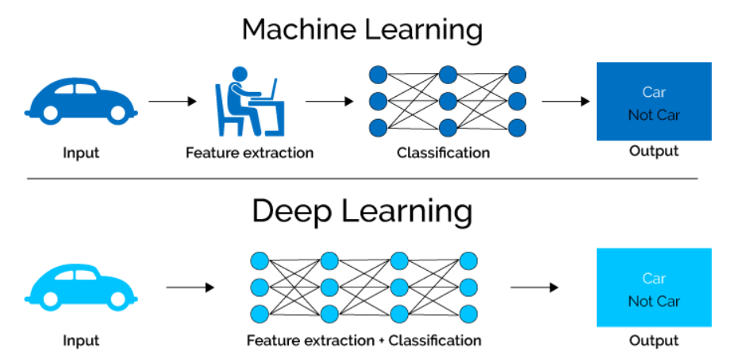

# Deep learning in the cloud
## Introduction
Deep learning (DL) methods are very hot in the big data era as they have dramatically improved the state-of-the-art in various fields, such as speech recognition, visual object recognition, object detection and many other domains such as drug discovery and genomics [1]. Deep nets have brought breakthroughs in processing images, video, speech and audio, whereas recurrent nets have shone light on sequential data such as text and speech and reinforcement learning has achieved superhuman level performance in games that were thought unsolvable like Go, Dota or even Atari games  [3,4,5]. It is no wonder that the latest Turing Award was won by 3 pioneers in deep learning [2]. With this project we aim to explore the cloud services offered to train and use deep learning models. We also want to provide some rules of thumb that will help people to understand if they want to use the cloud or build their own cluster for deep learning.

## Deep learning basics
Deep learning refers to a class of machine learning algorithms that have neural networks as the building block (Figure 1). Neural networks are biologically inspired from neurons in the brain; receive a number of inputs from other networks and depending on them and an activation function, they are “activated” or not to send input to neurons on the next layer (Figure 2).
  
")

Figure 1: Similarity of biological neuron and computational neuron (via https://www.quora.com/What-is-the-differences-between-artificial-neural-network-computer-science-and-biological-neural-network )

  

Figure 2: Simple neural network

The deep part of the name comes simply from including multiple hidden layers in a model. Practically, it has been shown that many layers help a model achieve better performance when a lot of data are used for training. Figure 3 shows a VVGNET, a commonly used deep learning model that has around 20 layers.
  

Figure 3: Example of Alexnet and VGG16, commonly used deep learning  model via https://www.researchgate.net/figure/AlexNet-and-VGGNet-architecture_fig1_282270749 

## Superiority against other ML algorithms
They are very relevant today as they achieve state-of-the-art and even superhuman level performance in many tasks that have been thought impossible in previous years (image classification, action recognition in videos, speech-to-text).

This is basically achieved by two main features of deep learning algorithms:
1. Their performance scales well with the amount of data that they receive as input. (Figure 4)
  

Figure 4: Scaling of deep learning performance compared to other algorithms via http://www.slideshare.net/ExtractConf  
- They are able to extract useful features directly from raw data (Figure 5). So, the need of a field expert is less and less needed.

  

Figure 5: Feature extraction in deep learning compared to types of machine learning algorithms taken from https://towardsdatascience.com/why-deep-learning-is-needed-over-traditional-machine-learning-1b6a99177063 .

## When (not) to use
Generally, Deep Learning should be considered as another tool in the toolset of a data scientist. It does not make sense to use it just because of the hype. 

As a rule of thumb, you can consider deep learning when:
* You have a ton of data (at least several GBs)
* You have unstructured data, like videos, speech, sound, text, images, etc...

Normally, you don’t want to use deep learning when:
* You have very few data. However, there have been many cases where pre-trained deep models have been used for transfer learning in small datasets.
* You need your model to be interpretable, meaning that you want to know why it predicted what it predicted. DL models should be thought as “black boxes” in general.
* You have low computing capacity requirements. As we will also see later, DL models need quite powerful resources to train and predict
* You have a problem that may be solved much more easily. Cloud many times provides complete services like speech recognition, translation, image recognition that can be solved with deep learning, but it would be an overkill to do so, as full-featured services exist for that and it rarely is profitable to not use them and develop them in-house. 

## Computing DL
In deep learning computations we have mainly two algorithms that run continuously:
1. A forward pass - Input is passed through the neurons to generate an output.
2. A backward pass - Output error is passed through the neurons in the opposite direction to train neurons (change the neuron weights, so that output error becomes smaller)
The combination of these is called backpropagation and is used for training a DL model. Forward pass is used for inference (predictions).
Both these operations can be easily translated with linear algebra into matrix multiplications. Matrix multiplication is a very highly parallelizable operation that profits a lot from the use of GPUs. While a CPU core is much more complex and faster than its GPU counterpart, a GPU features thousands of cores and this is what makes GPUs suitable for DL.  Figure 6 shows how a CPU cluster compares to GPUs when it comes to inferring with DL models. Typically, GPUs can be around 10x faster when compared to high-performance CPUs.

  

Figure 6: CPU vs GPU for DL model inference
https://azure.microsoft.com/en-us/blog/gpus-vs-cpus-for-deployment-of-deep-learning-models/ 

## Cloud for DL
In general, as we discussed in the previous section, training and using DL models requires good resources in GPUs. You do not want to invest in a high-end GPU, if all you want is to try DL or use it for just a project and then move to the next. You may also want to try to see how many GPUs or what kind makes sense for your to buy. This is where the Cloud comes into play. There are free options to test ideas, without burning your PC. Scaling up is a matter of changing configuration.

But bear in mind that training a DL model can take a lot of time. Training on Imagenet takes about a whole day of processing time. OpenAI Five (Dota game) trained over 10 realtime months in a GPU cluster [5]. Alpha Zero[3] trained in 40 days in a Google Tensor Processing Unit (TPU) cluster.

  

Figure 7: DL takes time meme

## Cloud choices 
Today there are more than 30 players[6] on the market, who provide cloud resources for Deep learning tasks (with GPU acceleration). It might be very hard to decide on something from this wide list, starting Deep learning project from scratch, so we created a short overview of the most popular options. 

### Google Cloud Compute Engine
  

Figure 8: Google Cloud Compute Engine icon

Google Cloud Compute Engine provides powerful and customizable services for Deep learning: it includes both hardware options (e.g. VMs with enhances GPU) and software (VM images with pre-installed software for Deep learning tasks). Moreover, this is the only option for using Tensor Process Unit (as of October 25, 2018). Even though Google Cloud is easier to configure and launch comparing to AWS, it has less transparent pricing – sometimes it’s hard to estimate the final bill. However, this cloud provider has a $300 free tier, which is a great amount to start.
In addition to that, Google provides Preemptible VMs for short-term and fault tolerant jobs: they can be up to 80% cheaper than regular machines, but require more configuration.

### Amazon Web Services
  

Figure 9: AWS icon

According to usage statistics and job listings for Data Scientists, AWS today is an industry standard. Due to the fact that AWS provides one of the widest showcases of VMs and images, so as other configuration options, this provider is harder to use because of configuration difficulties, so one of popular advice for people who start Deep learning - do not use AWS if you are not familiar with the platform or you are not-experienced programmer. Just like Google Cloud Compute Engine, it provides a lot of hardware and software options for Deep learning tasks but doesn't have TPU option. You can start from a p2.xlarge ec2 instance with one NVIDIA K80 with 12GB and go up to a p3dn.24xlarge instance with 8 NVIDIA Tesla V100 GPUs with a total of 256GB memory.

### Google Colab
  

Figure 10: Google Colab icon

This option is less like 2 previous ones, it is out-of-the-box solution for Deep learning: the user just needs to go to Colab web page (https://colab.research.google.com/) and he is ready to start. This service has jupyter-like GUI, and it automatically connects to VM with Nvidia K80 12GB GPU and 13 GB RAM. It is also possible to connect Colab with any other VM, but it requires configuring this VM. Colab has native support for TensorFlow and Keras, but the best part about this option is that it is completely for free.
Colab has native integration with GitHub and Google Drive, and also allows collaborators to leave comments in the notebook, which make it a great tool to work on Deep learning project with a team.

### Comparison

There are many ways to compare options that we described above. First of all let’s look at cost and execution time of some typical task:

  

Figure 11: specs of VMs and results of running experiments 
Taken from https://towardsdatascience.com/maximize-your-gpu-dollars-a9133f4e546a

Here we can see again that Colab with its free usage is the most cost-effective option to use, and the least cost-effective, but the fastest and the most expensive is AWS with V100 x 4 Nvidia GPU configuration[7].

Another way to compare cloud providers is to look at their usability characteristics: supported programming languages, frameworks, UX, etc. In this case, we shouldn’t compare Colab with other options, since it is SaaS, so it provides more of a service to start Deep learning programming right away (even though it is configurable and able to connect to other cloud platforms). If we look at AWS and Google Cloud Compute Engine, we can say that the last option is more tailored for Deep learning since it provides TPU and configuration is less confusing, so data scientist can launch VM easily and focus on Deep learning tasks. On the other hand, AWS is an industry standard: the majority of people and businesses use it, and as the biggest player on the market it provides one of the widest showcases for hardware and software, hence, it gives the ability to tailor the cloud architecture for a given project in a more precise way.

## Different frameworks choices
Due to the fact that Deep learning is one of the hottest topics today and there exist many different frameworks: for instance, Wikipedia page for deep-learning software has 19 different platforms. Here we tried to focus on the most popular options.

### Tensorflow
  

Figure 12: Tensorflow icon

Tensorflow is an end-to-end open source machine learning platform, it was developed by the Google Brain team for internal Google use, and on November 9, 2015, it was released under the Apache 2.0 open-source license. This is the only platform that has native support for Tensor Process Unit, which makes it the fastest platform in terms of executing learning tasks. TensorFlow has stable Python and C APIs and multiple API without backward compatibility guarantee (C++, Go, Java, JavaScript, and Swift). Based on TensorFlow, Google creates multiple products:
* TensorFlow Extended – an end-to-end platform for preparing data, training, validating, and deploying models in large production environments
* TensorFlow Lite – lightweight library for deploying models on mobile and embedded devices
* TensorFlow.js – JavaScript library for training and deploying models in the browser and on Node.js
TensorFlow works with Deep learning models on a low level (basic concept is Tensor), which gives researchers and data scientists a lot of capabilities to work on state-of-the-art and tailored for special use-case models.

TensorFlow provides 3 main key characteristics that make it an industry standard.
1. Easy model building: the library has a lot of ready-to-use elements for start modeling, so as integration with other tools (such as Keras)
2. Robust ML production anywhere: a developer has multiple ways to build the model  – from on-premises to the cloud, within the most popular platforms and devices
3. Powerful experimentation for research: low-level access to model gives a lot of opportunities to researches and industries

### PyTorch
  

Figure 13: PyTorch icon

PyTorch is an open source deep learning platform that provides a seamless path from research prototyping to production deployment. PyTorch was primarily developed by Facebook's artificial-intelligence research group and Uber's "Pyro" team. PyTorch supports Python and C++ and uses CUDA friendly tensors, which gives the platform strong GPU acceleration. Facebook also released several products that allow easy use of PyTorch:
* Glow – machine learning compiler that accelerates the performance of deep learning frameworks on different hardware platforms
* PyTorch Geometric – library for deep learning on irregular input data such as graphs, point clouds, and manifolds
* Skorch – high-level library for PyTorch that provides full scikit-learn compatibility
PyTorch, just like TensorFlow, gives developers low-level access to models (basic concept is also Tensor).

### Keras
  

Figure 14: Keras icon

Keras is a high-level neural networks API, written in Python and capable of running on top of TensorFlow, CNTK, or Theano. “Being able to go from idea to result with the least possible delay is key to doing good research” is the motto of Keras, so 2 main advantages of Keras is a very steep learning curve and very small idea-to-prototype time. This leads to more high-level access to models inside, the basic concept in Keras is the layer.
Keras was developed as part of the research effort of project ONEIROS by a Google engineer.
In 2017, Google's TensorFlow team decided to support Keras in TensorFlow's core library, which lead to the use of distributed training of deep-learning models on clusters of Graphics Processing Units (GPU) and Tensor processing units (TPU).
There are 3 main principles that Keras is following.
1. User friendliness 
The focus here is on the user, even if it shrinks Keras abilities. It has consistent & simple API with the most popular concepts implemented (convolutional neural networks, recurrent neural networks).
1. Modularity 
Models are created from “bricks” - neural layers, cost functions, optimizers, initialization schemes, activation functions, and regularization schemes, they are independent and allow to build most of widespread models with few lines of code.
1. Easy extensibility 
Modules that were described in the previous section can be defined by the user, which also allows fine-tuning of models depending on the task (e.g. industry specific or research)

### Comparison
Just like cloud providers, we can compare Deep learning frameworks based on several criteria.
First of all, it makes sense to compare the specifications of each one: licensing, platform, programming languages support, support for different models, etc. 

Figure 15: Comparison of Deep learning software 
Taken from https://en.wikipedia.org/wiki/Comparison_of_deep-learning_software

The other way to compare frameworks is to look at its usability characteristics: supported programming languages, frameworks, UX, etc. Here some highlights regarding each one of platforms.
1. Keras:
* Easy to start, easy to continue 
* not the best for production projects and state of art modeling
2. Tensorflow:
* The most popular framework on the market, basically industry standard
* Gives ways to work with NN on low-level
3. PyTorch
* PyTorch has a cleaner interface and sometimes easier to use, providing the same abilities
* Way less popular, more “geek standard”

## Demo
For demo we decided to show one of Generative adversarial network (also known as GAN) in Colab environment.
Generative adversarial networks is a family of unsupervised machine learning algorithms. Within this model 2 neural networks playing a non-zero sum game: one of them generates objects (e.g. instances, audio) and another one tries to define if the input object is real or generated. In some configurations there are more than 2 networks competing, for instance Cycle GAN: there are 2 pairs of competing networks, that tries to convert one domain to another and backwards. 

  

Figure 16: Biggan showcase image

The BigGAN is capable of generating very realistic images with high fidelity and low variety gap. In the given Colab we use one of pre-trained models to generate image of certain domain, change parameters to see how they affect final result and interpolate between generated images. The last option is the most interesting one, because basically model generates 2 different objects (for instance, an image of chicken and an image of dog), and then it converts one image to another, so we can see intermediate steps.

To use it, follow the link: https://research.google.com/seedbank/seed/biggan and click “Run seed in the Colab”. After it opens and loads, click “Runtime”->”Run all”. After code is executed you can play with parameters to see how it affects results, check different domains (images), and check other models (different model configurations and for image resolutions).

# Conclusion
Deep learning is a sub-field of machine learning that becomes more and more relevant in the big data era, as its performance scales well with the amount of data it receives as input. This has allowed it to be the algorithm with state-of-the-art performance in by far the most fields. However, starting with deep learning locally needs an initial hardware investment in a good GPU or specialized hardware. This is why many times it makes sense to start exploring the field or create a proof of concept in the cloud, instead of opting to buy a gpu. In this project we have explored the DL offerings of Google and Amazon cloud vendors and also the most popular frameworks that one can use to compute DL models.

# References

[1] LeCun, Y., Bengio, Y., & Hinton, G. (2015). Deep learning. nature, 521(7553), 436.

[2] Turing award 2019. https://www.nytimes.com/2019/03/27/technology/turing-award-ai.html Accessed on 26/04/2019

[3] Silver, D., Hubert, T., Schrittwieser, J., Antonoglou, I., Lai, M., Guez, A., ... & Lillicrap, T. (2018). A general reinforcement learning algorithm that masters chess, shogi, and Go through self-play. Science, 362(6419), 1140-1144.

[4] Mnih, V., Kavukcuoglu, K., Silver, D., Graves, A., Antonoglou, I., Wierstra, D., & Riedmiller, M. (2013). Playing atari with deep reinforcement learning. arXiv preprint arXiv:1312.5602.

[5] Reinforcement learning for DOTA 2 https://openai.com/blog/how-to-train-your-openai-five/ Accessed on 26/04/2019

[6] Jeff Hale, Towards Data Science, List of  Deep Learning Cloud Service Providers https://towardsdatascience.com/list-of-deep-learning-cloud-service-providers-579f2c769ed6 Accessed on 26/04/2019

[7] Jeff Hale, Towards Data Science, Best Deals in Deep Learning Cloud Providers https://towardsdatascience.com/maximize-your-gpu-dollars-a9133f4e546a Accessed on 26/04/2019