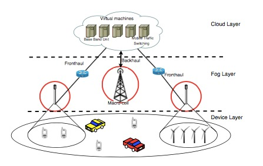

# Fog computing and 5G

## By Alhassan Ali & Magali Bonzom

1. Introduction
2. Fog and Cloud Computing
    1. Limitations of cloud computing
    2. Fog computing
    3. Comparison between cloud and fog computing
    4. Advantages and drawbacks of fog computing
3. 5G overview
    1. 5G concept
    2. 5G and fog computing
    3. Network architecture of 5G
4. 5G and Fog Computing architectures
    1. 5G-Fog Computing high level architecture
    2. Components of Fog Computing Architecture
    3. Fog Application Architecture
5. Examples of fog computing use cases
    1. Example 1: Self-driving cars
    2. Example 2: Smart Traffic Light Systems
6. Conclusion and open issues

## 1. Introduction

5G cellular network promises to offer very high transmission speeds and extremely low latency.
However, due to some of the limitations of the current cloud based paradigm such as increased
latency caused by the physical distance between the 5G base stations and the cloud, and
congestion due to forwarding all the data from devices directly to the cloud. A different
approach is needed to address these shortcomings.

Fog computing is a model that involves extending cloud capabilities to the edge of the network,
close to the devices, parts of the computing power is no longer provided centrally in the cloud,
but is rather decentralized. Not all data need to be transferred to the central data endpoints
within the cloud anymore. Since the distance to be covered by the data generated by the
devices is shorter, the latencies are reduced.

The main goal of fog computing is to bring the processing and storage capabilities from the
cloud back to the edge of the network. As our world is becoming more and more connected,
especially due to the IoT-devices, we will witness a _“data Tsunami”,_ an exponential increase of
data. Cisco estimated that in year 2020, 50 billion devices will be connected. (For further Cisco fog computing statistic, please use the following link: [https://www.cisco.com/c/dam/en_us/solutions/trends/iot/docs/computing-overview.pdf
](https://www.cisco.com/c/dam/en_us/solutions/trends/iot/docs/computing-overview.pdf
)) It is important that the communication latency between the devices or terminals, and cloud computing centers is
minimal. Moreover, user mobility is a key factor that has to be taken into consideration. Hence,
fog computing is necessary for this. One example, which will be discussed further on in this
paper, is self-driving cars where information processing needs to have a very fast response
time, and processed in real-time (Boegelein, 2019).

## 2. Fog and Cloud Computing

**Limitations of cloud computing**

The current cloud computing model mainly provides data-centers as the only point of execution
after the basic processing is done at the devices. However, with a huge number of devices
constantly sending data to the cloud, this would increase the levels of congestion in the
network and may lead to packet loss and delays. Furthermore, sending lots of data to the cloud for processing may make the cloud become a bottleneck. Furthermore, latency is unavoidable due to the large number of hops that a packet has to travel through to reach the cloud.

In a consumer setting, this would simply lead to a hindered user experience, which is important
for service providers to keep their reputation intact, either it is entertainment or business
related. In an industrial setting where devices need to react with near-zero latency in real-time,
it would have far more serious, potentially dangerous consequences. Therefore, the
requirement of distributed computation, storage and networking services which are close to
the source of data is needed, in other words, fog computing.

**Fog Computing**

Fog computing is a term that was originally coined by Professor Salvatore J. Stolfo then picked
up by Cisco. The OpenFog Consortium is creating the open architecture, and testing it via fog
computing use cases and testbeds. The OpenFog Consortium was founded in November 2015
by Cisco, Intel, ARM, Dell, Microsoft and Princeton University, built on the shared vision that an
open fog computing architecture is necessary in today’s increasingly connected world.

From a physical point of view, there is no difference between fog and clouds: the only fact that
classifies whether we are talking about fog or clouds is the altitude. This image can also be
applied to fog computing and cloud computing: the cloud is at a distant place _(physical distance
between data centers and devices)_ , while the fog is closer to the ground. Fog provides the same
services as the cloud _(computing, storage and networking)_ and shares the same mechanisms
_(virtualization, multi-tenancy, etc.)_ .This opens the possibility for applications to exploit the
interchangeability between the fog and the cloud. The cloud consists of powerful servers, while
the fog is a combination of less powerful, decentralized and distributed computers that are
closer to the devices (Itwissen.info, 2019).

Fog Computing is crucial for the Internet of Everything (IoE) applications (such as: automated
transportation, smart cities, industrial automation, etc.) that require real-time/predictable
near-zero latency. The main characteristics of the fog are its proximity to end-users, its dense
geographical distribution, and its support for mobility.

Short video introducing fog computing: [https://www.youtube.com/watch?v=tuo5Pxc4w3c](https://www.youtube.com/watch?v=tuo5Pxc4w3c).

**Comparison between cloud and fog computing:**

The table below shows the main differences of cloud computing and fog computing:

|                                | **Cloud Computing**                     | **Fog Computing**                          |
| ----------------------------   | --------------------------------------- | -------------------------------------------|
| **Architecture**               |    Centralized                          | Distributed                                |
| **Data processing**            |  Far from the source of information     | Close to the source of information         |
| **Communication with devices** |  From a distance                        | Directly from the edge                     |
| **Number of nodes**            |  Few                                    | Many                                       |
| **Computing capabilities**     | Higher                                  | Lower                                      |
| **Latency**                    |  High                                   | Low                                        |
| **Connectivity**               |  Internet                               | Numerous protocols and standards           |

(Sam-solutions.com, 2019)

**Advantage and drawbacks of fog computing:**

1. **Advantages of Fog Computing:**
    1. Faster processing of data
    2. Real-time capability of applications
    3. The data volume to be transferred in the cloud is reduced
    4. Shorter latency and transmission times
    5. Maintaining IoT capabilities even without connecting to core cloud services.
    6. IoT devices can continue their unrestricted operation even in the event of a faulty network connection
    7. Independence from central computing and transmission capacities
    8. Protection of sensitive data through decentralized processing
    9. Acceleration of analysis and decision-making processes 
    
2. **Drawbacks of Fog Computing:**
    1. Higher costs for decentralized hardware components
    2. Increased maintenance requirements due to a larger number of decentralized, intelligent nodes
    3. Security measures also need to be decentralized
    4. Higher chance of “Man-in-the-middle” attacks 
    5. Higher intelligence at the edge of the network requires additional resources and more complex components
    
(Gupta et al., 2019)

## 5G overview

**5G Concept**

Over the past decades, there has been a higher demand for a faster, safer, and smarter wireless
network. It is expected that 5G will hit the market by 2020. It will allocate more bandwidth due
to the high frequency signals (millimeter-wave frequency band), and offer sub-millisecond
latency. As a result, there will be higher-quality videos, multimedia will be transmitted faster,
and data delivered more efficiently, which will lead to higher Quality of Service and Quality of
Experience (Gupta et al., 2019). This will effectively be used for machine-to-machine
communication. “For 5G to be successful, it has to support fog computing, otherwise the low
latency radio interfaces will be of no avail” (Gupta et al., 2019).

The main requirements for 5G are:

- High data rates
- Low latency
- Low energy consumption
- High scalability
- Improved connectivity and reliability
- Improved security

Video explaining 5G and its features: [https://www.youtube.com/watch?v=2DG3pMcNNlw](https://www.youtube.com/watch?v=2DG3pMcNNlw).

**5G and Fog Computing**

Fog computing is a necessity for 5G to be successful. The customer and provider will benefit
from the integration of fog computing and 5G. Storage and computation services in the
network, which are provided close to the devices, will enhance the applications performance,
by offering fast end-to-end response time, and low latency.

Thanks to 5G, device-to-device or machine-to-machine communication is enhanced. Devices
communicate directly with each other, passing through a base station that only controls the
information that have to be transferred. Hence, it offers fog systems great scalability, and
enables devices to interact with each other.

5G networks complements fog computing with the use of “small cells”. Small cells are short
range, low power, wireless transmission systems and have a range of 10 meters to a few
kilometers (RF Page, 2019). They have the features of conventional base stations, and are
capable of handling high data rates for individual users. A fog computing-based radio access
network (F-RAN) provides 5G with a higher spectrum and increased energy efficiency (Cranford
and Cranford, 2019). Hence, the networking nodes provide computation and storage as well.

**Network Architecture of 5G**

The system model of 5G is an IP based model that is designed for wireless and mobile networks.

(Qorvo.com, 2019)

5G network architecture main goal is to handle different mobile service requirements with more flexibility and efficiency. As 5G is still at its early stage, we can not go into detail in the architecture. It is developed by 5G Infrastructure Public Private Partnership (5GPPP), which is a joint initiative between the European ICT industry and European Commission. (5g-ppp.eu, 2019) According to 5GPPP, the foundation of 5G architecture consist of cutting-edge technologies and a redesigned wireless network architecture, and the central cloud will be connected via a backhaul network to many edge computing clouds that are at most 20 kilometers from the user. (SDxCentral, 2019) With software-defined networking (SDN) and Network Functions Virtualization (NFV) supporting the underlying physical infrastructure, 5G fully migrate access, transport, and core networks to the cloud. (Huawei.com, 2019)

## 5G and Fog Computing architecture

**5G – Fog Computing high level architecture**

Fog computing over 5G enhances the architecture of the state-of-the-art Heterogeneous Cloud
Radio Access Networks (HCRAN). In the traditional HCRAN, the application processing tasks are
executed within the core network on the cloud. This involves billions of end devices to
communicate their data to the core network. This large amount of data transferred could
impair the efficiency of the front haul capacity and overwhelm the core network (Gupta et al.,
2019).

To solve this problem and reduce the traffic flow in the core network and fronthaul, it is
essential to bring down the storage and computation capabilities from the cloud closer to the
edge. As can be seen in the image above, the architecture adds another level to the basic
architecture of cloud computing, which is called the fog level. The architecture consists of the
following three layers:

1. Edge or device layer
2. Fog layer
3. Cloud layer

**1. Device layer**

The device layer consists of the terminals and end-devices (IoT-devices) that collect and
provide the data to be processed. Sensors, gateways, smartphones, traffic monitoring system,
or smart homes are examples of such devices. They communicate with the next higher level,
the fog level. In the case of edge computing, the terminals are able to perform peer-to-peer
communication among themselves. The devices are usually virtually running on the operating
system or embedded coding.

**2. Fog layer**

The fog level lies between the Device and Cloud layer, and consists of intermediate network
devices. It has its own computing power and intelligence. The data transmitted to a fog node of
the fog level are pre-processed here, which reduces the burden on fronthaul. Due to the large
amount of data processed, it is possible to employ small- and medium-scale big data processing
at this level (Naha et al., 2018). The fog layer decides what should and should not be sent to
the cloud layer.

**3. Cloud layer**

The cloud layer is on the top level of the hierarchical architecture. It consists of virtual
machines that has infinite scalability, henceforth, is able to process large and intensive
computation and storage, which would not be able with edge devices (Naha et al., 2018).

**Components of Fog Computing Architecture**

In this section we give a detailed explanation of the components in the fog computing
architecture. The architecture consists of eight layers. To clarify some concepts, we provide the
explanations with an example of self-driving cars.

(Naha et al., 2018)

**1. Physical Layer**

The physical layer consists of the sensors and IoT devices that are transmitting the data, for
example, temperature sensors, self-driving vehicles, or smart homes. In the case of self-driving
cars, the cars are the IoT devices consisting of specific sensors, and communicating with various
other physical or virtual sensors such as roadside devices or traffic signals, to be able to drive
safely.

**2. Fog device, server, and gateway layer**

A fog server manages several fog devices and therefore has higher processing and storage
capacity than a fog device, hence, requires more configuration. In order for a fog server to run
properly, it should meet certain requirements, such as connectivity, hardware configuration, or
the number of devices it has to manage. A fog device usually consists of various physical and
virtual sensor nodes. In the case of a self-driving car, when the car wants to find the most
economically friendly route it will extract information from several fog devices and servers,
which a managing and recording information on “hardware configuration, storage configuration, and connectivity of device and severs” (Naha et al., 2018). In general, this layer maintains the communication between the fog devices and servers.

**3. Monitoring layer**

This layer monitors the system performance, resources, and responses. The availability of
resources in fog computing is important, and this layer monitors the current resource demand
and predicts its future demand. Thus, a superior level of quality of service is maintained.

**4. Pre and post-processing layer**

In this layer, the received data are filtered and analyzed, and then categorized whether they
should be sent to the cloud for storage or stored locally. The most challenging part in fog
computing is to minimize the volume that needs to be stored at the edge. In the case of a self-
driving car, all data coming from sensors need to be filtered and analyzed. However, some data
might not be relevant and should not be stored locally. This layer makes sure to avoid faulty
data in case of a sensor failure, and will try to reconstruct missing data based on, e.g. data
generation patterns.

**5. Storage layer**

This layer stores data through storage virtualization and provides a back-up, which is useful if a
storage fails and data get lost. The virtualization also reduces cost, as no additional expenses for
storage hardware are needed.

**6. Resource management layer**

Fog computing needs to take care of all fog devices, IoT devices, and the cloud, therefore,
resource management is a critical matter. This layer maintains the allocation of resources, and
scheduling. “Scalability ensures the scalability of fog resources during peak hours where
resource demand is high. The cloud deals with horizontal scalability while Fog computing aims
to provide both horizontal and vertical scalability” (Naha et al., 2018).

**7. Security layer**

In fog computing, security is crucial, especially because most components have a wireless
connection. The security layer takes care of the privacy of Fog users, the secure data storage,
and encryption of communications. For a user to connect to the fog computing environment,
they have to go through an authorization process to get authorized by the provider.

**8. Application layer**

The application layer consists of IoT applications, as well applications based on Wireless Sensor
Network and Content Delivery Network. Most devices connected to fog computing usually have

latency-aware characteristics. Hence, those applications expect to receive better service quality
and cost-effectiveness from fog computing. (Naha et al., 2018)

**Fog Application Architecture**

For an application to be able to run in a fog-architecture, is has to consist of the three following
components, as can be seen in the image below (Gupta et al., 2019):

1. Device component
2. Fog component
3. Cloud component

**Device component**

The device component consists of the end devices, and usually should not contain heavy
processing tasks. It performs device level operations such as redundancy elimination, and
power management.

**Fog component**

The fog component usually is located in any type of device between the edge and the cloud.
Low latency is the major criterion in fog computing, which is performed in the fog component
with sufficient processing power, that cannot be provided by end-devices. It performs real-time
operations, aggregates data, and send them to the cloud.

**Cloud component**

The cloud component is located in the cloud servers within the core network. As it resides on
the top layer of the architecture, it records all data received from all devices and therefore has
a global knowledge of the entire system. Applications tasks that require large processing power
and storage are located in the cloud component due to the abundant amount resources it has.
“It contains logic for long-term analytics of the data collected from the lower layers and for
operations that don’t have any sort of real-time restrictions or latency constraints” (Gupta et
al., 2019).

## Examples of fog computing use cases

**Example 1: Self-driving cars**

Fog Computing provides solutions for numerous applications in the area of the Internet of
Things, especially for industry 4.0. It is highly important and applied for real-time processes and
applications. The data supplied by the sensors of the devices are processed in a decentralized
manner, and the fog-nodes supply the required information to the machines within a very short
time.

An area of application for fog computing are self-driving cars. The sensors of the intelligent
vehicles capture an immense amount of information about the environment and driving
conditions, which has to be analyzed and processed within a very short time. In order for the
vehicles to respond to current road conditions, traffic conditions and unexpected events, it is
crucial that it is possible to evaluate a large amount of data with minimal latency and send that
information to the vehicles. Equipped with more than 200 CPUs, it's basically a “wheeled data
center” (Director, 2019).

Classic cloud computing is not enough to provide satisfactory solutions to this situation.
Therefore, edge computing and fog computing enable data to be processed directly in the
vehicle or processed to transmission facilities in the immediate vicinity of the vehicle. At the
same time, the network services and central resources are independent. Therefore, fog

computing enables efficient traffic control with real-time processing and analysis of all data
provided by the traffic system.

**Example 2: Smart Traffic Light Systems**

Another example of latency-critical application that requires fog computing would be Smart
Traffic Light Systems (STLS), which is a network of traffic lights that intelligently takes decisions
that reduce traffic congestion, minimize noise and fuel consumption, prevent accidents, and
give the drivers a better experience by long-term monitoring. Although the STLS is just a
component of the larger idea of Smart Connected Vehicles and Advanced Transportation
Systems, it is rich enough to drive some key requirements for fog computing.(Jomaa and Jack Kie, 2016)

**STLS requirements**

A traffic light in an STLS should be able to detect vehicles not following traffic rules and inform
adjacent traffic lights to notify vehicles or pedestrians that could potentially be affected by
those rogue vehicles. However, this accident prevention mechanism causes the traffic light
cycles in the affected area to go out of synchronization. Therefore, re-synchronization is
required to mitigate this consequence.(Lämmer and Helbing, 2008)(Jomaa and Jack Kie, 2016)

Flow control is essential to ensure a smooth movement of traffic without having to make the
drivers stop too often. An STLS can collect information about the level of traffic in each lane of
the city and maintain a lane continuously open for a certain period of time, reducing the
number of times a vehicle would have to stop at traffic signals. This would reduce congestion,
fuel consumption, and noise, since vehicles would not have to accelerate as often.

Moreover, by monitoring and analyzing the data gathered from the entire system over a large
period of time, the STLS can improve it’s traffic routing plan continuously. Through long-term
analysis on observed vehicle and pedestrian movements, the STLS would be able to decide the
optimal times for which pedestrians should be allowed to cross. (Chang and Gong, 2001)

The following are the design requirements of STLS:

- **Low-latency response:** Accident prevention requires a very low response time to alert
    the potentially affected person.
- **Handling a large volume of data:** An STLS has a large number of sensors that generate
    data at a high rate, poor network architecture can be a victim of bandwidth over-
    utilization and become congested.
- **Heavy processing power:** Planning requires large amounts of data to be processed, and
    the analysis has to be done on a city level.

**STLS Deployment**

Sensors that are deployed on the roads and CCTV cameras installed at intersections, are the
main data collection points in an STLS. Sensors can detect crossing vehicles and their speeds.
Since any action performed by the STLS is reflected by a change of traffic lights, the traffic lights
are considered the actuators of the system.

Each intersection will be equipped with a 5G small-cell which connects the devices on that
intersection, allowing real-time device-to-device communication among them. The small cell is
equipped with compute and storage facilities. The small cell is also connected to the cloud by a
high bandwidth connection through intermediate network devices, these network devices will
be used for communicating with devices in the neighboring intersections, and are also fog-
enabled, meaning that they are points for offloading application logic as well. (Wiering et al., 2004)(Millward, 2019)

The device component of STLS are the sensors, CCTV cameras, and traffic lights. The sensors
should be able to send updates to the small cell over a 5G network. The CCTV cameras should
process the recorded video stream in real-time to detect events of interest. As for the traffic
lights they just change lights according to the decisions taken by the system.

Regarding the fog component, it runs on the small cell in each intersection as well as on the
intermediate network devices connecting the small cells to the Internet. The logic running on
these devices handles most of the requirements of an STLS. The fog component should handle
the data sent from the sensors and CCTV cameras and detect possible accidents, then sends a
message to the traffic lights on corresponding street to change lights accordingly in real time.
There has to be communication between adjacent traffic lights so that they may run a
distributed algorithm and re-synchronize their light cycles. (Peng, Aved and Hua, 2010)

Finally, the cloud component is responsible for the long term analysis of the STLS system. Data
about the traffic conditions and events generated from the small cells will be uploaded to the
cloud at regular intervals, which reduces the volume of data sent at any given moment to avoid
congestion. 

For further explanation, and visualization of 5G and Traffic Management, please use the following link: [https://www.youtube.com/watch?v=Vs7bUQgwiIU](https://www.youtube.com/watch?v=Vs7bUQgwiIU).

## Conclusion and open issues

We could only imagine what 5G mobile network could possibly achieve, with its superior transfer rates and low latencies. Fog computing is key in making this possible due to its close affinity for use-cases on IoT. You can’t run everything in the cloud, since there are latency, mobility, geographic, network bandwidth, reliability, security and privacy issues. Nor can you run everything at the edge with intelligent endpoints, due to energy, space, capacity, environmental, reliability, modularity, and security challenges. Therefore, the more logical approach is to integrate both paradigms together. (Tulluru and S.G, 2018)

However, there are privacy issues involving fog computing on 5G. As fog computing virtualizes the network, it disconnects the link between the hardware and the network functionality. This raises concerns about data visibility to the third-party, where fog applications process application data. 5G networks handle voice and data packets in the same manner which may lead to leakage of sensitive voice data.

Fog applications run in the form of virtual machines on virtualized fog-devices. This would require Network Function Virtualization. However, implementing NFV on such a heterogeneous network as a fog-enabled 5G network is still not feasible.

A further issue that needs to be addressed is the possible increase of carbon footprint because of the large amount of fog-devices in a network with a dense geographical distribution. As fog computing runs applications on a hypervisor, which is a virtual machine monitor, it imposes higher energy consumption due to the additional processing used for virtualization.

A large-scale successful commercial deployment of fog computing systems on 5G mobile networks is still an a work in progress that needs more research in various different fields, with different challenges that need to be addressed to make it a reality.

Fog computing tutorial under the following link (free trial): [https://www.fastly.com/edge-cloud-platform?_bk=%2Bfog%20%2Bcomputing&_bt=344683518854&_bm=b&_bn=g&campaignid=1806158870&adgroupid=69084791653&adid=344683518854&gclid=EAIaIQobChMI_5TVzLTm4QIVFofVCh2rkgEzEAAYAiAAEgJm9vD_BwE](https://www.fastly.com/edge-cloud-platform?_bk=%2Bfog%20%2Bcomputing&_bt=344683518854&_bm=b&_bn=g&campaignid=1806158870&adgroupid=69084791653&adid=344683518854&gclid=EAIaIQobChMI_5TVzLTm4QIVFofVCh2rkgEzEAAYAiAAEgJm9vD_BwE).

## References

Boegelein, L. (2019). Fog Computing: Alternative zum Cloud Computing. [online] IT-SERVICE.NETWORK Blog. Available at: https://it-service.network/blog/2017/07/05/fog-computing-edge-computing/ [Accessed 23 Apr. 2019].

Chang, T. and Gong, S. (2001). Tracking multiple people with a multi-camera system. Multi-Object Tracking.

Cranford, N. and Cranford, N. (2019). The role of fog computing in 5G. [online] RCR Wireless News. Available at: https://www.rcrwireless.com/20180131/the-role-of-fog-computing-in-5g-tag27-99 [Accessed 23 Apr. 2019].

Director W. (2019). Edge Computing und IoT: Läutet Fog Computing das Ende der Cloud ein?. [online] Computerwoche.de. Available at: https://www.computerwoche.de/a/laeutet-fog-computing-das-ende-der-cloud-ein,3330809 [Accessed 23 Apr. 2019].

Gupta, H., Chakraborty, S., Ghosh, S. and Buyya, R. (2019). Fog Computing in 5G Networks: An Application Perspective. fog ̇5g ̇full.

Huawei.com. (2019). [online] Available at: https://www.huawei.com/minisite/hwmbbf16/insights/5G-Nework-Architecture-Whitepaper-en.pdf [Accessed 24 Apr. 2019].

Itwissen.info. (2019). Fog-Computing             :: fog computing        :: ITWissen.info. [online] Available at: https://www.itwissen.info/Fog-Computing-fog-computing.html [Accessed 23 Apr. 2019].

Jomaa, K. and Jack Kie, C. (2016). An Integrated Model to Control Traffic Lights Controlling of Traffic Lights in Multiple Intersections Using Fuzzy Logic and Genetic Algorithm. Business and Economics Journal, 08(01).

Lämmer, S. and Helbing, D. (2008). Self-control of traffic lights and vehicle flows in urban road networks. Journal of Statistical Mechanics: Theory and Experiment, 2008(04), p.P04019.

Millward, D. (2019). Smart traffic lights to stop speeders. [online] Telegraph.co.uk. Available at: https://www.telegraph.co.uk/motoring/news/8521769/Smart-traffic-lights-to-stop-speeders.html [Accessed 23 Apr. 2019].

Naha, R., Garg, S., Georgakopoulos, D., Jayaraman, P., Gao, L., Xiang, Y. and Ranjan, R. (2018). Fog Computing: Survey of Trends, Architectures, Requirements, and Research Directions. IEEE Access, 6, pp.47980-48009.

Peng, R., Aved, A. and Hua, K. (2010). Real-Time Query Processing on Live Videos in Networks of Distributed Cameras. International Journal of Interdisciplinary Telecommunications and Networking, 2(1), pp.27-48.

Qorvo.com. (2019). Small Cell Networks and the Evolution of 5G - Qorvo. [online] Available at: https://www.qorvo.com/design-hub/blog/small-cell-networks-and-the-evolution-of-5g [Accessed 23 Apr. 2019].

RF Page. (2019). What are small cells in 5G technology - RF Page. [online] Available at: https://www.rfpage.com/what-are-small-cells-in-5g-technology/ [Accessed 23 Apr. 2019].

SDxCentral. (2019). Defining 5G Architecture –  What You Need to Know. [online] Available at: https://www.sdxcentral.com/5g/definitions/5g-architecture/ [Accessed 24 Apr. 2019].

Tulluru, S. and S.G, D. (2018). Fog Computing a Paradigm: Scenarios And Security Issues. International Journal of Engineering Research in Computer Science and Engineering, 5(4).

Sam-solutions.com. (2019). Fog Computing vs. Cloud Computing. What are the Key Differences? | SaM Solutions. [online] Available at: https://www.sam-solutions.com/blog/fog-computing-vs-cloud-computing-for-iot-projects/ [Accessed 23 Apr. 2019].

Wiering, M., Van Veenen, J., Vreeken, J. and Koopman, A. (2004). Intelligent Traffic Light Control.

5g-ppp.eu. (2019). 5G-PPP. [online] Available at: https://5g-ppp.eu [Accessed 24 Apr. 2019].

