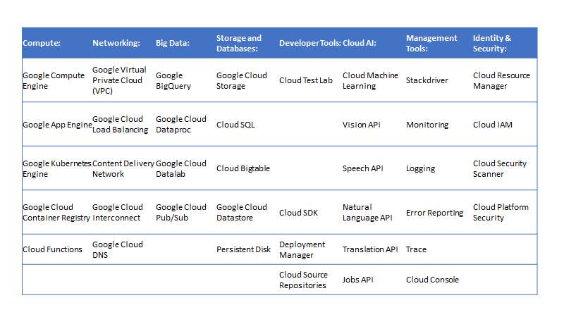
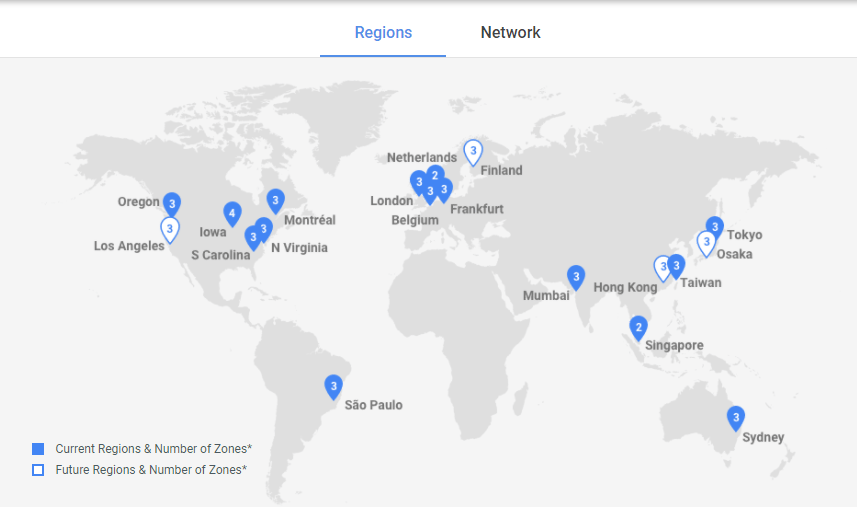
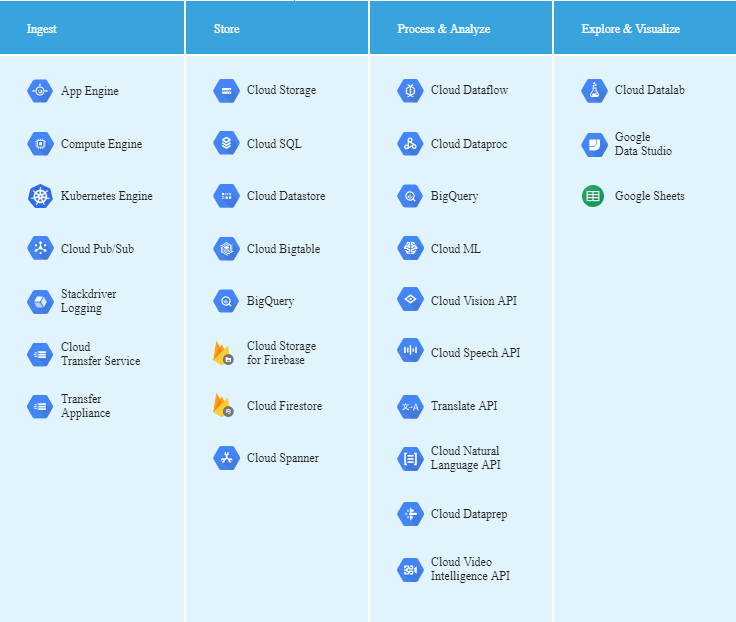
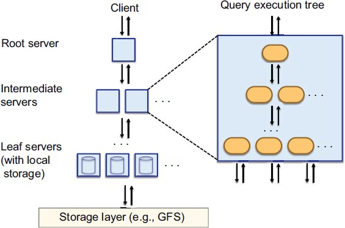
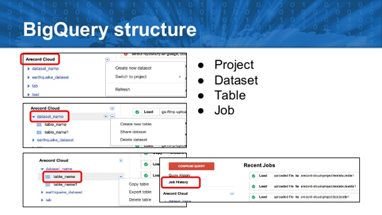
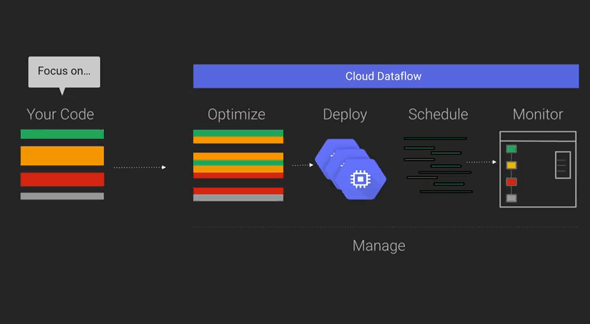
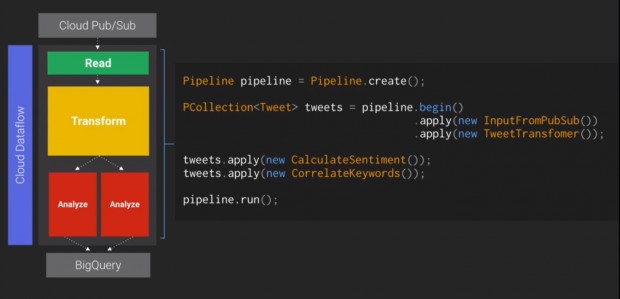
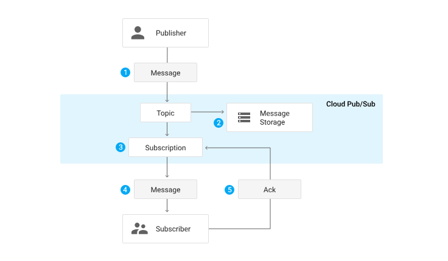

# Google cloud platform for Data Science

### Introduction to Google Cloud Platform

In 1961, after John McCarthy presented the idea of “computation being delivered as a public utility.” cloud computing started to become a vision. Cloud computing can be defined as a platform where users use the network remote servers to store, manage, and process the data on the internet rather than a local server or personal computer. Cloud providers usually offer a pay-as-you-go service. 

Cloud computing is being used too much by organizations that it is becoming the new normal in businesses.  Since it offers numerous benefits, it helps society to cope with future problems such as managing big data, cyber-security, and quality control. Some of the features and benefits of cloud platforms offer can be defined as follows:

1. Many emerging technologies such as  Artificial Intelligence, distributed ledger technology are available on many cloud platforms. 
2. Cloud computing enables to reduce the cost of running the applications faster and keeping them up-to-date. 
3. Protection, data security, and safety is one of the main concerns of users/organizations and cloud services concentrate on these issues. In the case of crashing or losing the data, users do not have to worry about it as these platforms serve for the sake of security.
4. It also offers more scalable storage.
5. It allows users to process their data online on the internet rather than running the programs on physical hardware and software. 

Google Cloud Platform is like other cloud platform technologies, is a group of cloud-based services which basically allow the user to build everything from simple web sites to very sophisticated web-based applications.
Google Cloud Platform offers many products for different purposes. Computational products, which basically allow the user to create virtual machines, auto-scaling applications,  containerized applications and managing virtual machines. Storage products provide different options to store your data both in RDMS and non-relational databases. Moreover, for big data analysis, Google Cloud Platform offers several services for several purposes like networking which allows you to manage your DNS records and maintain the applications, services related to monitoring and management,  machine learning, security, development and so on. Overall, the main GCP services are as follows:

* Compute
* Networking
* Storage and Databases
* Big Data
* Machine Learning
* Identity & Security
* Management and Developer Tools



In the following sections of the report, we will go through in details of the three GCP products: BigQuery, Cloud Pub/Sub and Cloud Dataflow which are big data products that GCP provides us. Lastly, it is possible to use Google Cloud Platform either on the web-based Developers Console or the console-based gcloud tool. 

### Google Cloud Platform Regions

Google Cloud Platform has data centres in a total of 15 regions and each region has at least 3 zones. Depending on the needs, the users can locate their applications in these locations around the world.



### Use case

There are too many firms that use Google Cloud Platform and here we would like to provide one of them to express better why GCP is very convenient.
One of the Philips Lighting products called as Philips Hue, which offers smart lighting solutions, used Google Cloud Platform to build the backend. According to the results, it is possible to route 200 million transactions per day through a Google-powered backend. Google Cloud Platform has dramatically cut the costs and resources required to handle the Philips Hue backend and scales on demand.
“We chose Google Cloud Platform to power Philips Hue’s backend because it scales instantly, freeing engineers to work on product development rather than managing infrastructure.” George Yianni, Head of Technology, Home Systems, Philips Lighting

Before talking about some data analysis tools,  in the following part, it is possible to find a little comparison between Google Cloud Platform and a well-known cloud service, Amazon Web Services.

### Google Cloud Platform vs. Amazon Web Services

* Using GCP cheaper to use than using AWS. Google Cloud Platform adopts per-minute charging system except for the initial minimum 10 minutes tier. On the other hand, AWS charges on an hourly basis. For example, when the instance is run for 17 minutes the user would pay for 17 minutes in Google Cloud Platform however, in Amazon Web Services the payment would be done for 60 minutes. Even if you use an instance for 1 minute, the scenario would be the previous case. You pay 10 minutes in Google Cloud Platform, on the other hand, you end up with paying for 60  minutes in Amazon Web Services. 
* Google Compute Engine is way better on handling traffic spikes. Moreover, compute engine load balancers are able to scale instantly when they notice a sudden traffic spike. In 2013, Google proved that its load balancers are able to serve 1 million requests per second within 5 seconds after setup.
* BigQuery, the data analytics tool which will be discussed later in this report, is an integrated and fully hosted platform that scales to thousands of nodes and charges, which is very similar with the system that we mentioned previously, only for space and computation time. On the other hand, Red Shift, the equivalent platform in Amazon Web Services, requires configuration by the users and also it charges hourly rather than based on usage.
* Google data centres, which provide regions and zones of the Google Cloud Platform, are connected by Google’s private fibre network. It means the network communication between two cloud platform zones passes through a network only belongs to Google which can be called as a private network. On the other hand, Amazon Web Services does not provide such a private network.

However, when talking about the strengths of Google Cloud Platform, it should be acknowledged that Amazon Web Services provide broader products and platforms as it has been in the market for a very long time.  

### Data lifecycle

The data is managed by GCP services during its life cycle which consists of four stages: pulling row data from several sources, storing data in the needed format, transforming row data to the useful information and finally, visualizing the result of the previous analyzing stage. GCP proposes the following services to manage data in these four stages of the lifecycle of data.



### Data Analysis Products

As mentioned at the beginning of the report there are several products which Google Cloud Platform provides the analytics. For example, Google BigQuery Service, which allows the user to do big data analytics by querying the huge amount of data and features data ingestion at the rate of 100,000 rows per second per table. Google Cloud Pub/Sub Service is a messaging and queuing tool that lets the user connect 
ple producers and consumers and enables transferring the data in low-latency and high frequency. Last but not least, Google Cloud Dataflow Service is basically enabling to perform data-processing tasks in any size. It possible for a user to build, deploy, and run complex data-processing pipelines. It is a very easy, flexible, and powerful tool and so on. 
At the following sections, it is possible to find very detailed explanations about each of them.

### Google BigQuery Service

BigQuery is a serverless, highly-scalable and cost-effective data warehouse. It is product of a research technology which has been developed at Google Research. It helps data scientists to work more efficiently and less costly. One of the most important advantages of using BigQuery is that there is no need for a database administrator or any expensive hardware infrastructure. All of these kinds of work are solved by Google Cloud. As a result, data scientist just needs to run his SQL queries which will be very fast without facing any infrastructure or hardware problem.  Petabytes of data can be analyzed by BigQuery which is one of the reasons makes it a unique platform for analytics. Moreover, when using BigQuery, there is no need to deploy any resources, like virtual machines or disks, because it is fully-managed and the user just needs to start it.
BigQuery can be accessed in different ways, this can be a command line tool, BigQuery Rest API, libraries such as .Net, Python, Java or just simply using GCP Console.

BigQuery has three main characteristics which are the main reason why the user gets an answer of queries in seconds, in real time They are as follows: 

* Scalability
* Interactivity 
* Ad-hoc

However, thousands of nodes and CPU’s are running, nodes and CPU’s are selected dynamically depend on the table’s size. This is the scalability of BigQuery.
Query execution in BigQuery results fast which make it interactive, and finally, thanks to a full-table scan on each query without any index or pre-aggregation, BigQuery supports queries in all the stored data which makes it an ad-hoc system. 
Furthermore, it uses multi-tenant Architecture, distributed storage and columnar data layout, multilevel execution tree.

#### Multilevel execution tree 

Multilevel execution tree is a massively parallel distributed tree and consists of a root, intermediate and leaf servers.  Firstly, a query is pushed down a to the tree then the results are aggregating from the leaves very fast. In the following schema, it is possible to see how the tree looks like.




When a query is executed, firstly the query is received by the root node. After reading the metadata table,  it forwards the query to the next level. The leaf nodes interact with the distributed file system and retrieving the desired data. After that, the leaf nodes sends the answer back to the tree. 
For example, let's imagine that you are executing the following query: 

```sql
SELECT A, COUNT (B)
FROM T 
GROUP BY A
```
As it is explained at the above, the root node is in charge of getting the partitions which T contains and rewrites the query as follows:

```sql
SELECT A, SUM(B)
FROM (R1 UNION  ALL...R1n)
GROUP BY A
```

R1i … R1n are the answers of the queries sent to the nodes at level one
Where R1i can be defined as follows:

```sql
SELECT A, COUNT (B) AS C 
FROM T1i 
GROUP BY A
```

Where T1i is the partition which is processed by server i at the very first level of the execution tree.  
Until it reaches the leaf nodes, the query is modified and sent to the following level. The leaves read the data from the partitions and   the result to the root.
Note that, the cost is proportional with the amount of the data that you want to retrieve. 


#### Columnar Layout & Distributed Storage

As we know, in relational databases, data is stored as row-based. When the user wants to query only some columns, the storage engine needs to skip some unwanted columns. However, BigQuery uses columnar storage which makes querying only the needed columns easily. Moreover, the various columns are stored separately which enables to return only needed columns.

#### Shared Multi-tenant Architecture

First of all, tenants are multiple client organizations.  In Shared multi-tenant architecture, the same data schema, but separate data partitions are provided for tenants and each query does not use its own cluster depends on the money it has, it is just using a small amount of time of the dedicated nodes. Moreover, in multi-tenant applications, separated silos of data are used for each tenants, however a single project, a single logical structure and a single set of index definitions are used. Additionally, when new tenants are added to the platform, it will not affect the data structure. 


A containers hierarchy is used in BigQuery in order to store data. These containers are called as projects, datasets, and tables which you can find at the following image. 



* Projects: 
Projects are top-level containers in Google Cloud Platform. In addition
to hold computing resources and user data, projects store information such as
billing data and authorized users. There are tree identifiers in the projects.

* * Project number: this is assigned automatically by GCP and cannot be changed during the lifecycle of the project.
* * Project ID:  this is assigned by the user when creating the project and cannot be changed during the lifetime of the project. There is a restriction to chose this identity, it should be string and consists of three English words which are delimited by the two hyphens.
* * Project name: this is assigned by the user and the users can change it whenever they want.

* Datasets: 
Datasets do not contain any data, however, it is a collection of data that helps the user organize and cluster data into groups.
* Tables:
Tables contain the data in BigQuery, along with a corresponding table schema that describes field names, types, and whether certain fields are mandatory or optional.
* Jobs:
Loading data, running queries, and exporting information and copying data together are called as jobs which are executed asynchronously because of the large number of datasets.

#### Use case & Performance 

A company called Shine Solutions created a serverless ETL by using BigQuery. While doing that instead of loading data from external sources they read the data from Google Cloud Storage by using user-defined functions.  BigQuery provides user-defined functions which are written in JavaScript and according to their experience, UDF is very similar to Map function on MapReduce as it takes one row as input and creates zero or more outputs as output. With this way, they were able to load and clean the data by querying over Google Cloud Storage and write the results into BigQuery. According to their experience using SQL and JavaScript together is “very useful when you find yourself frustrated by trying to express complex and difficult computations in SQL e.g. string parsing, loops etc. SQL is too restrictive by nature, and not expressive enough to suit more complex tasks.”
Thomas Park, a Google engineer that worked on building UDFs, stated that “JavaScript UDFs are executed on instances of Google V8 running on Google servers. Your code runs close to your data in order to minimize added latency.”
When the code is ready to execute, with a traditional database it is expected to take some time however, with BigQuery querying 1.5 billion data only took 37,7 seconds. 

#### Some Cons of BigQuery
Although, BigQuery is a very useful tool, there are some points which needs consideration.

The amount of scanned data is very crucial. As it is explained before, it is directly proportional to the cost. You should minimise the selections as much as possible. 
Unfortunately the deleting or renaming a column is not that trivial in BigQuery. One of the options could be creating a new table with all the columns except the one which is undesired. Another option could be expelling the existing table into Google Cloud Storage and import the table with only the columns you want to query.


### Google Cloud Dataflow



The other GCP service for a data scientist is the cloud-based data processing tool which is called as Google Cloud DataFlow. Dataflow is multi-functional because it is available for both real-time stream and batch (historical) data. It is easy to use, because there is no need for any complex workarounds or compromises. The main goal in DataFlow is processing projects parallelly. 
In other words, the user can use the same pipeline for various sets of information, like bounded and unbounded. The user executes pipelines parallelly. Additionally, it is easy to do testing and replacing different parts of the pipeline. Pipeline in DataFlow is a unit of work which consists of reading, extraction, transformation, and writing of information.



It shows good performance when working with a big amount of data. Parallel pipelines can run for data processing and the user can build low-latency applications. Moreover, Dataflow can use services outside of Cloud Platform. In order to do it, the user needs to use the Cloud Dataflow API’s.

#### Use cases

Most common use cases of DataFlow are as follows:
Fraud detection, IoT analytics in different areas, like healthcare, logistic, education and so on., various kinds of analysis and the cloud tool called as Dataprep which exploring, cleaning, wrangling (large) datasets.


### Cloud Pub/Sub

In order to make a connection between independent systems via many-to-many messaging capabilities, Google provides a service which is secure, flexible, durable and scalable and real-time messaging service called as Google Cloud Pub/Sub. The information exchange between systems are asynchronous and real-time and it is operated inside and outside of GCP by Cloud Pub/Sub.  This independent communication between systems can be one-to-many, many-to-one and many-to-many.

#### Core Concepts

The core concepts of Cloud Pub/Sub can be defined as follows:
* When the message is sent by the publishers it is called as a topic.
* Subscription is when the stream of messages from the desired topic is received by the subscribing application. 
* The messages are the data sent to a topic by the publisher and it is received eventually by the subscribers.
* A message attribute is a key-value pair which can be defined by the publisher for a message. 

All processes in the Cloud Pub/Sub have been described in the following figure.



Basically, there are senders, receivers and communication between them. First of all, a sender or a publisher creates a topic in the application, then sends a message to that topic (1) which is kept in the message storage(2) which locates inside of the Cloud Pub/Sub. Then the message is sent from the topic to each subscription one by one(3). This stage can happen in two ways: the receiver can pull the message from the topic, or vice versa message can be sent from the topic to the receiver. When the message reached to the receiver(4) and acknowledgement about this delivery is sent to the Cloud Pub/Sub (5) then the message is deleted from the message queue. Additionally, if a topic is subscribed by multiple subscribers, then all of them will receive the message from that topic. However, if subscribers pull the message from the same topic, only one of them will receive this message.


#### Use Case

Cloud Pub/Sub is not considered as a complicated tool. Imagine that you have a Cloud Storage Bucket where cat pictures are uploaded. And you want to be notified when a new picture is uploaded. So what you have to do is basically to set up a Cloud Function to just chase the bucket you created for the new updates. When the Cloud Function is fired, new data is written into pub/sub. It is also possible to have another Cloud Function which watches the topic and let your users know when a new picture is uploaded. Another example could be while distributing the workload for network clusters among multiple workers, pub/sub can be used. 
To conclude, when building a microservice architecture, it is important to have something which is able to store huge amount of data and deliver it to multiple services.

### Conclusion

In this report, we talked about the Google Cloud Platform and its three products for big data analytics. BigQuery, which is a data warehouse which provides scalability, interactivity and ad-hoc queries. Cloud Dataflow is basically a data processing tool for real-time and historical data analysis. Cloud Pub/Sub is a real-time messaging system. For each of the products, uses cases were also provided.
We also covered the payment methods for GCP and available regions and zones as well as made a small comparison between GCP and AWS. 


### References


1. Shine Solutions Group. (2018, October 15). Creating a serverless ETL nirvana using Google BigQuery. Retrieved from https://shinesolutions.com/2016/03/30/creating-a-serverless-etl-nirvana-using-google-bigquery/
2. Want to use BigQuery? Read this. Retrieved from https://towardsdatascience.com/want-to-use-bigquery-read-this-fab36822830
3. Google. (2012). An Inside Look at BigQuery. [PDF File] Retrieved from: 
https://cloud.google.com/files/BigQueryTechnicalWP.pdf
4. Krishnan, S. P., & L., U. G. (2015). Building your next big thing with google cloud platform: A guide for developers and enterprise architects. New York: Apress.
5. Cloud Dataflow - Stream & Batch Data Processing  |  Cloud Dataflow  |  Google Cloud. (n.d.). Retrieved from https://cloud.google.com/dataflow/
6. Data lifecycle  |  Solutions  |  Google Cloud. (2019, April 10). Retrieved from https://cloud.google.com/solutions/data-lifecycle-cloud-platform
7. Google Cloud Platform Services Summary. (2019, April 10). Retrieved from https://cloud.google.com/terms/services
8. McNulty, E. (2014, August 16). What Is Google Cloud Dataflow? Retrieved from https://dataconomy.com/2014/08/google-cloud-dataflow/
9. Kurt. (2019, March 11). What is Google Cloud Platform (GCP)? | GCP Services. Retrieved from https://www.edureka.co/blog/what-is-google-cloud-platform/
10. Google Cloud Pub/Sub. (2015, April 8). Retrieved from https://www.enterpriseintegrationpatterns.com/ramblings/82_googlepubsub.html
11. Hrcek, Z. (2019, January 7). Simple serverless data pipeline on Google Cloud Platform. Retrieved from https://www.the-swamp.info/blog/simple-serverless-data-pipeline-google-cloud-platform/
12. What Is Cloud Pub/Sub?  |  Cloud Pub/Sub Documentation  |  Google Cloud. (2019, March 15.). Retrieved from https://cloud.google.com/pubsub/docs/overview
13. Why is cloud computing important? (2018, September 14). Retrieved from https://opencirrus.org/cloud-computing-important/
