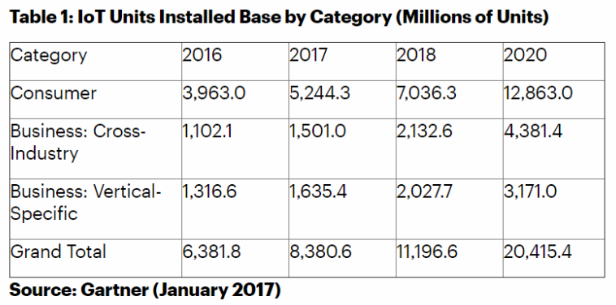
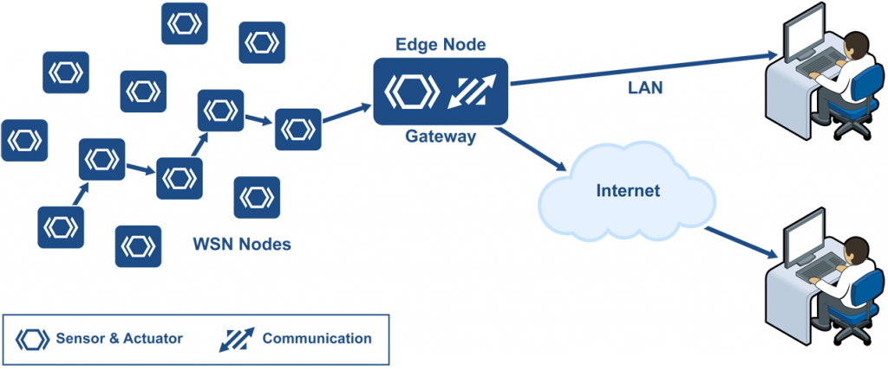
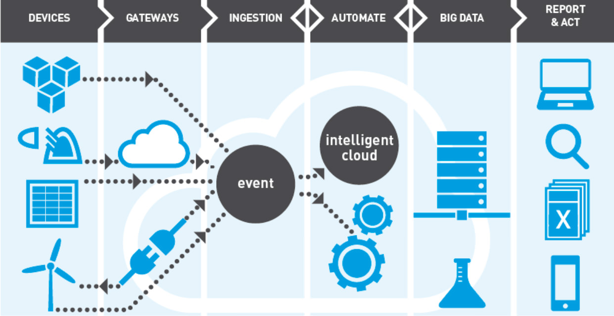
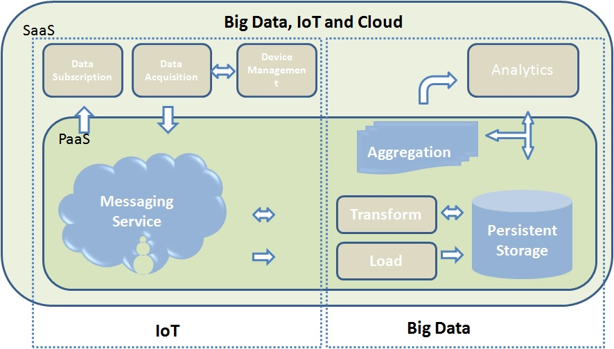
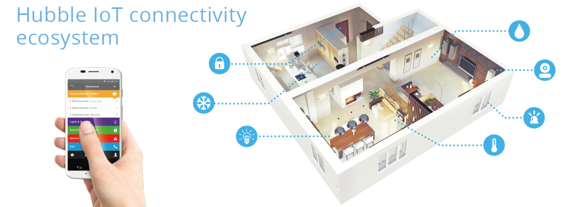
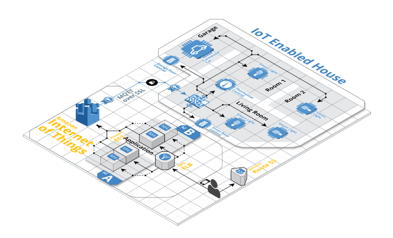
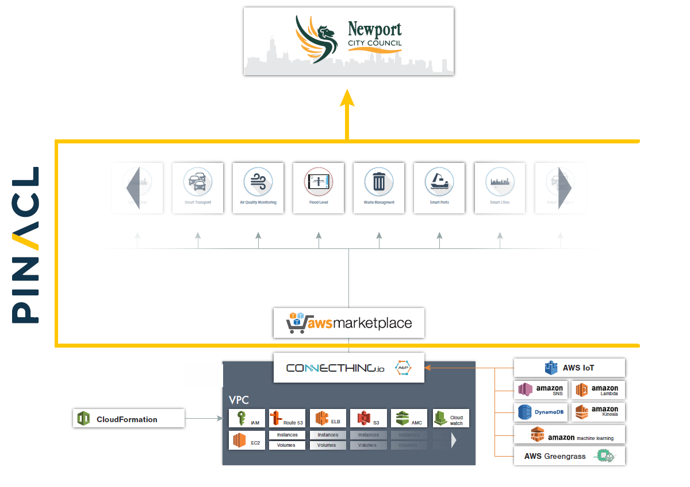
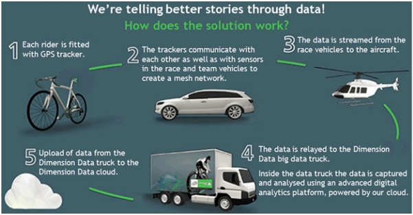

# Table of Contents

1. [Internet of things: Overview](##Internet-of-things-Overview)
	-   [Definition of IoT](##Definition-of-IoT)
	-   [IoT architectures](##IoT-architectures)
		-   [Local IoT architecture (Edge computing)](##Local-IoT-architecture-(Edge-computing)) 
		-   [Cloud IoT architecture](##Cloud-IoT-architecture)
		-   [Hybrid architecture](##Hybrid-architecture)
2. [Cloud IoT](##Cloud-IoT)
	- [The relation among IoT, Cloud Computing and Big Data](##The-relation-among-IoT,-Cloud-Computing-and-Big-Data)
		- [Advantages of cloud IoT](##Advantages-of-cloud-IoT)
		- [Disadvantages of cloud IoT](##Disadvantages-of-cloud-IoT)
3. [Case Studies](##Case-Studies)
	- [Hubble Connected (Smart Home)](##Hubble-Connected-(Smart-Home))
	- [City of Newport Case Study (Smart City)](##City-of-Newport-Case-Study-(Smart-City))
	- [DimensionData and Tour De France (Smart Event)](##DimensionData-and-Tour-De-France-(Smart-Event))
4. [Conclusion](##Conclusion)

# Internet of things Overview
Nowadays, we can easily find products of Internet of Things (IoT) in our daily lives from small personal fitness trackers to big smart home system. Moreover, the enterprise deployments of IoT are going to explode due to low-cost sensors and speedy data computing. In 2017, Gartner[[1]](https://www.gartner.com/en/newsroom/press-releases/2017-02-07-gartner-says-8-billion-connected-things-will-be-in-use-in-2017-up-31-percent-from-2016) predicted that 21 billion connected things will be in use by year 2020 and all the developments will generate 44 trillion gigabytes of additional IoT data. Moreover, consumers are projected to spend around 1.5 million US dollars on IoT products. As a consequence, machine-to-machine IP traffic is expected to reach around 6.3 exabytes per month by 2020, which was nearly six times higher than the number of 1.6 in 2016. Therefore, what kind of technology architectures are going to be used to deal with these explosive data becomes highly important. Firstly, we are going to introduce Internet of things(IoT) briefly and then we will focus on the most broad IoT architectures available today.

Fig.1: IoT Units Installed Base by Category [[1]](https://www.gartner.com/en/newsroom/press-releases/2017-02-07-gartner-says-8-billion-connected-things-will-be-in-use-in-2017-up-31-percent-from-2016)

-   **Definition of IoT**

	Internet of things, or “IoT” is extension of the internet connectivity system into physical devices[[2]](https://en.wikipedia.org/wiki/Internet_of_things#cite_note-30) by using embedded electronics, internet connectivity hardwares such as wireless and remote sensors, wearable technologies, smart appliances etc. All internet devices can communicate and interact with each others over the internet connection and they could be monitored and controlled remotely. IoT could be categorized into 3 groups as follow[[3]](https://www.iotforall.com/what-is-iot-simple-explanation/).

	1.  **Gather and send information**: IoT devices such as temperature, moisture, air, light, motion sensors collect the environment information.
	    
	2.  **Receiver and act on information**: Once machines receive data or signals from IoT devices, they performs some activities based on data they get. For example, receiving signal from car key, car’s door is unlocked automatically.
	    
	3.  **Do both**: This category integrates both devices’ characteristic above together.
-   **IoT architectures** [[4]](https://www.cio.com/article/3231654/iot-architecture-to-run-on-the-cloud-or-not.html)

	After having the basic understanding of IoT, we focus on the most broad IoT architectures available today (local, cloud, and hybrid architectures) for various use cases and then going deeper into cloud computing cases in the following research sections.

1.  **Local IoT architecture (Edge computing)**
	
	Using edge computing which processes data at the edge of the network or nearest to the source without being reliant on cloud environment can make more real-time responses.

Fig.2: Wireless sensor network (WSN) installed in a factory, connected to the Internet via a gateway[[5]](https://www.micrium.com/iot/devices/) 
	
>__Case: Oil Rig__
	Sensors being set on an oil rig can detect a faulty valve that may cause a fire and the companies can react immediately without time delays. On the other hand, it may be too late if the data need to be sent to cloud to process and returned a warning message.
	

	
Fig.3: oil rig - use case of edge computing[[6]](https://www.automationworld.com/oil-and-gas-edge)
	
2. **Cloud IoT architecture**

	Cloud IoT architecture can help companies to manage the combination of internal and external data from a large of connected devices. It provides the ability to interact and integrate with different IoT devices and cloud system. Also, because it can combine external data, this architecture provides more flexibility.
		
	
	Fig.4: Cloud IoT[[7]](https://www.scientechworld.com/internet-of-things/iot-solutions/iot-builder)
	
>__Case: Supply Chain Applications__
By using cloud and aggregating all the information from IoT in each distributing point can help companies have whole view of their supply chain and manage it well. On the other hand, the companies will not be able to get whole supplier information by just using local(edge) architecture in each distributing point.
	

Fig.5: supply chain applications - use case of cloud IoT architecture[[8]](https://www.embitel.com/blog/ecommerce-blog/how-modern-retailers-can-leverage-the-iot-benefits-in-their-supply-chain-management)

3. **Hybrid architecture**
	
	The combination of local(edge) and cloud computing can process large core data sets at edge and then process a reduced set of aggregated data at the core. It gains advantage of real-time response from local architecture and system-wide access as well as scalability from cloud architecture.

Fig.6: Cloud and Edge computing-Complementary Technologies powering IoT[[9]](https://www.oreilly.com/library/view/openstack-for-architects/9781788624510/fb5fdb94-6aca-4f4f-867b-6a0556a4472b.xhtml)

>__Case: Wind Turbines__
Use sensors on each turbine to collect and analyze data locally and then aggregate the data to get the whole view on the health of a single turbine. By aggregating the summary from all the turbines, the company can optimize the performance and get insightful information of the wind farm.
	

Fig.7: wind turbines - use case of Hybrid IoT architecture[[10]](https://www.windpowerengineering.com/connectivity/wind-farm-controls-networks/talking-turbines-internet-things/)

# Cloud IoT
## The relation among IoT, Cloud Computing and Big Data

In general, cloud providers offer three primary services to users[[11]](https://www.whizlabs.com/blog/relationship-between-iot-big-data-cloud-computing/) on a pay-as-you-go model: Infrastructure as a Service (IAAS) at a bottom level, Platform as a Service (PAAS) that requires customers to configure and implement, Software as a Service (SAAS) at a top level that covers everything. IoT and big data are inter-related in a way that sensor-generated data are fed to the big data system for analysis and reports are then generated out of it. It can be seen that cloud computing serves as infrastructure of both IoT and big data providing on-demand resources and services to ensure uninterrupted service. Therefore, cloud computing internally links IoT and big data together depending on the level of offered service.

Focusing on IoT, cloud computing provides adequate data management, secured data acquisition, and stable data subscription before forwarding the message to big data module. In addition, security requirement is met by identity management and access control processes. As another benefit of cloud computing, the usage of high-level software and application reduces dependency on efficiency of IoT terminal devices. In addition, cloud computing also allows high-speed data flow from IoT devices over network to data processing and analytic units and hence reduces a necessary to temporally store huge data locally that would lead to expensive IoT hardware. Based on this superiority, cloud-based system is embraced in both IoT and big data.

Fig.8: relation among IoT, cloud computing and big data[[11]](https://www.whizlabs.com/blog/relationship-between-iot-big-data-cloud-computing/)

## **Advantages of Cloud IoT**
Despite the promises of IoT, the concept cannot be fulfilled without the integration of cloud computing that will serve as the backbone of everything IoT offers. Massive amount of data are exponentially generated each year and the increased need of data transmission poses a significant challenge in connecting IoT devices. Apart from that, realizing IoT is also confronting with other issues including development burden, scalability issue, security, and heterogeneity. Luckily, the integration with cloud computing can help solve these problems[[12]](https://www.thorntech.com/2017/02/cloud-computing-foundation-internet-things/).

### 1. Development

Cloud computing can ease some of burdens and accelerate system development. To implement IoT system, it is necessary to understand how each hardware functions (sensor operation, internet connection, battery life, and more). Furthermore, large-scale software development is always hard and the there is also a need to install back-end infrastructure. Fortunately, cloud computing can deal with these technical issues. Specifically, developers do not need to worry about setting-up servers, deploying databases, and configuring networks, as it is easy to set virtual servers. This decreased workload also cuts down development cost and speed up implementation process, reducing the time to get to the market from perhaps several months to a few weeks.

### 2. Scalability and Flexibility

Cloud computing can provide the scalability and flexibility. With the higher interactions between devices, huge volumes of data are generated. Consequently, we need to have a cost-effective way to store, process, and access data. Traditionally, developers needed to consider about buying enough capacity of the system to accommodate intensive usage, especially during peak time. Thanks to the pay-as-you-need concepts, cloud computing can eliminate this worrisome and resizing (scaling up and down) the system to handle with the fluctuating demands of end-users is easy. To exemplify, a farmer may have different demand of crop monitoring, varied by the changing season. SeedStar and JDLink are prime examples of companies that apply cloud computing in agricultural IoT system to dynamically adapts technological requirements for land preparation, seeding, fertilizing, harvesting.

### 3. Security

Cloud computing can provide solution to improve system security. A huge number of devices in IoT system generates higher chance of confronting security attacks; a breach at a single point to can provide the access to the entire system potentially resulting in identities being stolen, the loss of money, and even bodily harm. Educating the end-users is undoubtedly of necessary. Apart from that, cloud computing can offer security strengthen via the process of authentication, updating, and encryption. In details, cloud computing provides identity management solution in which certificates should be issued to each device and can be revoked in order that the possibly stolen devices can no longer connect to the system. In addition, cloud computing has tools and processes that facilitate firmware and software update procedure, ensuring the highest and latest method of cyber-attack prevention.

### 4. Integration and Interoperability

Finally, cloud computing can alleviate the issue of heterogeneity occurred when many IoT companies try to build their own platform with the aim to become market leader. It is apparent that the lack of standardization results in that devices from different manufacturers cannot communicate with each other due to the absence of integration and shared data. Luckily, some giant companies, including Intel and IBM, are working on cloud solutions to alleviate this issue via collaborations between companies and global platform development with the aim to standardize complex and fragmented IoT industry.

## **Disadvantages of Cloud IoT**
It is also worthy to note that cloud computing does not always grant benefits, there are several concerns from integrating this technology to IoT[[13]](https://www.iotforall.com/what-is-the-cloud/).

-   **Data ownership**: there is an argument who owns the data between system operator or cloud provider. Especially, some personal information that are sensitive, such as medial data, is required to have clearly-defined owners who gain access.
    
-   **Potential crashes**: it can be seen that connecting IoT to cloud heavily relies on internet connection. If connection is interrupted or the cloud service itself crashes, the IoT application will not work, and backup solution is needed to be prepared.
    
-   **Latency**: it takes time (milliseconds to seconds) for data to be sent to the cloud and commands to return to the device. If any delay can significantly affect a critical operation (such as medical diagnosis), it is necessary to consider highly reliable cloud service which may come with costs.
    
Therefore, one should trade-off the benefits of applying cloud computing into IoT with these drawbacks. However, with deliberate and extensive preparation, the advantages seem to outweigh the disadvantages and concerns.

# Case Studies
Hereby, three different examples of migrating IoT system to cloud computing are given, which are relevant to the concepts of “Smart Home”, “Smart City”, and “Smart Event”.

**1. Hubble Connected (Smart Home)**

Fig.9: Hubble IoT connectivity ecosystem[[14]](https://hubbleconnected.com/eu/about/)

Hubble Connected[[14]](https://hubbleconnected.com/eu/about/) is in a connected-home industry providing platform to manufacturers, such as Motorola, that look for connectivity at home. The applications include Smart Nursery baby monitor system, home security, entertainment system, and voice-controlled home applicant network. Based on the Platform-as-a-service concept, the company offers a complete SDK, API integration documentation and full application build assistance for manufacturers. At the beginning, the company’s director of technology saw a high number of unconnected devices situated at homes of people, and there was a wide use of smartphone application. He originated an idea to connect these two elements via the cloud so that users can control devices using smartphone apps. The main product of this company is to enable connectivity for devices, and they have already reached the target of about 1 million connected home.

Amazon Web Services (AWS) serves as a tool to stream data to entertaining devices, such as smart phone, tablet, or TV. In addition, AWS also provides storage for content such as video in Amazon Simple Storage Service (Amazon S3) in which 6.5 billion objects (at a rate of 150 gigabytes per day) are currently stored in this storage. Delivers smart notification in timely manner is also essential for monitoring system under the smart home concept, and Amazon Simple Notification Service (Amazon SNS) also provides this function.

Fig.10: AWS IoT solution for connected home[[15]](https://aws.amazon.com/iot/solutions/connected-home/?nc=sn&loc=3&dn=1)

Fig.11: AWS IoT architecture for IoT Enabled House[[16]](https://www.ebizoncloud.com/cloud-computing-consulting-services/aws-iot/)

The director of the Hubble Connected is also admired of reliability of AWS by raising the importance of having monitoring camera always online in order to 24/7 track baby’s status. After migrating to cloud, database that was in Cassandra platform was managed by Amazon Relational Database Service (Amazon RDS) which could impressively reduce the cost of database by 60 percent. Further, the company aims to integrate machine learning module and voice-controlled digital assistant technology into the system that would further revolutionize the concept of connected home[[17]](https://aws.amazon.com/solutions/case-studies/hubble-connected/).

To sum, cloud computing takes parts in improving smart-connected-home concept in terms of streaming data, providing huge online storage, delivering notification smartly, ensuring reliability, reducing cost of database management, and allowing advanced function including voice-based technology.

**2. City of Newport Case Study (Smart City)**

Fig.12: the City of Newport’s environment in AWS[[18]](https://aws.amazon.com/solutions/case-studies/CityofNewport/)

Located in Wales close to England, Newport is a city with industrial heritage and the aim to be a center of modern industry and commerce. To accomplish the goal, Newport is exploring the opportunity to implement the concept of smart city to improve quality of life, reduce operational costs, and enhance safety and security[[18]](https://aws.amazon.com/solutions/case-studies/CityofNewport/). Currently, Newport is deploying three proof-of-concept projects focusing on air quality, flood control, and waste management. Originally, the city had collaboration with Pinacl, a system integrator company, to deploy public WiFi, then realized that it could take advantage of IoT which is under company’s capability to improve three aspects of city life. Conventionally, low number of sensors with modest functionality provides limited insight of pollution fluctuation. The city aims to install 85 sensors in different locations to gather air quality data and perform in-depth analysis for better understanding and addressing pollution. Similarly, the city also aims to deploy IoT sensors to automatically monitor water levels, rather than traditionally manual checking, to identify and clear blockages before flooding happens. Finally, Newport wants to track the fullness of public trash bin in order to provide waste-management service sufficiently and cost-effectively.

Fig.13: AWS smart city reference architecture[[19]](https://www2.deloitte.com/content/dam/Deloitte/us/Documents/process-and-operations/us-cons-smart-cities-and-the-journey-to-the-cloud.pdf)

Traditionally, the city might need to buy server, hardware, and licenses, and maintain IoT infrastructure. These complex and expensive burdens discouraged the city and the Pinacl as the first goal was to deliver early demonstration to prove the concept, and therefore they started to find an alternative scalable, acceptable, and cost-effective solution. Luckily, Davra Networks had just made its ConnecThing.io solution (on AWS Marketplace), an application that connects objects to the internet and turns data into usable business intelligence. 

The company can help customers to get value from data immediately rather than deploying costly hardware, which fitted the objective of Newport city who did not want to purchase a bunch of complex hardware just to rapidly demonstrate how the concept works with a potential aim to scale up when succeeds. The pay-as-you-go model based on the number of connected sensors was ideal for the proof-of-concept approach, and this is the reason why Davra Networks was selected to take parts in the project.

Thanks to cloud computing’s excellent feature of scalability, the city has opportunity to start with small investment and risk to figure out things, and then scale elastically if the concepts work and the city’s needs grow, with further large business investment. This also accelerates the deployment from traditionally several months to a matter of weeks, according to a director at Pinacl, Currently, the three parties are creating a platform to understand, manage, and improve how the city works so they can offer ever-better experiences to the citizens, resulting in a major step forward in the smart city.

**3. DimensionData and Tour De France (Smart Event)**

Fig.14:  process flow of Tour De France provided by Dimension Data[[20]](http://sagarnangare.com/case-study-of-use-of-cloud-computing-iot-big-data-machine-learning-devops-in-tour-de-france/)

Tour De France is one of the world's biggest sporting event. In its 105th edition in 2018, a total of 176 riders from 22 teams participated in the race with the total distance of 3,351 km consisting of 21 stages. Since 2015, audiences around the world started to get real time statistics from watching  on TV at home including current speed of riders, position, distance between riders and real time predictions such as winner of different stage of the competition, thanks to the addition of technology into a sport event. To gain such data, there are many barriers such as a high speed of biker (from over 40 to over 100 km/h) and harsh environment (wind, rain, vibration, crashing, and more). This is a big credit to DimensionData, a cloud solution company that deploy IoT system with cloud computing technology, that can raise the quality of broadcasting and experience of worldwide users.

Before the race begins, DimensionData [[20]](http://sagarnangare.com/case-study-of-use-of-cloud-computing-iot-big-data-machine-learning-devops-in-tour-de-france/)[[21]](https://www.dimensiondata.com/tourdefrance/-/media/dd/tdf/pdfs/idc-opinion---ride-along-with-the-tour-de-france.pdf) installed a 100-g sensor on the riders or under the saddle of the bikes. The 100-g sensor contains GPS chip, low radio frequency chip and rechargeable battery which can last till 21 stages. When a race starts, sensors produce information of position and speed and then send the information to a close-by car that is used by competition staff and TV broadcasters. Afterwards, the sensor data is transmitted to flying airplane and helicopters that are monitoring the race. This data is then forwarded to a TV trucks that are located at the finishing line. The big data truck is connected to DimensionData’s cloud services, located in data centers in London and Amsterdam; the captured data is then analyzed using analytic platform on the cloud. Interestingly, machine learning and predictive algorithms are used together with previous historical data to generate analysis and prediction, which will be forwarded to 17.8 million viewers on live tracking website (2000-page requests per second), social medias, mobile apps, TV channels and team staff. Despite this complexity, the entire process takes up to only 2 seconds. Notably, the whole operation could not be possible without the involvement of cloud.

# Conclusion
Apparently, cloud computing enables possibility in deployment IoT system by serving as backbone of the systems that need to handle with abundant data and react in reasonable time. The past decade has witnessed the growth of cloud-based IoT systems. However, one should also note that cloud computing is not the only solution for IoT, where the technology also comes with some shortcomings that would lead to inappropriateness for certain types of system, especially in the situation that need real-time response (e.g. responsive time is critical and instantaneous decision making is necessary such as oil rig faulty detection). In this case, alternative solutions, such as fog computing, edge computing or hybrid might be an ideal solution for implementation. Nevertheless, the never-ending research and development of cloud technology can still be a factor to further drive the popularity of employing cloud in IoT paradigm.