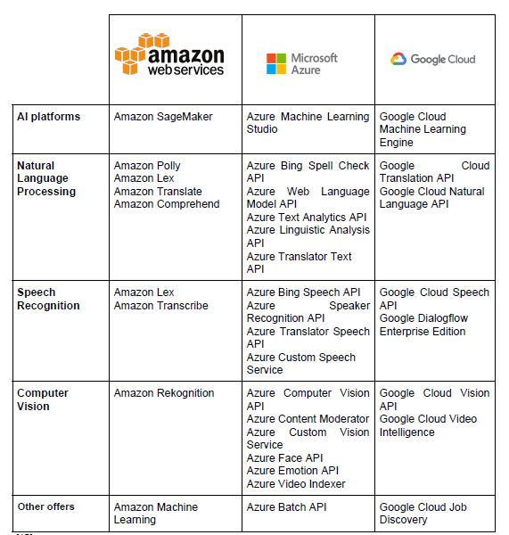

# Machine Learning Services in the cloud (AWS)

## Introduction

Machine Learning and Artificial Intelligence have become more and more popular inside enterprises, being able to offer a competitive advantage by improving operations in many areas such as fraud detection, customer retention and sales forecasting. With the evolution of cloud platforms, Machine Learning has started to be offered under the form of various services in the cloud, by many providers, the most well known being Amazon Web Services, Google Cloud and Microsoft Azure [1]. 

There are multiple benefits of using Machine Learning as a Service (MLaaS, i.e. services in the cloud), rather than dealing with it just locally. Firstly, building complex machine learning models in-house can have issues with scaling, because training real-world models require high computing power, which is easily available using the clusters of computers offered by the cloud. Companies are therefore released of the burden of having the required computing power, and they can upscale and downscale their machine learning workloads depending on the demand, while only paying for what they use. Another important reason for using Machine Learning in the cloud is that it makes these capabilities accessible without the need of a team of data scientists or people with advanced knowledge of Artificial Intelligence. Data Science knowledge is lacking in many enterprises, as shown in a survey by Tech Pro Research in december 2016 that said that only 28% of the companies had experience with AI, and in 42% of them their employees did not have the required skills in this area. Thus, MLaaS can very skillfully provide these capabilities, often out of the box, without the need of deep knowledge [1].

Generally, the Machine Learning services offered by cloud providers can be divided in two categories: general purpose ones, that are very flexible, and specialised ones, that can be easily used out of the box.
The specialised services are provided using APIs and they are very specific to certain use-cases, not requiring additional implementations (e.g. image recognition, voice-to-text, translation etc). The general purpose capabilities need to be implemented on top of the technologies offered by the cloud (e.g. Python with TensorFlow), when there is a need of a functionality not offered as a specialised service. The rest of the research project will focus on Amazon Web Services general and specialised Machine Learning offerings, and it will provide a brief comparison with the services offered by Google Cloud and Microsoft Azure [1].

## Amazon Web Services - Machine Learning offerings

##  Amazon SageMaker

Amazon SageMaker is the general purpose machine learning service offered by AWS, to be used by data scientists and developers. It covers the entire machine learning workflow, including preparing the data, choosing a model, training and tuning it, and making it ready for deployment [2]. 

### Benefits
It can get models ready into production faster and for lower costs than when processing them locally, covering the build, train and deploy steps [2]:
* regarding the **building** step, it can be used to label training data fast, using a combination of human intervention and further learnt automation of the labelling. It includes the possibility of using jupyter notebooks during the development, and the user can use not only their own notebooks, but also other pre-builts ones that can be used as they are or modified. They include a lot of popular use-cases such as recommendation, fraud detection, churn prediction, anomaly detection and many others.  Similarly, there are many existing pre-trained models that can be used, from a selection of popular libraries (e.g. Scikit-learn, TensorFlow, SparkML etc). 
* Amazon SageMaker assists with the **training** step as well. They enable a so called ‘one click training’, their infrastructure being able to scale to petabytes size datasets, providing fast training. The tuning of the parameters is done automatically, removing the need to manual optimisation and reducing the time dramatically (up to weeks). Once trained, the model can be used on any platform without re-training, the performance being automatically optimised for the hardware platform chosen.
* The models can be **deployed** into production with a single click, being ready to generate predictions for  batch and streaming data. AWS ensures both high performance and high availability using auto-scaling clusters spread across multiple availability zones. 

### Use cases
Many customers have reported using Amazon SageMaker successfully. As an example, GE Healthcare trains computer vision models that are deployed in their MRI and X-Ray machines. They used some reinforcement learning models to reduce the size of their models, while achieving a balance between compression and accuracy. They reported an improvement in the speed of implementation, being able to do the whole pipeline in less than four weeks [2].

##  Amazon Personalize

Amazon Personalize is a machine learning service that help developers offer real time personalization and recommendation for the customers. Customer engagement is an important trait in every organisation, thus making product and content recommendations, and tailoring search results and promotions is seeked by more and more companies. Amazon Personalize is aiming to fill the gaps of many companies that are missing the data science knowledge, by offering a service that is easy to use by developers with no prior experience of machine learning [3]. 

The developer needs to provide the necessary data, that is, a stream of activity data (e.g. views, purchases etc), the inventory of products/content they want to recommend, such as songs, movies or items and they can also provide additional demographic data. Amazon Personalize then processes the data and selects, trains and optimise the adequate personalisation algorithms customized for the data. The service is easily available through an API and all data is stored securely. The payment works as a ‘pay-for-what-you-use’ basis [3].

### Benefits 
* **offering recommendations of high quality**: making good recommendations is a difficult task that depends on skills, data and technology. Amazon personalize takes care of the common issues that appear, such as having no data for new users or the evolving behaviour of the users, to make high quality personalizations that understand users’ needs and preferences.
* **personalisation available through all channels and devices**: the recommendations can be easily integrated in mobile or web platforms, among others, via a simple API call. 
* **real-time customer engagement**: it can provide real-time customer recommendations, by mixing real time activity data with the current user profile and product information. In this way it can engage the customer on the spot, to surface the relevant article, video or product offer.
* **models ready quickly**: using this service personalisation models can be released very easily in just a few days. The machine learning pipeline is automated and accelerated [3].

### Use cases
Many companies have used Amazon Personalize for personalised recommendations, search and notifications. For example, Domino’s are using the service to provide customised communication related to their special deals and offers through their digital channels.  This considers’ their individual customers previous behaviour and preferences [3].

##  Amazon Forecast

Amazon Forecast is a machine learning service that provides accurate time series forecasts. Many companies struggle to accurately predicting future business outcomes such as financial outcomes or product demand, given the many issues that need to be considered. For example, just looking at past sales data to forecast future sales is not enough, as some trends are irregular and other independent variables can influence it [4]. 

Amazon Forecast uses the same forecast technology as at Amazon.com to improve the way businesses do their forecasting, by combining time series data with other correspondent features. The data that needed to be provided is the historical data and any other variables that may be considered as relevant. No prior machine learning experience is needed to implement the service. The interactions with the service are encrypted, ensuring security of data, and offering access control to the administrators. The company only pays for what they use [4].

### Benefits
* **offers 50% more accurate forecasts than time series analysis alone**: it uses machine learning to understand how time series data and other independent features (e.g. product features, store location) interact together to make more accurate forecasts. The models are updated over time.
* **reduce forecasts development time**:  it automatically deals with building, training and deploying the forecasting model, starting only from your time series and associated data. 
* **suitable for any type of time series forecast**: forecasts can be build for any use case (e.g. resource planning, product demand) and industry (e.g. finance, retail, logistics) [4].

### Use cases
As specified before, Amazon Forecast can be used for forecasting product demand (e.g. to determine how much inventory to buy and allocate per store), financial performance (e.g. to forecast sales revenue or expenses) or resources need (e.g. to forecast staffing required or raw products for manufacturing). For example, MercadoLibre used Amazon Forecast to predict the demand for over 50,000 products, mentioning how easy it was to set it up and experiment with different models [4]. 

##  Amazon Comprehend
Amazon Comprehend is a machine learning service used to identify insights and relationships in textual data, that can be used without any machine learning knowledge because it fully automates the process. It can be used to analyse emails, reviews, social media posts and other unstructured textual data to discover useful information for a business. It identifies the language of the text, it uncovers names of places, companies or people, it states the sentiment expressed by a text and it can identify the topic of a paragraph, among other functionalities. Like the other services offered by Amazon Machine Learning, the payment is done per usage [5]. 

### Benefits

* **better analyse your textual data to uncover insights**: from customer reviews, social media posts, news etc 
topic organisation of documents: it can extract topics from a collection of documents and then group the documents together based on the relevant topics, which can have various benefits 
* **train models on your own data**: it provides the ability to use your data to train models that deal with specific requirements of your business (e.g. classify social media posts by product)
* **can be used with industry specific or general text**: the things discussed so far have been referring to the general purpose text. However, there is also a version of Amazon Comprehend Medical, which can be used in the medical field to identify medical information from health related textual data. Thus, it can uncover things like medications and medical conditions, from sources like doctor’s notes or patient records [5].

### Use cases 
Given the benefits presented above, there are various use cases in which Amazon Comprehend can be used. One use case would be in call centre analytics, to analyse the support emails, social media comments and other sources to understand customers’ experiences and to improve them. It can also be used for personalizing content on a website, for example by grouping news article by topic and presenting them to the user based on their past search. Moreover, it could be used for classifying support tickets, then extracting relevant information, and passing the tickets to the relevant team [5].

##  Amazon Translate
 
Amazon Translate is a neural machine translation service that delivers fast, reliable translation. It uses deep learning models that provide more accurate translation than other existing models. It allows developers to translate their content in other languages just using the API [6].

### Benefits
* **high accuracy and continuous improvement**: containing state of the art deep learning algorithms, it also improves by learning from new and expanded datasets
* easy to integrate in apps**: it can be used just calling its API, easily integrated into apps and websites
* **customizable**: developers can define how brand or model names are translated in a different language
* **scalable**: it is fast and reliable no matter the volume of requests made [6]

### Use cases 
Examples of popular use cases include:
* **Multilingual sentiment analysis of social media text**: it can be used to translate social media posts, which can be later fed into other services (e.g. Amazon Comprehend)
* **Provides translation of user content**: websites and apps can make the content avaiable in the language required by the user very fast and easily
* **Real-time translation for communication apps**: it can be easily integrated in the communication area, being helpful for customer support issues
There are many companies that make use of Amazon’s Translation service. For example, Hotels.com
Have stated that, after trying multiple machine translation services, they considered Amazon Translate to be the better considering the accuracy and speed. As they are a brand well represented internationally, operating in 41 languages, they have used this service to translate their reviews [6].

##  Amazon Transcribe

Amazon Transcribe is an automatic speech recognition service, that can be included in applications easily, without any machine learning knowledge. Using its API, developers can analyse audio files and generate text files of their transcriptions, but they can also analyse live audio and receive a stream of text in real time [7].

### Benefits
* **Elegant transcriptions**: the text results of the service are formatted and contain punctuation, so that they can be used without any edit.
* **Generates timestamps**: for each word, enabling easy localisation
* **Easily usable in many scenarios**: it can generate subtitles for any audio or video file, it can transcribe low quality customer support calls. It can use both audio files and live audio, as expressed above.
* **Customizable vocabulary**: the vocabulary used can be enriched with custom words depending on the business (e.g. product names)
* **Recognise multiple sources**: it is able to realise when the speaker changes, and adjust the text accordingly [7]

### Use cases
* **Improve Customer Service**: by transforming audio into text, other text analysis services can be used to analyse the interactions and help improve their services.
* **Subtitling services**: it can help media companies to add subtitles to their videos for a wider audience reach
* **Archiving audio**: it can be used to transcribe audio and video files for compliance purposes.
There are many companies that make use of Amazon Transcribe. For example, Isentia uses this service to monitor the media coverage for their clients. They transcribe all audio and video data that they monitor using this service, helping them create more than 13,000 summaries per day [7].

##  Amazon Rekognition
 
Amazon Rekognition service analyzes images and videos. It can identify objects, people, text, scenes, activities and even inappropriate content. It also provides facial analysis and recognition being able of comparing faces for user verification, people counting, and public safety use cases. This service Its continuously training, the identification of the objects that appear in the images and videos to be more accurate in the analysis of them.
 
To use this service you do not require to be an expert in machine learning. So, using this API fastens the process of building an image and video analysis into your deployment. While you are using this service, Amazon also offers other AWS services which you can integrate within your application, such as Amazon S3 and AWS Lambda. In this case with this two integrated services, the application becomes scalable, because you will pay as you go [8].
 
### Types of Detection and Recognition [8]:
 
* **Object, scene and activity detection**: Amazon Rekognition can detect object and scenes in both images and videos. However, activities are only detected in videos.
* **Facial recognition**: Identifies a person in a photo or video using your private repository of images.
* **Facial analysis**: Analyzes the sentiments, features, etc. of the person in the image or video.
* **Pathing**: Captures the path of the people in the stored video.
* **Unsafe content detection**: Analyzes the images and videos searching for unsafe or inappropriate content in the image and videos
* **Celebrity Recognition**: Identifies celebrities in the videos and images for marketing and advertising purposes
* **Text in images**: Detects text from the images
 
### Some uses cases
 
* **Rekognition video**: They can be used to find missing people. Retrieving all the videos that are from suspicious sources and after applying Amazon Rekognition service we can search the person that is missing.
* **Rekognition image**: To find images with your friends. From an image collection we save the metadata of the similar faces and then we will retrieve the ones with the highest confidence match [8]. 

##  Amazon Textract
 
Amazon Textract as the name says, extracts text and data from documents using machine learning. However is not a simple optical character recognition (OCR) process, it goes beyond. OCR is difficult customize, so when we change a form we will need hard-code and update each rule and workflow of the OCR software. In contrast Amazon Textract is more flexible and is prepared to read any type of document.
 
Using Amazon Textract will help you avoid writing complicated code to extract data from these documents. It automatically detects the documents layout and key elements. This API is trained with tens of millions of documents from all type of industries, so you will only need to be worried how will the layout of the form change.
 
In this service also, you will pay for what you use. At this moment you can process documents for $1.50 per 1,000 pages [9].
 
### Features:
 
* **Optical Character Recognition (OCR)**: Automatically detects printed documents. Identifies the key elements and exports the data in JSON format to the integrated Amazon services. 
* **Key-Value Pair Extraction**: detects linked data items. Such as in the field age of a form the age would be the key and the number associated to it would be the value.  
* **Table Extraction**: it detects the structured data in the tables, so it preservers this tabular schema and uploads it like that to the database.
* **Bounding Boxes**: It creates a bounding box in each word of the document and returns the location and geometry of this boxes. It is used for search for future words that are needed. 
* **Adjustable Confidence Thresholds**: when the information is extracted it returns a confidence score for all that it has identified. This confidence score can be used to make informed decisions about the way of using the results [9].
 
### Use cases
 
Create smart search indexes: a mortgage company can use this service to process all the loan documents they have. This documents will be process and stored indexed in Amazon Elasticsearch Service. So it will create a fast search engine if the mortgage wants to make searches per person etc [9].

##  Amazon Polly
 
Amazon Polly turns text into speech. It uses advanced deep learning technologies to make this speech sound like a human voice. This speech can be synthesize in lots of languages being able to deploy you application around the world. Not only you can choose the language, you can decide a natural-sounding voice, whether a female voice or a male voice. With this service you are able to create applications that talk, with a fluid pronunciation creating a high-quality voice for a better user experience.
As other services of Amazon you pay as you need. You can replay the audio unlimited times, but low cost payment per character converted [10].
 
### Benefits
 
* **Store & redistribute speech**: This speech file can be stored in formats like MP3 or OGG, and you are able to distribute them whereas in the cloud or locally.
* **Real-time streaming**: Amazon Polly when it turns text into speech it returns this audio as a stream, so you are able to play this voice instantly.
* **Customize & control speech output**: As mentioned before, you are able to choose the language that you want, the volume, the pronunciation, etc. Amazon Polly is really customizable.
 
### Use cases
 
Duolingo uses Amazon Polly to teach languages in their platform. So, what they do is take the prepared test with the lesson and these are sent to Amazon Polly to transform them to speech. These speech files are stored and indexed in the integrated services of Amazon, such as Amazon S3 and Amazon DynamoDB. Lastly Amazon CloudFront sends these speeches to the E-learning app [10].

##  Amazon Lex
 
Amazon Lex uses voice and text to build a conversational interface. It converts speech to text and it can recognize the intent of the text. To be able to do this, it provides advanced deep learning functionalities such as automatic speech recognitions and natural language understanding.
 
Nowadays in computer science this two functionalities are the most challenging problem to solve, because they require big amounts of data and sophisticated deep learning algorithms. Amazon Lex tries to give the possibility of using deep learning technologies in your application using the same power that Amazon Alexa uses. It is cost effective, charging for the request of text or speech, as always you pay as you go [11].
 
### Benefits
 
* **Easy to use**: Amazon Lex console guide you in the process of creating your own chatbot. It supplies few example phrases with which you can build a natural language model.
* **Seamlessly deploy & scale** :Amazon Lex allows to build, test, and deploy chatbots in the console. Then you can easily integrate this chatbots in chat services. Afterwards, you do not need to worry about the hardware or infrastructure, Amazon Lex takes care of it scaling automatically.
* **Built in integration with AWS**: You can easily integrate other Amazon services, taking advantage of all the resources of AWS [11].
 
### Use cases
 
Call center bots – The call center of Amazon Connect when they use Amazon Lex bots to realize task they can change passwords, ask for the amount of money in their account or even ask for an appointment. These bots use automatic speech recognition and natural language to recognize the intention of the person who calls. The answer of these bots adapts to the dialogue [11].

##  Frameworks for deep learning
 
### AWS Deep Learning AMIs
 
AWS Deep Learning AMIs provides machine learning in the cloud, enabling infrastructures and tools to accelerate the deep learning. For the use of this framework there is no additional charge. Paying the resources to store and run the application is enough [12].
 
Choices depending on what you need:
* **Conda AMI** – Using Conda, it creates different environments in Python for deep learning frameworks. Inside of each of this environments official pip packages of deep learning framework are installed. These environments are isolated from each other, you can do any type of task in each environment because you will not be interfering with any other tasks of other environments. Lastly, it provides an interface to connect with Jupyter notebook, being able to switch from environments and even reonfigure them.
* **Base AMI** – You can deploy your customized deep learning environment. Base AMI comes already with the basics components of deep learning pre-installed. It includes NVIDIA CUDA libraries, GPU drives, and system libraries [12].

### Apache MXNet on AWS
 
Apache MXNet is a framework that offers an easy to use, brief and concrete API for machine learning. This framework includes Gluon interface, which allows any developer with different skill level use it, helping them with getting started with deep learning wherever your product is (cloud, edge device and mobile apps).
 
Furthermore, Amazon allows to use other services along with this framework. Such as Amazon SageMaker that allows you to have full management to build, train and deploy machine learning models. It can even work along other frameworks, as the mentioned above AWS Deep Learning AMIs, to build your own environments and workflows, however is not restricted only to the frameworks of Amazon, it can use others such as Microsoft Cognitive Toolkit, PyTorch, Chainer, etc [13].
 
### Benefits of deep learning using MXNet
 
* **Ease-of-use with Gluon**: Gluon makes MXNet easy to use. It provides fast modelling interface, which can prototype, train and deploy these deep learning models. 
* **Greater Performance**: MXNet distributes the deep learning workloads along multiple GPUs, where these projects are handled in less time. And serverless and batch-based inference is used, so there is an improvement of time and productivity in the developers. 
* **For IOT& The edge**: MXNet produces lightweight models so they can process data remotely in real-time and run in any type of devices, such as Raspberry Pis, smartphones, etc. 
* **Flexibility & Choice**: To build the models you can use the next programming languages: C++, JavaScript, Python, R, Matlab, Julia, Scala, Clojure, and Perl. However the backend is compiled in C++ to have the best performance, independently of the language used for the model [13].

### TensorFlow in AWS
 
TensorFlow has the same objective as the other frameworks, making easy to getting started with deep learning in the cloud. Has become a support in areas of computer vision natural language understanding and speech translation.
 
As mentioned above in the MXNet framework, TensorFlow can also work with other services that provides Amazon, such as Amazon SageMaker, or even can work with different frameworks, as mentioned before with MXNet framework [14].
  
### Benefits
 
* **Visualization**: TensorFlow has a visualization tool, which allow you to visualize with from images and audio to histograms and graphs. Thanks to this tool it is easy to understand, debug and optimize the applications.
* **Mobile development**: Its suitable for Android and even for situations where internet access is not stable or expensive. 
* **Documentation**: Amazon offers tutorials and lots of documentation about this framework. Also there is a large community that contribute code and resolve issues [14]. 

## Comparison between cloud providers

 [15]

### Software
As you can observe in this table, Azure has this strategy of splitting products into separately into specific AI tasks. Most of this features are offered by Amazon and Google, but as part of APIs. However, all three vendors offer the same thing.
 
Amazon SageMaker and Google Cloud ML Engine are cloud-based services, whereas Microsoft Azure Learning Studio is a desktop application that uses cloud-based services.
 
Amazon SageMaker is designed to be fast and easy way to add machine learning capabilities. Thanks to AWS Gluon machine learning library, Amazon SageMaker supports TensorFlow, MXNet, and many other frameworks.
 
Google Cloud ML Engine was created to make it easier for developers, who already have some knowledge in machine learning, to train models. It supports TensorFlow machine learning service, which was created by Google. As mentioned above, this framework is also used by Amazon and Azure [16].

### Hardware
 
AWS, Azure and Google Cloud all support regular CPUs or GPUs for the training models. However, Google has these chips that speed up machine learning tasks, Cloud TPUs, they work with TensorFlow, which is making Google being ahead of their competitors in terms of  processing.
 
Nevertheless, AWS also has some unique hardware features. It has DeepLens which is a wireless video camera that runs deep learning models which sees and performs image processing in real time [16].

## Conclusion

In conclusion, machine learning services in the cloud (MLaaS) has evolved a lot and gained popularity in the past years. This was due to the high performance computing necessary for ML that cloud computing made easily available, as well due to the lack of data science knowledge in the enterprises. It is available mainly in two flavours: general, flexible ML that can be changed according to the needs, and specific, out-of-the-box solutions for well knows problems. Amazon Web Services offers a multitude of services regarding both, that range from recommender systems, natural language processing APIs, to image processing and voice recognition solutions. They all seem easy to use through their APIs, without the need of machine learning expertise. Other cloud computing platforms that offer similar services are Microsoft Azure and Google Cloud.

## References:
[1] G. Hummel and J. Cook, "What are the Benefits of Machine Learning in the Cloud?", Cloud Academy, 2018. [Online]. Available: https://cloudacademy.com/blog/what-are-the-benefits-of-machine-learning-in-the-cloud/. [Accessed: 26- Apr- 2019].

[2]"Machine Learning Models & Algorithms | Amazon SageMaker on AWS", Amazon Web Services, Inc.. [Online]. Available: https://aws.amazon.com/sagemaker/. [Accessed: 26- Apr- 2019].

[3]"Real-time personalization and recommendation | Amazon Personalize | AWS", Amazon Web Services, Inc.. [Online]. Available: https://aws.amazon.com/personalize/. [Accessed: 26- Apr- 2019].

[4]"Time Series Forecasting | Machine Learning | Amazon Forecast", Amazon Web Services, Inc.. [Online]. Available: https://aws.amazon.com/forecast/. [Accessed: 26- Apr- 2019].

[5]"Amazon Comprehend - Natural Language Processing (NLP) and Machine Learning (ML)", Amazon Web Services, Inc.. [Online]. Available: https://aws.amazon.com/comprehend/. [Accessed: 26- Apr- 2019].

[6]"Amazon Translate – Neural Machine Translation - AWS", Amazon Web Services, Inc.. [Online]. Available: https://aws.amazon.com/translate/. [Accessed: 26- Apr- 2019].

[7]"Amazon Transcribe – Automatic Speech Recognition - AWS", Amazon Web Services, Inc.. [Online]. Available: https://aws.amazon.com/transcribe/. [Accessed: 26- Apr- 2019].

[8]"Amazon Rekognition – Video and Image - AWS", Amazon Web Services, Inc.. [Online]. Available: https://aws.amazon.com/rekognition/. [Accessed: 26- Apr- 2019].

[9]"Amazon Textract | Extract Text & Data | AWS", Amazon Web Services, Inc.. [Online]. Available: https://aws.amazon.com/textract/. [Accessed: 26- Apr- 2019].

[10]"Amazon Polly", Amazon Web Services, Inc.. [Online]. Available: https://aws.amazon.com/polly/. [Accessed: 26- Apr- 2019].
[11]"Amazon Lex – Build Conversation Bots", Amazon Web Services, Inc.. [Online]. Available: https://aws.amazon.com/lex/. [Accessed: 26- Apr- 2019]. 

[12]"Amazon Deep Learning AMIs", Amazon Web Services, Inc.. [Online]. Available: https://aws.amazon.com/machine-learning/amis/. [Accessed: 26- Apr- 2019].

[13]"Apache MXNet on AWS", Amazon Web Services, Inc.. [Online]. Available: https://aws.amazon.com/mxnet/. [Accessed: 26- Apr- 2019].

[14]"TensorFlow on AWS - Deep Learning on the Cloud", Amazon Web Services, Inc.. [Online]. Available: https://aws.amazon.com/tensorflow/. [Accessed: 26- Apr- 2019]. 

[15]"2018 Digital Trend: Machine Learning as a Service", G2 Crowd. [Online]. Available: https://blog.g2crowd.com/blog/trends/artificial-intelligence/2018-ai/machine-learning-service-mlaas/. [Accessed: 26- Apr- 2019].

[16]"Comparing Machine Learning as a Service: Amazon, Microsoft Azure, Google Cloud AI, IBM Watson", AltexSoft. [Online]. Available: https://www.altexsoft.com/blog/datascience/comparing-machine-learning-as-a-service-amazon-microsoft-azure-google-cloud-ai-ibm-watson/. [Accessed: 26- Apr- 2019].
