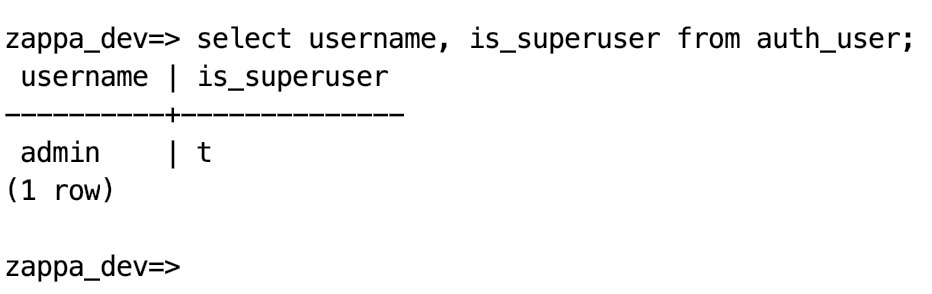

# Itroduction
With the current document, we are exploring some applications and frameworks built around the serverless paradigm.
In particular, the *Serverless Framework* and *Zappa* will be analyzed.
Both of them are framework to build serverless applications without really thinking serverless.
This means developers are free to use their favourite environments and programming language to build their applications and they simply deploy them as serverless through a particular tool.
During the document, it will be clear the different focus of the two frameworks and the different use cases for both.

# The Serverless Framework
The Serverless Framework is a free and open-source web framework written using Node.js that allows users to easily build \& deploy auto-scaling, pay-per-execution, event-driven functions (*a.k.a. serverless computing*) in almost all cloud vendors.
Just to give an intro of serverless computing, it is a cloud computing model which aims to abstract infrastructure management, provide an inherently scalable design with a pay-per-use model.
This helps provide availability and fault tolerance which helps developers focus on writing business logic and not worry about other things. A Serverless app can simply be a couple of lambda functions to accomplish some tasks, or an entire back-end composed of hundreds of lambda functions. 

There are five main concepts that we need to highlight independently in order to understand the framework. 

* **Function:** Is an independent unit of deployment, like a micro service, composed for single package of code responsible to execute only one task, for example: authenticating a user.
* **Events:** An event is anything that could trigger your function. For example, asking access to an API. When defined an event in the serverless framework it will automatically create the necessary infrastructure. For example, if your API needs to be trigger by an HTTP call then the framework will create the API gateways endpoint and will configure your function to listen to these events. 
* **Resources:** These are the services that the cloud vendor provide and that your function needs to have access, for example S3 bucket in AWS. Through a simple configuration the framework allows you to automatically provision the resources that you have defined when deploying your application. This provide the user of a tool to repeatedly deploy its application with a single command line even when changing the account or the provider.
* **Services:** It is the unit of organization defining all the functions, events and resources that go with the project. The user could define one or more services that are saved by the framework as a *yaml* file and deployed at once. 
* **Plugins:** These can override or extend the functionalities of the framework, The user could install many plugins in its service such as browserify to optimize JavaScript code or autoscale DynamoDB resources with a single AWS AutoScalingPlan (https://github.com/serverless/plugins).


## Serverless framework and AWS Key Management Service

In this report we will show the capabilities of Serverless framework through an application using AWS Key Management Service. This is useful when we need to store and read sensitive or secret data and allow different users different access to each of these data.

First, we need to configure the serverless framework with our credential in AWS. 

```bash
serverless config credentials \
    --provider aws \
    --key <key> \
    --secret <secret>
```

Now for creating the lambda function we can use some templates already defined by the framework. Then, inside your project execute the following command.
```bash
serverless create \
    --template aws-python3 \
    --name hello
```

This command will create two files, serverless.yml (the services) and handler.py (the function). The function receive as parameters information about the event that triggered it. It should look like this:

```python
import json

def hello(event, context):
    body = {
        "message": "Go Serverless v1.0! Your function executed successfully!",
        "input": event
    }

    response = {
            "statusCode": 200,
            "body": json.dumps(body)
        }
    
    return response
```

On the other hand the serveless.yml file will have all the information regarding the configuration of your services and the events that will trigger your function. It should look something like it is show bellow where we are specifically saying what event will trigger our function, in this case just a GET request to *hello*.

```yaml
service: hello-world 
provider:
  name: aws
  runtime: python3.7
functions:
  hello:
    handler: handler.hello
    events:
      - http:
          path: hello
          method: get

```

After, those two simply step we just need to execute 
```bash
serverless deploy
```
and the framework will immediately configure a lambda function for us and assign it an endpoint for accessing it.
That was easy, let make it a bit complicate accessing from the lambda function to a service: AWS Key Management Service.

AWS Key Management Service (KMS) makes it easy to create and manage keys and control the use of encryption across a wide range of AWS services and in your applications providing the user with centralized control of its encryption keys. You can create new master keys whenever you wish, and easily manage who has access to them and which services they can be used with. You can also import keys from your own key management infrastructure into AWS KMS or use keys stored in your AWS CloudHSM cluster and manage them from AWS KMS. You can manage your master keys and audit usage from the AWS Management Console or by using the AWS SDK or AWS Command Line Interface (CLI) (https://aws.amazon.com/kms/). 

Creating a new key in KMS is straight forward and a few configuration need to be set up. Mainly, we need to define the user with full administrative power and the users of the key it self. The first ones could rotate, modify, remove, etc. the key while the last ones can only use it for encrypting and decrypting content. The picture below shows how the new key should look like. 


Once the key is created we can use AWS Systems Manager (*ssm*) Parameter Store, to create Secure String parameters, which are parameters that have a plain text parameter name and an encrypted parameter value. Parameter Store uses AWS KMS to encrypt and decrypt the parameter values of Secure String parameters. The following command line will create a new secret information and encrypted using the previous created key.
```bash
aws ssm put-parameter \
    --name "password" \
    --value "content" \
    --type SecureString \
    --key-id "XXXXXXXX" 
```
Bear in mind that for executing this command you need to configure aws to the user with the administrative permissions or at least with the user of the key. 

Now, in order to access this content from a lambda function we can use serverless framework and in less than three minutes we can deploy our function. A couple of steps are just needed in order to achieve this. First, we need to  change our configuration file in order to allow the lambda function to access to *ssm* services.
```yaml
service: using-kms
provider:
  name: aws
  runtime: python3.7
  region: eu-central-1
  iamRoleStatements:
      - Effect: "Allow"
        Action:
            - "ssm:Get*"
        Resource: "*"

functions:
  getSecret:
    handler: handler.getSecret
    description: This function will return a secret stored using KMS
    events:
        - http:
            path: get-secret
            method: post
            integration: lambda
            cors: true
            response:
              headers:
                "Access-Control-Allow_Origin": "'*'"
```
Also, we need to change the function it self as well. In this case the function is trigger by a post request and in the body we will have the access key and secret key of the user trying to have access to the information store using *ssm*. After changing the handler function you just need to write serverless deploy in the command line and it is done. Subsequent figure shows the architecture of the lambda function in aws. 
```python
import boto3

def getSecret(event, context):
    body = event['body']
    aws_access_key = body['aws_access_key']
    aws_secret_access_key = body['aws_secret_access_key']

    session = boto3.Session(
        region_name='eu-central-1',
        aws_access_key_id=aws_access_key,
        aws_secret_access_key=aws_secret_access_key
    )

    ssm_client = session.client('ssm')

    my_password = ssm_client.get_parameter(Name='top_secret_1', 
                WithDecryption=True)
    return str(my_password)
```


This example is to show the advantage of serverless framework for easily deploying lambda function on AWS. However, this is not the only one. Firstly, the ability to incorporate infrastructure as code. Also, it uses CloudFormation under the hood, which means you can easily spin up identical AWS deployments for say, dev, staging and prod environments. These include any specified resources, which can include S3 or other AWS Services.
Another benefit is a better developer workflow with Git and command line deploys vs. just uploading .zip files to Lambda. Finally, for a backend built with Serverless, the use of API Gateway and the ability to share business logic makes using Serverless or a competitor a no-brainer.


# Zappa

The serverless framework is useful to manage resources associated with AWS Lambda functions. We showed how it becomes simple to deploy an arbitrary piece of code as a serverless function. However, in order to deploy a complete web server, we need several functions, associated to different routes. Developing microservices, we can completely define the granularity of the system. We could create one Lambda function for each route, or we could create a single function handling all the routes internally. The Serverless Framework gives to us the possibility to achieve it, designing and structuring the application from scratch. However, it is not always so handy. Sometimes, we are used to web application framework like Django or Express and it is cumbersome to transfer such an application to be completely serverless. This approach should simplify the deployment of scalable and always available application, however, in this case, it makes it more complicated.

Zappa is a deployment tool specific for Django and Flask, two applications frameworks for Python. The developer now can totally focus on the application itself, leaving the whole deployment to Zappa, as simple as it should be.

## Simple application deployed with Zappa

Let's try to deploy a simple application with Zappa. We will understand how easy it becomes to deploy a Django application completely serverless.

Assuming to already have a Django application running, we only need to specify the initial configuration for the deployment. Specifically, the AWS region, the S3 bucket name and the environment(dev by default).
After this simple configuration, we are ready to deploy the application as a Lambda function:
```bash
zappa deploy dev
```

With this simple command, Zappa ships the application on the AWS Cloud, exposing an API Gateway connected to a Lambda function.
However, we need to allow the API Gateway to perform requests to Django. We just need to add the newly created endpoint to the allowed hosts of the Django setting file. Whenever we change something in the application, the deployment needs to be updated:
```bash
zappa update dev
```

Now, we completely deploy the application on the cloud. However, since serverless applications are stateless by nature, we still need to properly configure the handling of static files and the database. Zappa allows us to use the models and the backends of Django even if the application is serverless. We just need a bit of configuration.

Serving static files efficiently shows one of the downside of using a serverless approach. By definition, the developer has no control on the resources of the application. Usually, static files are served by a fast web server (Apache, Nginx,...) hosted on the same machine of the Django application. With this approach, the static files are served with low latency to the user, while only the complex processing and rendering is left to Python (or any other language). However, this approach is not feasible with a serverless deployment due to the nature of the product. This points out one of the main downside of this kind of applications.
Anyways, there are other ways of serving static files. For example, we can rely on an external service. Exploiting the AWS services, S3 and CloudFront could solve our problem. While Lambda and Django process complex content, CloudFront handles the static files and delivers them directly to the user. In order to achieve such result, we need to install *django-s3-storage*. We need to create a specific S3 bucket serving the static files of the application and configure properly its address in the Django setting file. Running the command:
```bash
python manage.py collectstatic --noinput
```

we are able to move all the static files to the cloud. With this configuration, the pages will be served directly from the S3 bucket, however, CloudFront can be configured to leverage the power of a CDN.

Regarding the database, we can deploy an arbitrary database in the cloud and connect it to the Django models. An easy choice would be to use AWS RDS, with for example PostgreSQL. We need to configure a proper security group for the Lambda function and include it in the inbound rules for the database. Moreover, we can configure the database to be available on specific subnets, the same in which we can provision the Lambda function. Given this initial configuration, we only need to install the proper backend for Django and configure the credentials for the new database. Given this, we are ready to migrate to the new database and push the new code with Zappa.
```bash
python manage.py makemigrations
zappa update dev
zappa manage dev migrate
```

At this point, in order to see if this full configuration works, we can open the admin page. It will be served as a static file from the S3 bucket and it will check user credentials in the RDS database. In the next section it will be explained how the security settings are handled.

In order to test the system, we first verify that the migration happened successfully. Specifying the host of the RDS database, with the user and password, we connect to Postgre. We can see the list of tables created through the migration with *\d*:


However, in order to see the full system to work, we need to create the super user. However, since the *createsuperadmin* command of Django is thought to be executed in an interactive mode, we need to use plain Python code. We will use the User model given by Django to create the admin. Zappa gives a way to execute plain Python code inside the deployed application:
```bash
zappa invoke \
    --raw dev \
    "from django.contrib.auth.models import User; User.objects.create_superuser('admin', 'admin@mida.com', 'admin_psw')"
```

In order to check that this command was successfully executed against the correct database, we perform a select query on the *auth_user* table.



Now, we can access the web application through the endpoint exposed by the API Gateway. In order to test the functioning of the current application, we need to open the admin page.


Previous figure shows how the static files (CSS in this case) are served by the S3 bucket, while the rendered HTML page is created by Django. Moreover, the information regarding the user is tested against the remote database and, upon success, Django renders the admin dashboard.

With this full configuration, we are able to serve static files efficiently and to use Django models on a remote database. Having the main web application running serverless. 

## Network security settings
In order to secure the application deployment, we need to set proper security groups and access policies. For example, the API Gateway can easily have a public access, however the database needs to be protected. In this regard, we need to properly protect the Lambda function and the database. Specifically, the Lambda function will only be accessed by the API Gateway and the database will only be accessed by the Lambda function, which contains the web application. Moreover, we can put all these services in the same VPC (Virtual Private Cloud). In this way, they can only be accessed by services inside it. Another precaution we can take is to use subnets inside the VPC, which corresponds to different availability zones. Following this idea, the Database can only be accessed inside the specific subnets of the VPC and only by a specific security group, corresponding to the Lambda function. Consequently, the Lambda function must be deployed only on those specific subnets in order to properly communicate with the database. Moreover, we must specify a fixed address that can access the database for admin purposes. In this regard, we can either specify something outside the VPC, like our PC, or a specific machine inside the VPC. In the case in which the machine is outside the VPC, the database must be set with a public access, with a proper inbound rule (specifying the security group of the Lambda function). However, if the machine is inside the VPC (called bastion host), then we only need to open the machine to the internet, making only our own machine access it through ssh. In this way, the database is protected and allows requests only from the same VPC.

```json
{
    "dev": {
        "aws_region": "eu-west-1",
        "django_settings": "zappa_tutorial_1.settings",
        "profile_name": "default",
        "project_name": "zappa-tutorial-",
        "runtime": "python3.6",
        "s3_bucket": "zappa-fax6b6jp7",
        "vpc_config" : {
            "SubnetIds": ["subnet-1c1fb646","subnet-a01668e8"],
            "SecurityGroupIds": ["sg-af579bdc"]
        }
    }
}
```

It can be understood that this configuration, only regarding the Lambda function, can be carried out in the Zappa deployment configuration. However, the network configuration regarding the database needs to be done manually from the AWS console. However, once this configuration is done, it does not need to be repeated. It is independent from Zappa itself, it depends more on the nature of stateless microservices. Serverless microservices are stateless by nature, which implies that they request their state from an external source on each execution. In a cloud infrastructure, this implies that a proper security configuration needs to be established between the services. However, this is a configuration that happens only once, at the first deployment of the application. 

## Analysis of the architecture
Zappa deploys the application as a single Lambda function, which is accessible by an API Gateway.


Out of this report can be easily understood how easy it becomes to deploy a serverless application with Zappa.
Once the initial configuration is set up, like security groups and configuration variables, the only task of the developer is to write the Django application. All the deployment process is left to Zappa.
However, we can see that in the end the Django application is deployed as a single Lambda function. This brings some implications. In order to discuss them, we need to go through the possible motivations for exploiting the serverless approach. If the focus is the simplicity of deployment, without sacrificing scalability and availability, then this kind of solution covers all possible aspects. The web application is guaranteed to be scalable and available by the nature of the Lambda function and Zappa makes the deployment extremely easy.
However, if the focus is to leverage the power of microservices, this solution may appear not ideal. The complete opposite approach would be to deploy each route as a serverless function, making each microservice scale independently. However, due to the cold start delay of Lambda, this solution may not be so efficient as well. As always, a good approach would be an intermediate solution. We can break down the application in some functional components and deploy each of them independently as a Lambda function. In this way we can group together different routes, avoiding the cold start problem and we avoid to have a big unique Lambda function.

However, if the goal is to have a tight control of the resources, still exploiting the power of microservices, maybe a serverless approach is not the best one. In order to achieve such result, probably Kubernetes/Docker or ELB/Autoscaling group are better solutions. As always, these approaches come with different downsides. For example, if the application has not a huge number of requests, the user still needs to pay for all the resources. Moreover, configure all these tools to work together sometimes is not trivial. However, they provide to the developer a great control. Most of the limitations of the serverless deployment are removed in this way. The biggest one is the stateless nature of the serverless applications. Each microservice can be deployed close to the database holding its state, which makes it a stateful microservice. Moreover, it can cache some results even in memory, making subsequent responses extremely fast. This is a fundamental limitation of serverless applications.

# Conclusions
Concluding the report, we presented the benefits and the downsides of serverless applications. We explored some available tools to deploy simple and complex applications completely serverless. The main result is that deploying an entire application as serverless can be extremely easy, however it comes with some limitations due to its stateless nature. In order to be more efficient, the application could be broken down to different microservices, distinguishing among the ones needing a state and the ones which do not. Following this approach, the serverless paradigm will be leveraged together with the traditional way of seeing microservices. Without giving up to performance. 


