# CC-2019 Research: Tableau + TPC-DS

* Braulio Blanco
* Gonçalo Moreira

Cloud Computing
Dr. Angel Toribio-González

## Introduction

We choose Tableau as our topic because we had never worked with this platform before and we were curious/interested in knowing it, so we decided to explore it.
Our initial idea was to load a TPC-DS into a database and create reports for general/middle managers.

With this research, we want to learn more about this tool, how it works, what are the main functionalities/features, where it can be used, and what's his performance.

Tableau has always been one of the top BI platforms and, according to the Annual Gartner Magical Quadrant, always positioned as a Leader. This means that it is a platform that execute well against their current vision and is well positioned for tomorrow.

In the latest Gartner Magic Quadrant (February 2019), Tableau is the Top 2 Leader BI tool, ahead of other market's competitors such as SAP, Oracle and IBM.

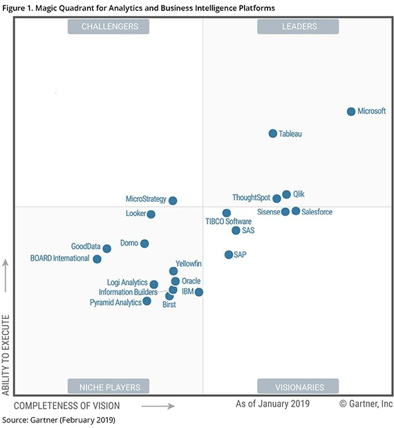

## Tableau - Products
Tableau offers interactive data visualization products focused on business intelligence.

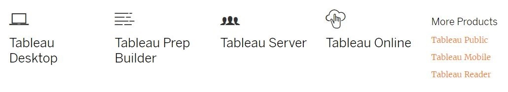

It works through four main products: Tableau Desktop, Tableau Prep Builder, Tableau Server and Tableau Online.

- __Tableau Desktop__
It is the main tool of Tableau platform and has the following features:
- Build charts and analyze data
- Create powerful and interactive dashboards
- Fast and easy user experience
- Good user interface
- Drag and drop to discover trends and outliers
- Easily combine data from multiple sources in 1 simple view

- __Tableau Prep Builder__
Prep Builder is the tool to help preparing and cleaning the data. It is a intuitive interface that can quickly transform and shape our data.
We can connect to many different data sources (such as spreadsheet - Excel, on-premise database - SQL Server or cloud applications - Amazon Redshift).
The Prep Builder can be very useful to find and fix data problems and inconsistencies in an instant, without coding. We can also use calculations to express data in different ways.

- __Tableau Server__
Visual tool that manage and monitor everything from user permissions to data source connectivity and the status of the server. It's intuitive to maintain and it is also the place where we can publish dashboards.

- __Tableau Online__
Tableau Online is “Tableau in the cloud”. It’s a cloud-based solution for sharing and collaborating on content creared in Tableau. We can have access to all functionalities of the Desktop platform but in the cloud. Therefore, we can do visual analytics and we easily share our dashboards. It is a Software-as-a-Service (SaaS) that is available to use right now and everywhere.
One of the best features of Tableau Online is “Ask Data”. This feature allows the user to ask natural language questions and get instant answers about the data. It’s very helpful to identify hidden opportunities.

## Tableau - Other Products
Tableau also has other products: Tableau Public, Tableau Mobile and Tableau Reader.
- __Tableau Public__: allows us to publish interactive data online.

- __Tableau Mobile__: easy-to-use mobile application for all devices (tablet or phone), available in the AppStore and GooglePlay.

- __Tableau Reader__: can be used to open and interact with packaged workbooks with extracted data sources that have been created in Tableau Desktop. It makes it easier to work with the views without needing to access to the source data, because a copy of the data source is already contained in the packaged workbook.

## Tableau - Developer Tools
Tableau's developer tools and APIs allow us to integrate, customize, automate, and extend Tableau to fit the specific needs of an organization.

- __Extensions API__: allows developers to create dashboard extensions that enable customers to integrate and interact with data from other applications directly in Tableau.
- __Data connectivity__: create connectors to data sources that are not supported by Tableau.
- __Automation__: automate repetitive tasks and programmatically manage Tableau Server content (workbooks, data sources and users).
- __Data science integration__: make our statistical models accessible to more people. Integrate and visualize the data from our models (R, Python and Matlab) in Tableau.
- __Embedded analytics__: make the data interaction easier for more people and allows users to add the power of interactive visualization to external applications, using key features and APIs such as JavaScript API, REST API, Single Sign-on and Mobile app bootstrap.

## Tableau - Data sources
With Tableau we can have access to many data warehouses and cloud data. It allows to connect to multiple different data sources such as spreadsheet (Excel), on-premise database (SQL Server) or cloud applications (Amazon Redshift).

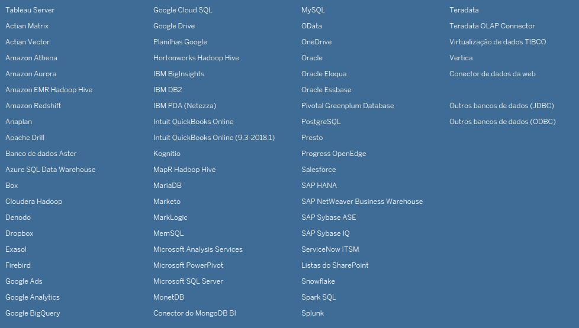

## Tableau -Simple Architecture
Tableau has a main server called Tableau server that connects with the different data sources as plain text files, databases or many different kinds of storage options. The data that is retrieved is showed to the user using a web browser, also the designers can use the desktop user to design the reports and publish it to the Tableau server. Finally Tableau allow us to embed the reports using HTML.

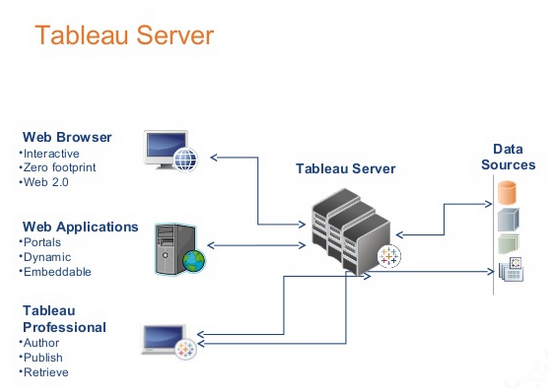

As we mentioned before Tableau accepts differents data sources and also Tableau has its own repository, this repository stores the metadata (model, configuration, security) and also we can use Tableau as a data server. The users can download the graphics and also the corresponding data.

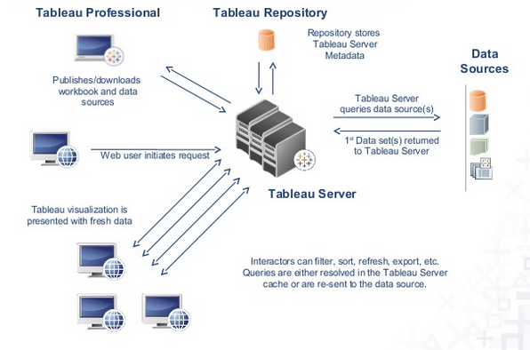

Tableau use HTTP Protocol to interact with the final users using web applications. Tableau has a gateway which receives all the requests  and it redirects to the appropriate resources. Also this gateway acts as load balancer in a distributed environment. The application server manages the security with the security components. Tableau uses a VizQL server to communicate with the data sources, this data is rendered and presented to the final user. VizQL manages the shared cache among users. The data that is extracted is loaded into a Tableau repository and its frequently updated with the sent data. 

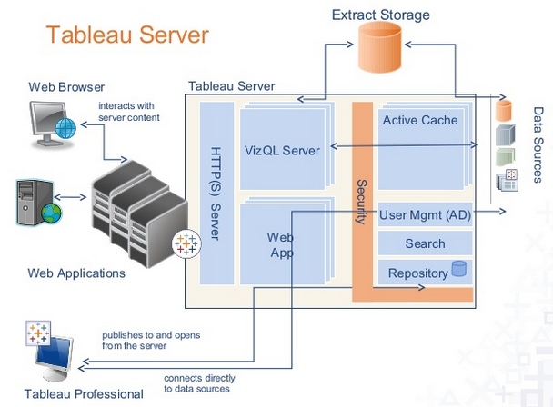

The users in Tableau can be administrators, designers, other systems and also the final users. The administrators can manage the security aspects of the server, can manage the users, groups and access to each resource, the designer can create worksheets and dashboards, the observer can only use the created worksheets or dashboards. 

## Authentication Mechanisms
Tableau Server uses its own verification mechanism to authenticate and authorize the access to users to the resources.  If the company has a external authentication service can integrate this service with Tableau server  using technologies as Kerberos, SSPI, SAML, OpenID. We can use also Active Directory or  LDAP for store the account information instead of the local Tableau Server, but we have to ensure that this store supports the authentication mechanism that we have. For example is not possible to access a LDAP Server using Kerberos, OpenID or SSPI, but we can use Kerberos if we are using Active Directory.

With respect to the final client, some clients does not support certain kind of authentication mechanisms, for example Tableau mobile does not support SSPI nor OpenID, web browsers supports all the mechanism and Tableau desktop supports almost all.

## Monitoring
We can monitor the health of the server configuring alerts and subscriptions using SMTP protocol. In the first approach, Tableau server sends server information to specific configured users  like status changes, licence reporting and remaining drive space using thresholds. We can configure the Email server to send mails to a list of users.

## Practical Case

In order to discover the features and to learn about Tableau, we are using the source tables of the TPC-DS as base tables and also Postgresql as the database.

### General Aspects.
1. Source Files: TPC-DS. TPC-DS is a Decision Support Benchmark, which models the decision support functions of a retail product supplier. Indeed, this tool offers the possibility to test all databases in the same way. Usually this tool is used for "Big Data". TPC-DS is the de-facto industry standard benchmark for measuring the performance of decision support solutions including, but not limited to, Big Data systems. The current version is v2.
1.Desired goals:
Design a dashboard focused in strategic management information.
Understand how Tableau works and how to implement reporting solutions for managers.
To discover the advantages and weakness of Tableau.
1.Scope:
Main functionalities of Tableau desktop and Tableau cloud.
Local postgresql database.
Restrictions:
For the proof of concept we are using a trial licence.

## Manager Dashboard.
### Configuring Data Connections: 
After installation of Tableau desktop we can configure the data sources. As we can see in the following image, Tableau has different data source connectors like MS Excel, Text files, JSON files, Access, PDF and other database services like Tableau server, MySQL, Postgresql, IBM DB2, Google Drive, Dropbox, and many others.

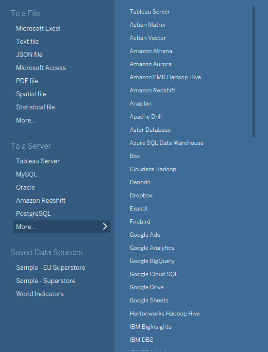

A configuration window will be displayed and we can connect a local or remote server.

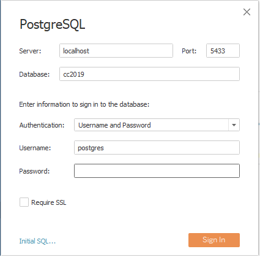

After the connection has been configured, the tables will be showed according the security of the account. We can use Custom SQL to configure our custom script.

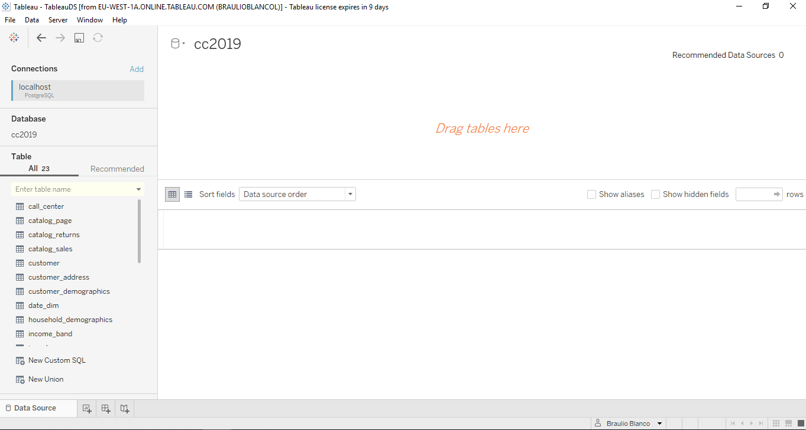

#### Select data with full tables using Tableau interface:
We have two options for gathering the data, the first is using the join provided for Tableau. Tableau provides a graphic tool to join the tables with a median level of knowledge of SQL queries. After selecting the kind of Join (Inner, Left, Right, Full Outer) and selecting the join attributes.

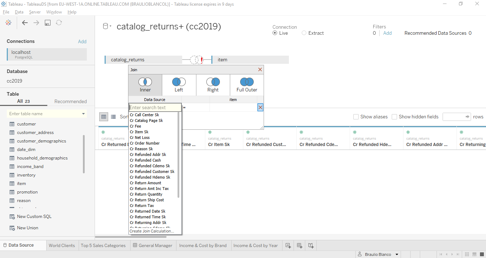

We can create using this tool complex join queries as possible. As we can see in the following image, we can create complex queries using binary joins.

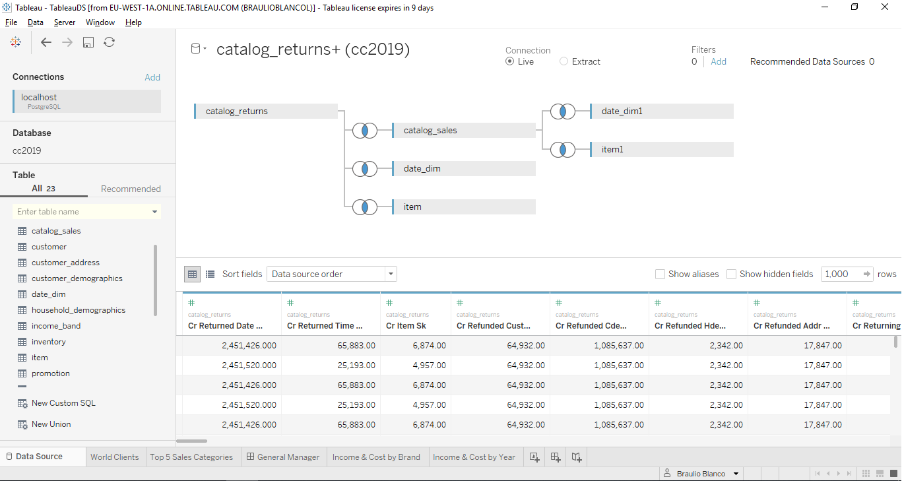
        
We can define filters to reduce the data. Tableau allow us to add as many filters as needed and we can define the following filters: range of values, max, min, or considering or avoiding null values on certain columns for numeric values.

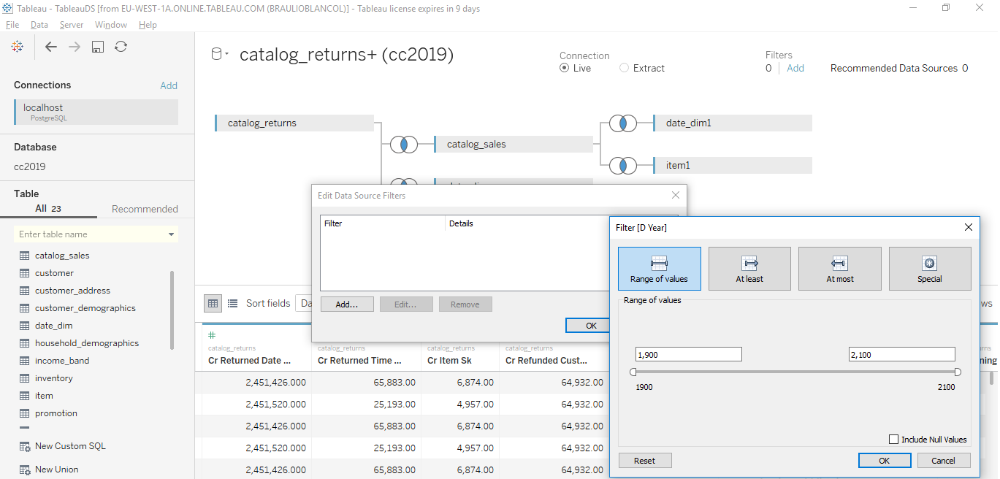

If we select a text value, we can filter based on a specific value, a wildcard, a condition or a top statement.

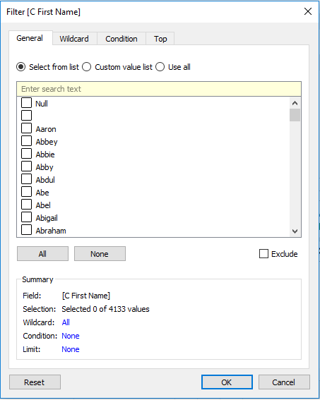

If we select a date value, we can filter based on a specific date, range of dates, or a component of a date like years, quarters, months, days, week days, etc.

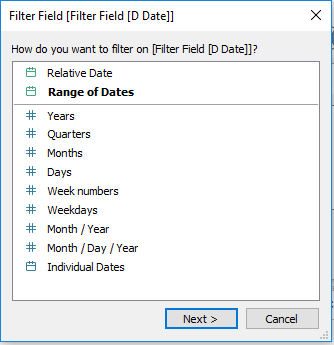

In the connection properties, we have two options: live or extract, live option will use the connection to retrieve the data, all the changes are reflected in Tableau in real-time. When the extract option is selected, Tableau takes a snapshot of the data and use this data to speed up the data visualization. Tableau uses in-memory data engine to extract directly. All the updates are managed by Tableau.         

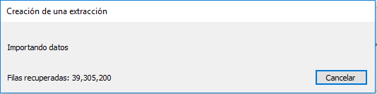

#### Select data with custom SQL:
The second option is to use custom SQL, we can use joins inside the select statement and as the result is a table, we can also use joins using the Tableau tool.
        

        
#### Creating worksheets:
In order to create the visual reports, we have to create worksheets, As we can see in the following image, we have at the right the data sources and when we select one of the data sources we will see the dimensions and measures, it is possible that some dimensions are in the measures sections because it is a number. In this case we have to change the data type to String using right click and have to drag the field and drop in the dimension section. Also we have to ensure that the date has the right configuration,we have to do right click and select Convert to continuous, the color of the icon will be green. We can see that in the left of the column the icon defines the data type.

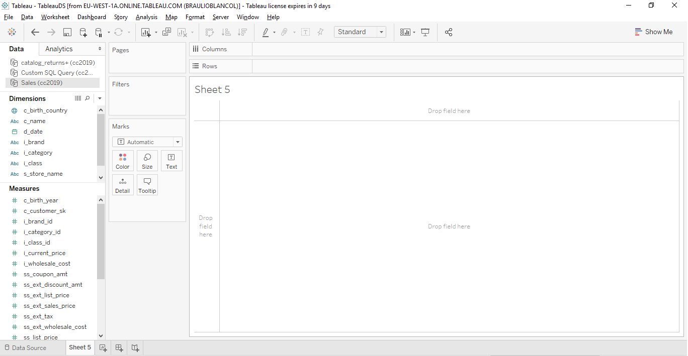

We can drag and drop in the graph all the fields that we want, there are rows and columns sections, used for many of the table charts, and the measures have to be placed in the right-central center.

In the right section there is a show me button, we can change the chart type selecting one of the charts,  if we hover the mouse over one chart we can see the chart name and the requirements for using the chart, for example in the following image, the packed bubbles chart, we need 1 or more dimensions and 1 or 2 measures. And if we check the details for the maps we can see that 1 geo dimension is required, 0 or 2 measures (size and color of the chart piece in the map chart)  and also 0 or more dimensions (text information that is showed as tooltip when the mouse hover the specific region.

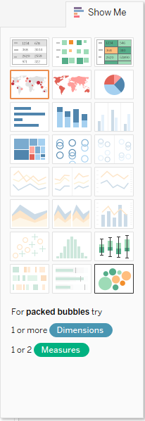     

In the left side of the main section, under the filters section, we can see the Color, Size, Label, Detail and tooltip button. The Color button configures the color configuration of the main chart. The size button controls the size of the label or certain components in some charts, like bubble chart size in packed bubbles chart. In the label button we can change the font, size and alignment. The tooltip button allow us to modify the text that will appear when the mouse hover the chart.

In the left side of the selected attributes, we see an icon that could be one of the icons of the previous explained buttons. We can change the behaviour of the attribute doing right click in the icon and select another type.

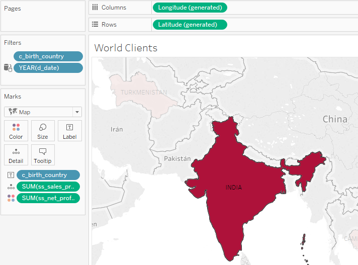     

If we select the attribute, according of the attribute type, we have many options like using minimum, maximum, average, create filters, create a sort option (ascending, descending) or make it generic to all or specific worksheets.

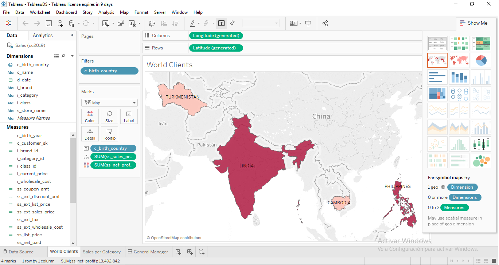     

We can create as many worksheets as possible.

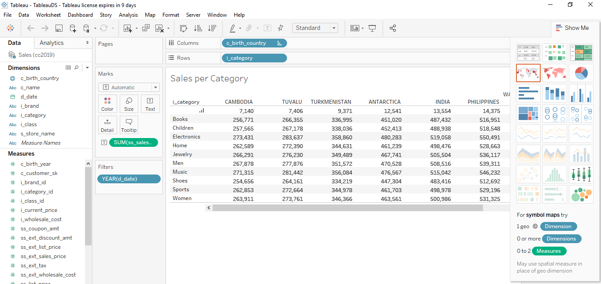     

#### Creating Dashboards:
After creating the worksheets we can create a dashboard that means that we can show many charts in the same page. As we can see we can insert in the canvas different HTML components as texts, buttons, images, web pages or divisions (horizontals or verticals).

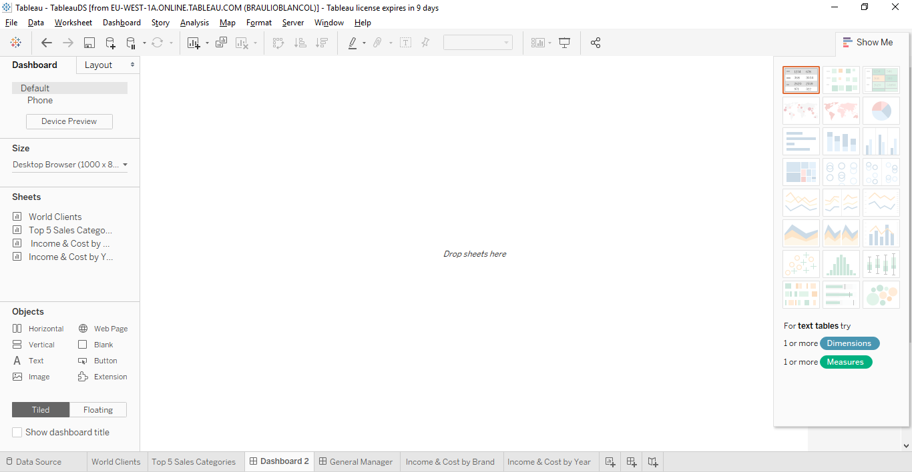

We only need to drag and drop the corresponding worksheets from the sheets section. After drop the components, we will see the filters placed in a section that can be moved to another section.

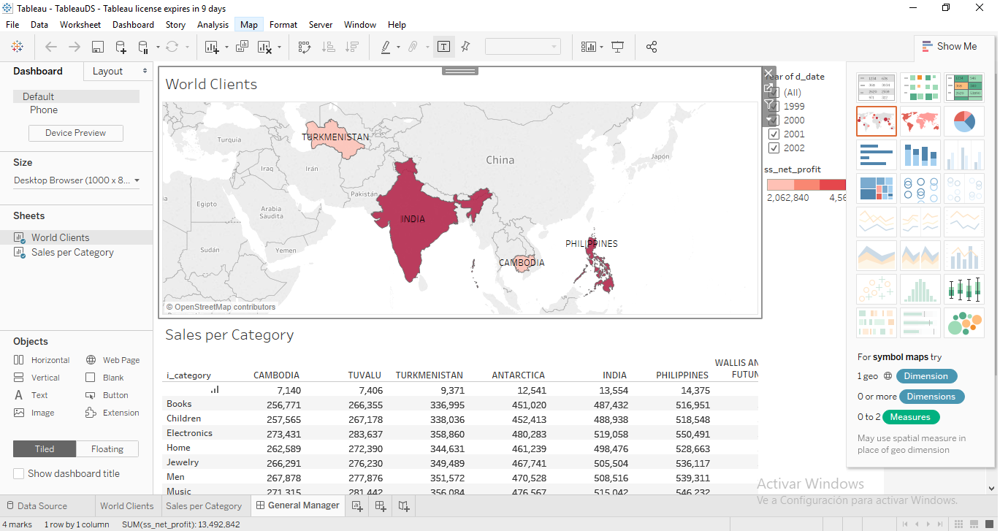

We have an option of preview in the left side of Tableau, we can change the device type (Desktop, Tablet, Phone), after selecting the device type, we can change the model that means the screen resolution. In the following image we can see the preview in a mobile device using the Tableau Mobile app.

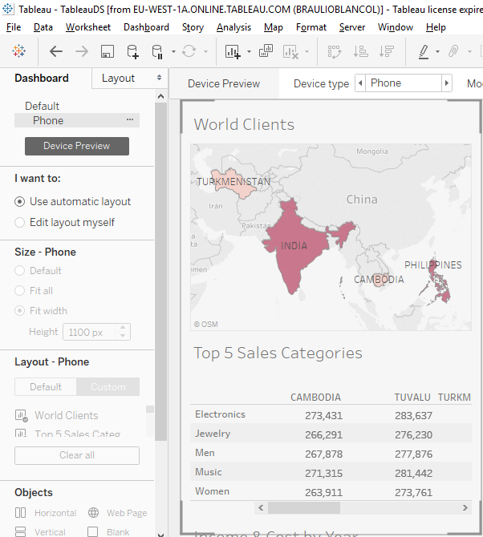

#### Publishing into the Cloud
If we select the server menu we can log in into a server like Tableau server for publishing the worksheets and dashboards.

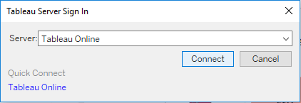
        
We will see the login page and after that we can publish it. We have to select a project and a workbook name, the workbook is a set of worksheets and dashboards. We will see the data uploading processing. After the process is complete we will see all the worksheets and dashboards will be in the cloud server.

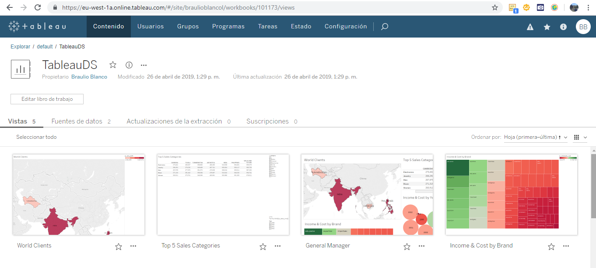

We can see all the sheets as observer as in the following image.

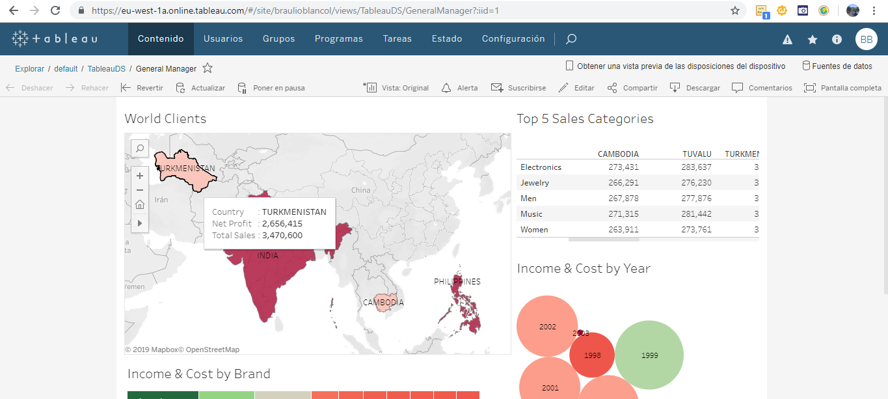

If we edit the dashboard or the worksheet we will see all the options that we have in Tableau desktop.

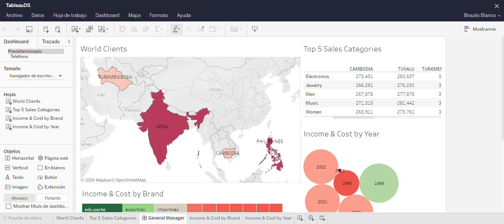

We can see the device preview also in the web mode.

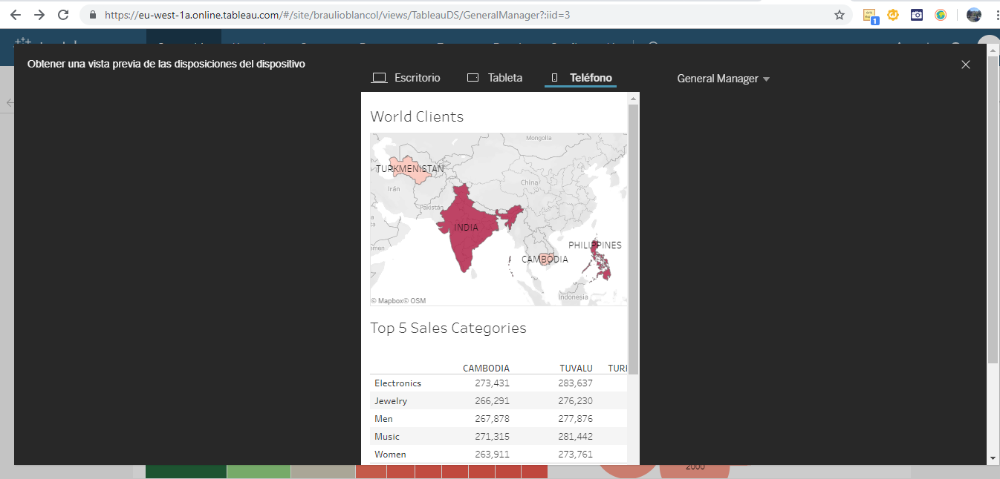

#### Roles and Security
We can create groups that represents a set of users like roles and also we can configure the users. After the user is registered, the user can log in into the cloud and all the worksheets and dashboards that are assigned to the user or group that the user belongs, are showed.

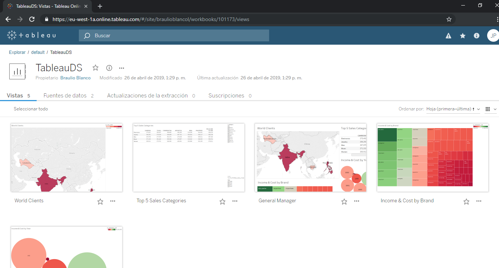

We can restrict each worksheet and/or dashboard to a specific set of options.

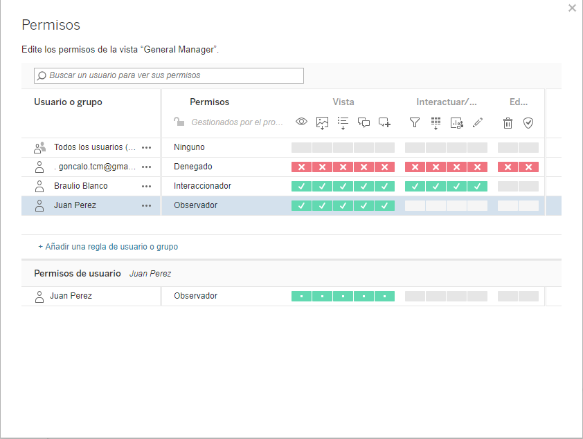

After we restrict the access the user will only see the authorized resources and will have only the authorized options.
        
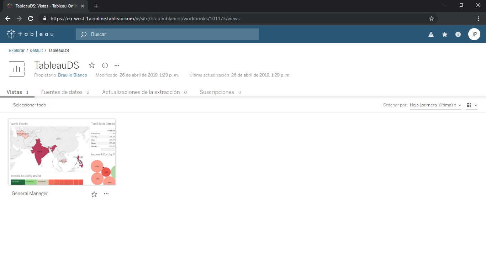

        
#### Integration
We can integrate Tableau with other systems using sharing option. This option shows a form where a generated HTML Placeholder is showed.         

        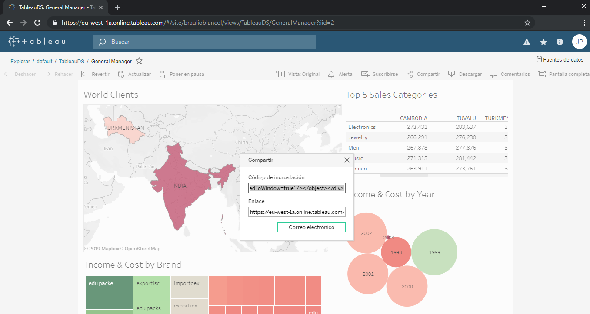

We can create an HTML using the provided HTML Placeholder and after executing this html, we will see the login page if there is no an active session.        
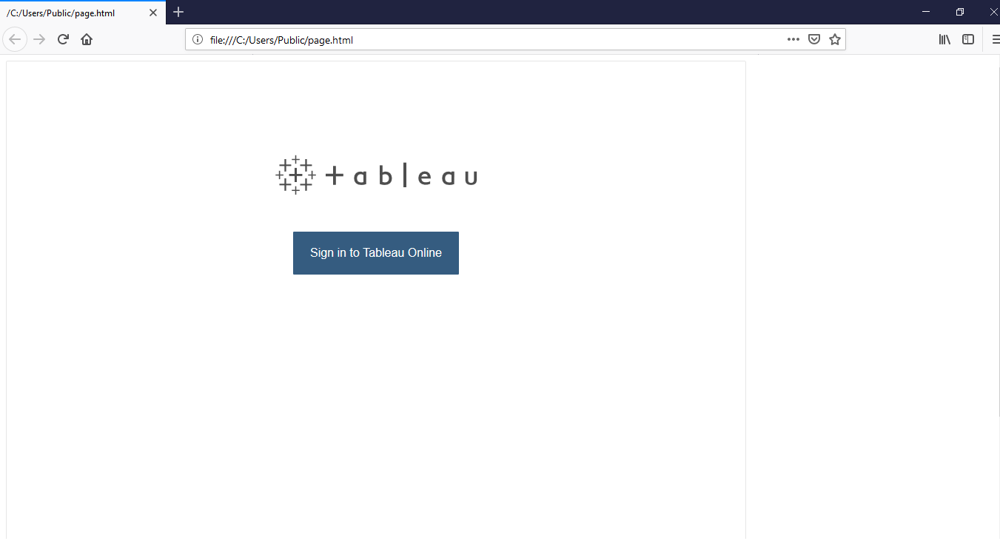

After a user is logged the html will connect to the Tableau server and Tableau will retrieve and show the information.

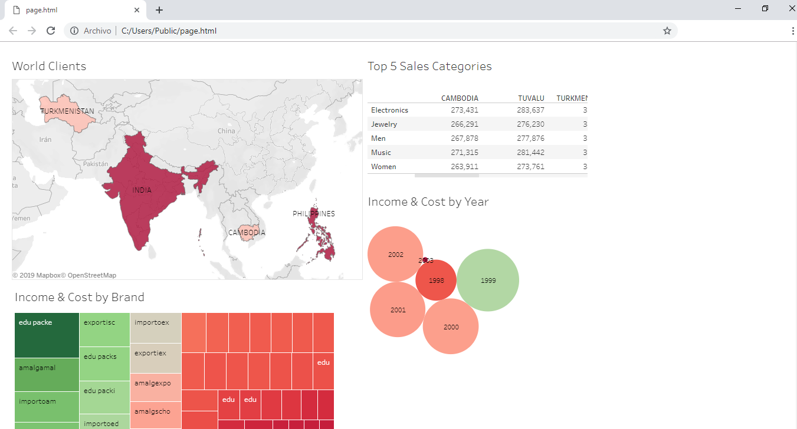

## Personal Experiences
* From our personal experiences, we think that Tableau is a very good Business Intelligence platform to build and create interactive dashboards thanks to the functionalities that it has. Tableau has many options to represent data in different views, applying filters, drill downs, formatting, creating sets, groups, generating trend lines and performing forecasting.
However, we know that other market competitors have more effective and intuitive features. For example, SAP Analytics Cloud offer powerful tools to do smart insights and smart discoveries , using machine learning. These features allow us to uncover top contributors of a selected value/variance point and to identify key influencers of a selected measure/dimension.
* Also, we didn’t explore the Forecasting functionalities but we got the idea that it's a bit limited and has some lack of predictive tools.
* The main advantages of Tableau are the variety and the availability of the products it offers .
It has products for various types of situations and that makes Tableau technically more specific.
* Besides we work with a small set of data, the performance was a little bit slow using live connection, when we change to extracted data, the performance improved.
 

## Conclusions and recommendations
* Tableau has designer tools that are very intuitive even for final users with low support of IT, this could allow the companies to obtain a direct participation of the business users in the Business Intelligence project development process.
* The architecture of Tableau is quite simple but allows to configure a basic distributed architecture and the disconnected data using the extract feature allow improve the performance.
* The integration feature can be useful if Single Sign On is implemented and the size of the charts are not heavy to be passed through the network. 

## Resources
- [Start free trial](https://www.tableau.com/products/trial)
- [Tableau Help](https://onlinehelp.tableau.com)
- [Tableau Blog](https://www.tableau.com/about/blog)
- [Tableau Community](https://community.tableau.com)
- [Tableau Certification](https://www.tableau.com/learn/certification)
- [Tableau e-learning](https://www.tableau.com/learn/training)
- [YouTube channel](https://www.youtube.com/channel/UCWGrtxO6JrPSDUcgp3Qm_Gw)
- [Classroom training (in-person + virtual)](https://www.tableau.com/learn/classroom)
- [Tableau Architecture](https://intellipaat.com/tutorial/tableau-tutorial/tableau-server-components/)

