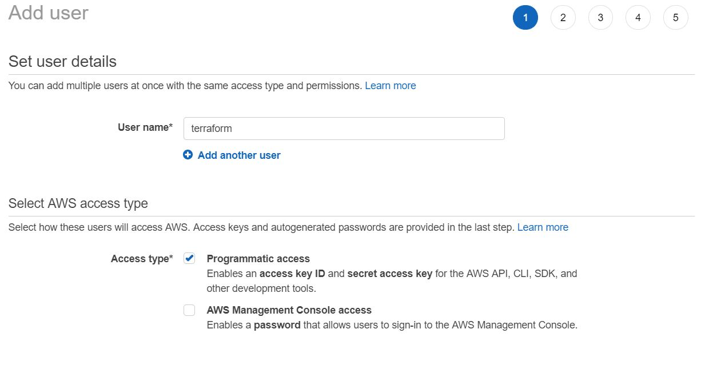
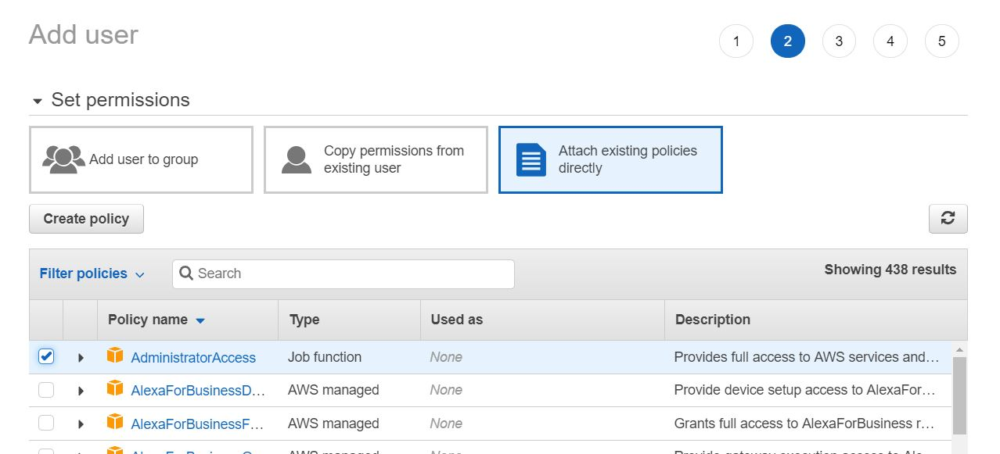
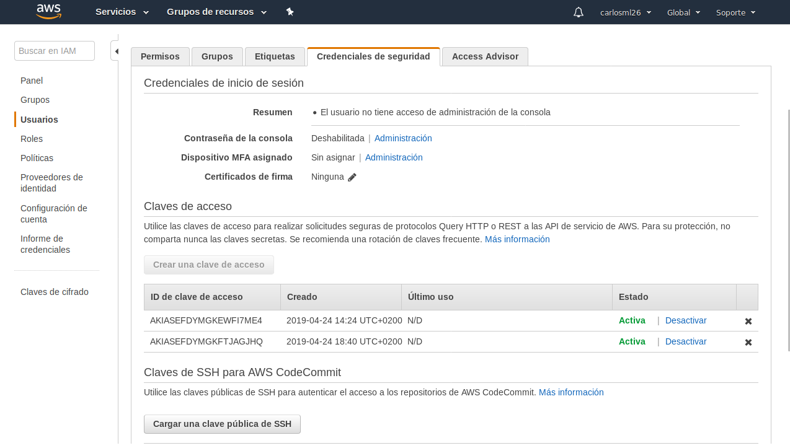
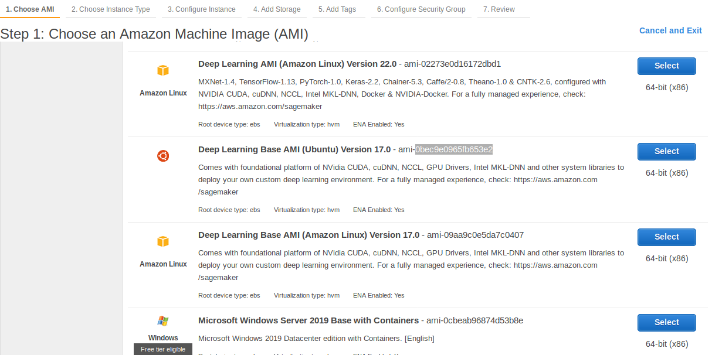
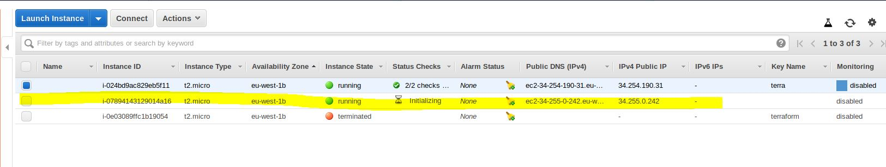
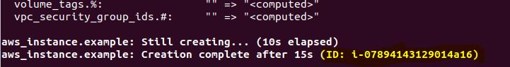
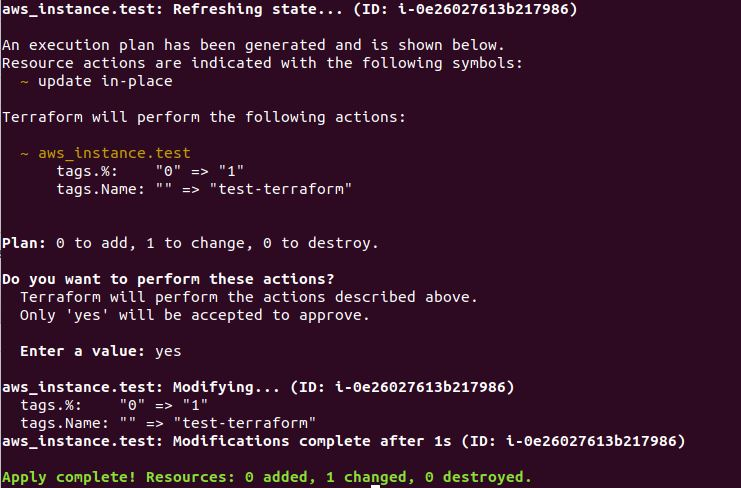

# Terraform: Research project
*Sokratis Papadopoulos*, *Carlos Martinez*

**CCBDA 2019**

-----------------------

### Abstract
In this document, we research on Terraform: a multi-cloud solution to write, plan and create infrastructure as code. 
We introduce the readers into the world of Infrastructure-as-Code, 
present Terraform basics, 
discuss its current state in the market and its use cases,
present some introductory examples of interaction with AWS and
compare it with Cloudformation: a popular competitor developed within Amazon.
We end this document with our comments on our experience with the tool, general conclusions and links for further studying.

* [1. Motivation](#1) : *reasons behind the creation of Terraform*
* [2. Introduction to Terraform](#2) : *brief introduction to Terraform, basic concepts and use cases*
* [3. Quick start with Terraform on AWS](#3) : *practical session on setting up Terraform and interact with AWS resources*
* [4. Terraform VS Cloudformation](#4) : *comparison between the two famous Infrastructure-as-Code technologies*
* [5. Conclusions](#5) : *final consolidating notes along with authors' experience comments on Terraform*
* [6. References for the interested reader](#6) : *studying material for the knowledge-thirsty*


<a name="1"/>

## Motivation
Provisioning and maintaining infrastructure is a crucial task of the cloud computing field. 
Either manually or automatically it is the first step towards building anything on the cloud.
As a matter of fact, handling this manually has a number of disadvantages. 
It is highly costly as it requires human capital (the most costly factor in today's world),
it is prone to inconsistencies due to human errors which lead to deviations from the desired configuration,
it lacks agility in deployment and makes it difficult to maintain compliace as it is not an automatic repeatable process.
On the other hand, infrastructure-as-code[1] is defining your infrastructure using configuration files (code) 
and it has become an important part of DevOps methodology. 
It eliminates all abovementioned disadvantages of manual configuration, adding a modern automated agile feeling to the infrastructure and as a result it is by far superior, 
at a very small cost of writing and maintaining a configuration file in a user-friendly and human understandable language.


<a name="2"/>

## Introduction to Terraform
  

Terraform is a tool for provisioning and maintaining infrastructure efficiently by writing, planning and creating Infrastructure-as-Code.
It is an open source project written in Go programming language, created and initially released by HashiCorp in July 28, 2014.
It can manage popular cloud providers, but also custom in-house solutions.  

It does this by using the concept of configuration files that describe the components of the infrastructure, whether it is a simple application or a whole complex multi-tier architecture.
Terraform workflow consists of 3 main steps: 
1. Author infrastructure-as-code, writing the configuration file.
2. Plan the infrastructure, preview your changes on an execution plan.
3. Apply the plan, create resources as described on the plan.

The configuration file consists of the following components of the desired architecture:
+ providers (AWS, Google cloud, Azure, etc.) Example of defining aws provider:
```hcl
provider "aws" {
  access_key = "kdsU3jds92l...1DdsA"
  secret_key = "Ddsawd39dds...k34kD"
  region     = "eu-west-1"
}
```
+ resources (EC2 instances, load balancers, etc.). Example of defining 5 identical t2.micro EC2 instances
```hcl
resource "aws_instance" "my_instance_name" {
  ami           = "ami-76d6f519"
  instance_type = "t2.micro"
  count         = 5
}
```

Once configuration file is ready, there are 3 basic commands that do all the work of planning and applying your infrastructure, as well as destroying it (steps 2 and 3 above):
+ `$ terraform plan` shapes an execution plan out of the configuration file along with its dependencies. 
+ `$ terraform apply` creates the desired architecture as described on execution plan.
+ `$ terraform destroy` destroys all the resources created by the configuration file.  

As changing infrastructure plans is very common for testing but also evolving projects, it worths noting that changes on a running infrastructure are applied the same way.
+ `$ terraform plan` creates an updated plan, indicating which components are expected to be updated and how.
+ `$ terraform apply` implements the changes.  

Another core concept that can be used within the configuration files are:
+ data: information fetched from providers. For example, a lookup of a previously created AMI from your AWS account, or the availability zones of a region.

Combining providers, resources, data and variables you can create highly automated infrastructure-as-code architectures.

### Maturity
Terraform is not mature yet. It is still under very active development, supported by thousands of developers and a big community. 
As a matter of fact, it is still in version `0` (latest stable version at the time of this document is v0.11.13), so significant changes are expected until version `1` is launched.
Beware that as the development is really high, articles of just few months old may be outdated already.

### Popularity
Terraform is currently hyped. Recently software industry is paying lots of attention on Terraform and has been praising it enthusiastically. 
Whichever tutorial, video or guide you use to understand Terraform, they will explicitly say (or you will implicitly think) that it is cool.
However, there are also down-to-earth people that warn us about the negative sides of the tool and the need of futher development and maturity.  
example comments of people praising or criticizing it. 

Here you can find an example out of a pool of thousands of professionals praising Terraform:
+ [Why should Terraform be one of your DevOps tools](https://medium.com/devopslinks/why-should-terraform-be-one-of-your-devops-tools-29ae15861b1f)

A good criticizing of Terraform may be read here: 
+ [Things I wish to know before jumping into Terraform](https://itnext.io/things-i-wish-i-knew-about-terraform-before-jumping-into-it-43ee92a9dd65).
+ [9 reasons why Terraform is a pain and 1 why you should still care](https://www.schibsted.pl/blog/9-reasons-why-terraform-is-a-pain-and-1-why-you-should-still-care/)

Finally, you can follow discussions on Terraform on Reddit:
+ [Reddit: Terrraform](https://www.reddit.com/r/Terraform/)

### Use cases
In this subsection we describe the most popular use cases of Terraform and at the end we include a link for further reading and completeness.

#### Multi-Cloud Deployment
Spreading infrastructure across multiple cloud providers is an attractive idea both for fault-tolerance (in case a provider fails), but also for using the exact best services of each provider.
Terraform allows a single configuration to be used to manage multiple providers and even cross-cloud dependencies letting developers ignore the hassle of realizing multi-cloud deployments

#### Multi-Tier Applications
As a common practice businesses desire multi-tier architecture in order to scale and maintain each tier independently, providing separation of concerns. 
Within Terraform, each tier is defined as a collection of resources, while the dependencies among tiers are handled automatically.
This means that Terraform will make sure that for example the database tier is available before web servers are started. 
Scaling one tier is as simple as introducing a `count` attribute within a resource and setting its value. 
For example `count=5` within EC2 instances resource would create 5 identical EC2 instances.
As a result of this automation, elastically scaling with load becomes trivial.

#### Disposable Environments
Every serious application nowadays has at least a production and a QA/dev environment. 
The test environments are typically identical copies of the production, so that new features are tested before releasing in production environment.
The more complex/mature the application becomes, the more difficult it is to maintain one or more up-to-date test environments.
With Terraform, one single configuration file can be shared with multiple environments, allowing easy creation and destruction of identical environments.

For more use cases, please follow this [link](https://www.terraform.io/intro/use-cases.html).

### Pros/Cons

In this subsection we refer to the pros and cons of Terraform. The positive things of using terraform are:

+ Automating the process of creating complex infrastructures in the cloud.
+ Small learning curve.
+ Manage a lot of different providers and resources.
+ It is opensource, so it is free and with a big community.
+ Well documented with a good API.
+ Reusable code.

The negative sides of terraform are:

- Not completely agnostic, you need to create a specific code for each different provider.
- It is necessary to know well the technology of the provider.
- It is opensource, so it has a delay when the providers change something or if they introduce a new service.

### Alternatives
Some alternatives to Terraform can be:
+ CloudFormation https://aws.amazon.com/cloudformation/ (comparison on section [4. Terraform VS Cloudformation](#4))
+ Ansible https://www.ansible.com/
+ Puppet https://puppet.com/
+ Salt https://www.saltstack.com/resources/community/
+ Chef https://www.chef.io/products/chef-infra/


<a name="3"/>

## Quick start with Terraform on AWS
In this quick start we are going to learn how set up terraform and how create instance ec2 and their resources.

### Terraform setup
First of all, we need to create an user with the policy of admin. Keep the key.pem, since we are going to use it to access to the ec2 and to the other machines which we are going to create with terraform.





We are going to connect to our ec2 instance with the key.pem that we had generated.

```bash
ssh -i "terra.pem" YOUR_USER@YOUR_EC2_MACHINE
```

Now we need to download and install terraform, we can get the link of the zip from terraform website.

```bash
wget https://releases.hashicorp.com/terraform/0.11.13/terraform_0.11.13_linux_amd64.zip
unzip terraform_0.11.13_linux_amd64.zip
```

In order to use terraform we have to execute `./terraform`. However, if we include terraform in the path is going to be easier to execute the command, simply by its name.

```bash
echo $"export PATH=\$PATH:$(pwd)" >> ~/.bash_profile
source ~/.bash_profile
```
 
### Playing with Terraform 
We are going to create out first Terraform project, so we need create a new folder for this project.

```bash
mkdir terraform-test
cd terraform-test
```

Terraform files have `.tf` suffix and the tool is going to read these files, in order to understand and execute the plan.
In this example we only want to create a new instance within our region, so we have to create a new file .tf with all the necessary things for seting up the instance.
In this case, we need to define the provider (AWS) with the access and secret key of the user that you have created and the region where you want to create the instance. 
Moreover, you need to define some resources at least for creating the machine. You need to specify the image of the machine and the type (ami).





```bash
nano ec2.tf
```

```HCL
provider "aws" {
  access_key = "ACCESS_KEY_HERE"
  secret_key = "SECRET_KEY_HERE"
  region     = "YOUR_REGION"
}


resource "aws_instance" "example" {
  ami           = "AMI_OF_YOUR_INSTANCE"
  instance_type = "t2.micro"
}
```

To start, within the created folder we need to execute `terraform init` which will download all the dependencies needed (for example the suitable plugin for the provider we use, AWS in this example).
Then, we are going to execute `terraform plan` in order to get an descriptive plan of all resources that are going to be created and `terraform apply` is finally going to execute that plan, creating our desired resources in the cloud.

When you are updating your configuration, `terraform plan` will spot the differences of previous configuration and then `terraform apply` executes the changes. 
In our case, since we run it for first time, terraform is going to simply execute the plan described on *ec2.tf*.

```bash
terraform init 
terraform plan
terraform apply
```

After executing the apply, we can see how that terraform has created a new instance, and we can see this instance in amazon console.





To destroy whatever we created on the plan, we have to use the destroy command.

```bash
terraform destroy
```


Now we are going to modify an instance that is running. 
So as we have already destroyed our instance, let's execute again the previous plan.

```bash
terraform apply
```

Now, let's modify the *ec2.tf*, in order to change some things of our instance. We are going to add a security group and some tags.

```HCL
provider "aws" {
  access_key = "ACCESS_KEY_HERE"
  secret_key = "SECRET_KEY_HERE"
  region     = "YOUR_REGION"
}


resource "aws_instance" "example" {
  ami           = "AMI_OF_YOUR_INSTANCE"
  instance_type = "t2.micro"
  vpc_security_group_ids = ["SECURITY_GROUP_ID"]
  tags {
    Name = "test-terraform"
  }
}
```

In this way, if we execute the terraform plan we can see that it is not going to create or destroy any instance, but rather add things into the previously created resources.

```bash
terraform plan
terraform apply
```



However, if we try to connect to this instance, we are not going to be able yet, because we have not added any key-pair to this instance.  So, we need to modify ec2.tf to add the key-pair.

```HCL
provider "aws" {
  access_key = "ACCESS_KEY_HERE"
  secret_key = "SECRET_KEY_HERE"
  region     = "YOUR_REGION"
}


resource "aws_instance" "example" {
  ami           = "AMI_OF_YOUR_INSTANCE"
  instance_type = "t2.micro"
  key_pair = "NAME_OF_YOUR_KEY"
  vpc_security_group_ids = ["SECURITY_GROUP_ID"]
  tags {
    Name = "test-terraform"
  }
}
```

If we now execute terraform plan, we are going to see that terraform is going to delete the instance and create a new one instead of modified the previous one. This is because we cannot add the pair-key after creating the instance.

```bash
terraform plan
terraform apply
```

Destroy all to cleanup and avoid charges.

```bash
terraform destroy
```

### Create resources with Terraform
Now we are going to create all the resources with terraform instead of creating manually and write their ids. 
So, we are going to create a new terraform file *sg.tf* to create the security-group resource. 
We need to define the name of the resource and its internal name. 
Moreover, in the egress we are going to accept only port `22` with `tcp` protocol.

```bash
nano sg.tf
```

```HCL
resource "aws_security_group" "allow_tls" {
  name        = "allow_tls"
  description = "Allow TLS inbound traffic"
  vpc_id      = "VPC_ID"

  ingress {
    # TLS (change to whatever ports you need)
    from_port   = 22
    to_port     = 22
    protocol    = "tcp"
    cidr_blocks = [
	"0.0.0.0/0"
    ]
  }

  egress {
    from_port       = 0
    to_port         = 0
    protocol        = "-1"
    cidr_blocks     = ["0.0.0.0/0"]
  }
}
```

If we use the parameter --target we can specify what resource we want to apply to the plan.

```bash
terraform plan --target aws_security_group.allow_ssh_anywhere
terraform apply --target aws_security_group.allow_ssh_anywhere
```

Despite that we now have 2 configuration files, Terraform will execute both. 
In order to associate the security group that we have created, we have to add the direction in the instance file.

```bash
nano ec2.tf
```

```HCL
provider "aws" {
  access_key = "ACCESS_KEY_HERE"
  secret_key = "SECRET_KEY_HERE"
  region     = "YOUR_REGION"
}


resource "aws_instance" "example" {
  ami           = "AMI_OF_YOUR_INSTANCE"
  instance_type = "t2.micro"
  key_pair = "NAME_OF_YOUR_KEY"
  vpc_security_group_ids = ["@{aws_security_group.YOUR_SG_NAME.id}"]
  tags {
    Name = "test-terraform"
  }
}
```

Now we are going to use the key-pair resource *kp.tf*. We need to add the name of the resource, its internal key name and your public key.

```bash
nano kp.tf
```

```HCL
resource "aws_key_pair" "KEY_PAIR" {
  key_name   = "NAME_KEY_PAIR"
  public_key = "YOUR_PUBLIC_KEY"
}
```

Now, in the same way we are going to associate the resource to our instance.

```bash
nano ec2.tf
```

```HCL
provider "aws" {
  access_key = "ACCESS_KEY_HERE"
  secret_key = "SECRET_KEY_HERE"
  region     = "YOUR_REGION"
}


resource "aws_instance" "example" {
  ami           = "AMI_OF_YOUR_INSTANCE"
  instance_type = "t2.micro"
  key_pair = "@aws_key_pair.YOUR_PK_NAME.key_name}"
  vpc_security_group_ids = ["@{aws_security_group.YOUR_SG_NAME.id}"]
  tags {
    Name = "test-terraform"
  }
}
```

So in this way, you can create all the resources that you need in a easy way and replicate it for all the machines that you want. 
You just need to write terraform apply and all the architecture that you are defined is going to be created in some seconds.


<a name="4"/>

## Terraform VS Cloudformation
In this section we compare Terraform with its main competitor at least within AWS environment, the native tool of Amazon: Cloudformation.
We present to you the differences, advantages and disadvantages side by side and then conclude on which are the most suitable business cases for each tool. 

| Terraform																				| Cloudformation																				|
| --------------------------------------------------------------------------------------| -------------------------------------------------------------------------------------- | 
| \*Cloud agnostic: many cloud providers & integration with other tools (Cloudflare, DNSimple, datadog, etc.) | Tight integration with AWS |
| Open source | Closed source - property of Amazon (Sometimes there is even no support for new services [2])|
| Simple syntax  `$ terraform plan` and `$ terraform apply` would get you running | CLI syntax is verbose `aws cloudformation create-stack --stack-name myteststack --template-body file://template.yaml` |
| Language: HCL, JSON | Language: JSON, YAML |
| Support easy multiple configuration (count=3) | Repeated code |
| GUI on enterprise version only | GUI support for free (drag & drop – auto coding) |
| Managing state file | No need to manage state file, Cloudformation manages the state of your stack for you |
| Easy working with multiple configuration files | Difficult to grasp nested architecture on multiple configuration files |

\* there are certain articles arguing that Terraform is not exactly cloud agnostic. For more information follow this [Terraform is not the cloud agnostic platfrom you think it is](https://adinermie.com/terraform-is-not-the-cloud-agnostic-platform-you-think-it-is/).  

Finally, for popularity comparison, the figure below is showing the google trend for the two competitor tools. As you can see, the gap between the two seems to be growing with Terraform being on the dominating side.


As a result of the above analysis, we believe there are 3 reasons to choose CloudFormation over Terraform, given that you only want to work within AWS, as CloudFormation cannot be used elsewhere:
1. You would like a more user-friendly GUI support for free (as Terraform GUI comes only on enterprise entition)
2. You want to definately not manage the state file of your infrastructure.
3. You want to work with YAML.

On the other hand, you would use Terraform over CloudFormation on the following 4 cases:
1. You prefer an open source solution.
2. You are interested in multi-cloud solutions, as you do not want to work or lock yourself with AWS.
3. You would like to work with multiple configuration files at a time.
4. You are okay working with JSON or HCL

As a conclusion, selecting the right tool is a case-by-case decision, so select the tool that suits bests to your business needs. 
Do not forget that there is always the possibility of using both, for different use-cases within the same project.


<a name="6"/>

## Conclusion
Terraform is one of the most popular Infrastructure-as-code tools in the market, a much promising tool that we indeed hope will flourish with time, as it is still in early stages of maturity. 
After working with terraform, we have seen that is a really interesting tool, we proved that things we used to do manually in aws are easily automated by writing one terraform file 
and with simple commands any infrastructure is ready to go. The terraform file have a json-like structure, it easy to learn, and you can find in the terraform API the format of all the different resources and various documentation. 
Moreover, we found that debugging within Terraform is pretty convenient, given their verbose produced logs. Overall we had a smooth experience with the product.

Working on this research project helped us dive into the surface of a great software. 
We do hope that everybody's expectations about Terraform will become reality and it will meet its full potential in the future.
Finally, we do hope that this report will be helpful for readers, introducing them to Terraform and helping them getting a grasp of it and decide whether it worths investing more time into diving further and using Terraform.


<a name="7"/>

## Sources of information for the interested reader
All documentation around Terraform is available on the [Terraform website](http://www.terraform.io).  You may find below some further material to dive into Terraform	:
  - [Github repo](https://github.com/hashicorp/terraform)
  - [Terraform documentation](https://www.terraform.io/docs/index.html)
  - [Terraform best practices](https://www.terraform-best-practices.com/)
  - [Introduction to HashiCorp Terraform with Armon Dadgar -founder](https://www.youtube.com/watch?v=h970ZBgKINg)
  - [Video sessions for Terraform with AWS](https://www.youtube.com/watch?v=IxA1IPypzHs&list=PLH1ul2iNXl7vk8RUchIiMBeXqDnFTi4_M&index=3)
  - [Udemy course on Terraform](https://www.udemy.com/terraform-beginner-to-advanced/)

## References
 1) Infrastructure-as-code definition and further information  
 https://d1.awsstatic.com/whitepapers/DevOps/infrastructure-as-code.pdf

 1) Reddit: Cloud formation feature support lag is way out of hand, by u/ffxsam  
 https://www.reddit.com/r/aws/comments/as21r7/cloudformation_feature_support_lag_is_way_out_of/

